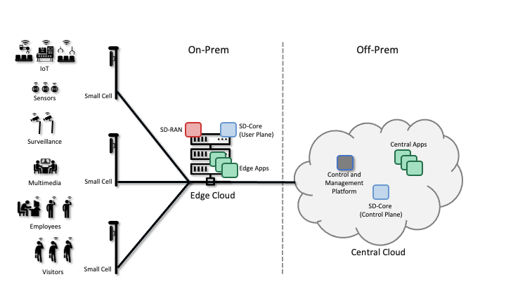
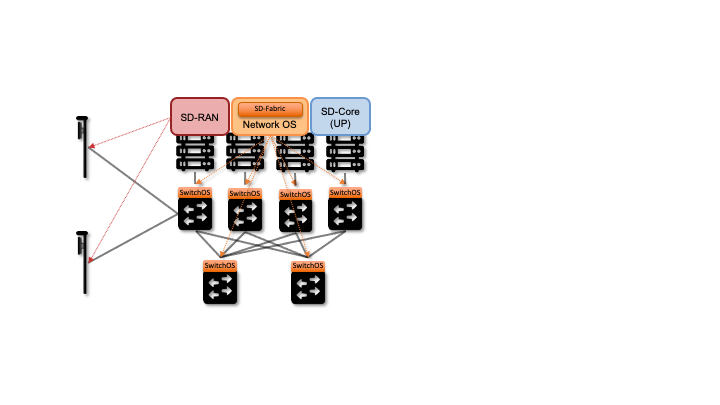
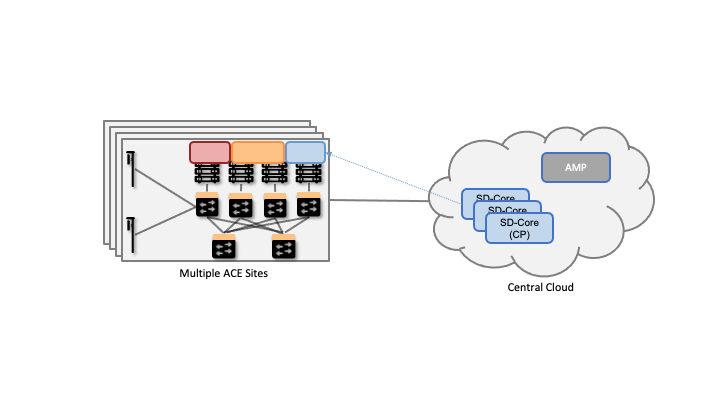
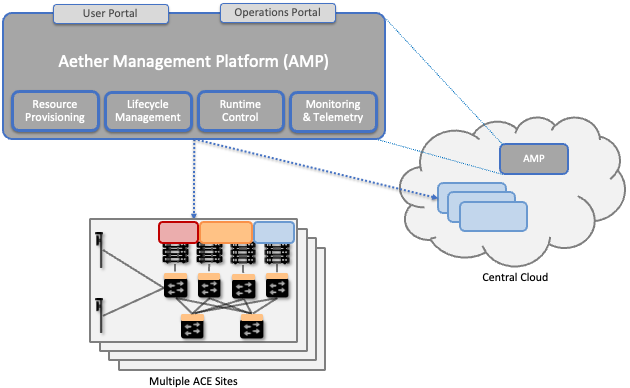
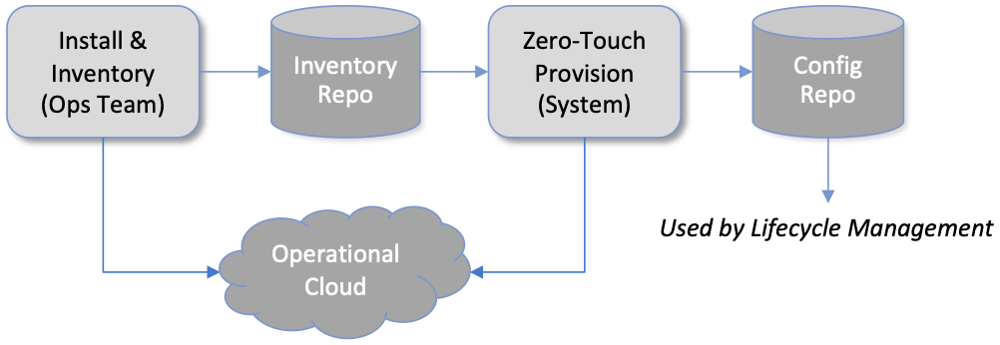
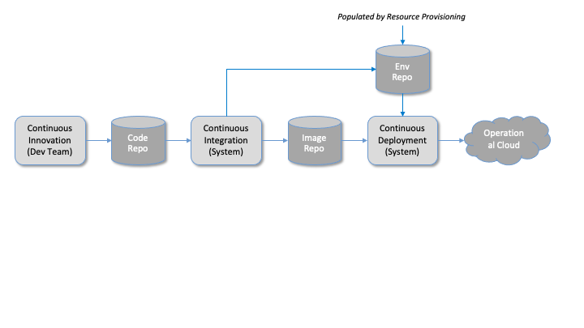
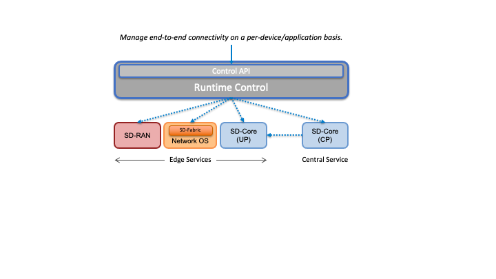
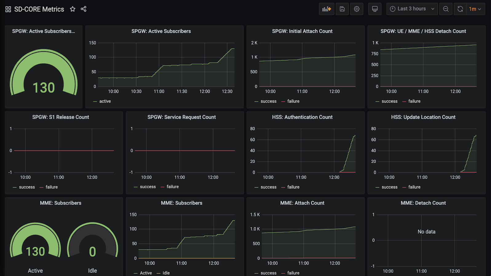

Chapter 2:  Architecture
========================

This chapter identifies all the subsystems that go into building and
operationalizing a cloud capable of running an assortment of
cloud-native services. We use Aether to illustrate specific design
choices, and so we start by describing why an enterprise might install
a system like Aether in the first place.

Aether is a Kubernetes-based edge cloud, augmented with a 5G-based
connectivity service. Aether is targeted at enterprises that want to
take advantage of 5G connectivity in support of mission-critical edge
applications requiring predictable low latency connectivity. In short,
“Kubernetes-based” means Aether is able to host container-based
services, and “5G-based connectivity” means Aether is able to connect
those services to mobile devices throughout the enterprise's physical
plant. This combination, coupled with Aether being offered as a
managed service, means Aether can fairly be characterized as a
Platform-as-a-Service (PaaS).

.. sidebar:: Industry 4.0

       *Edge clouds like Aether are an important component of a trend
       called Industry 4.0: A combination of intelligent devices,
       robust wireless connectivity, and cloud-based AI/ML
       capabilities, all working together to enable software-based
       optimization and innovation.*

       *Connecting industry assets to the cloud has the potential to
       bring transformative benefits. This starts with collecting deep
       operational data on assets and infrastructure, from sensors,
       video feeds and telemetry from machinery. It also includes
       applying ML to this data to gain insights, identify patterns
       and predict outcomes (e.g., when a device is likely to fail),
       followed by automating industrial processes so as to minimize
       human intervention and enable remote operations (e.g., power
       optimization, idling quiescent machinery). In general, the goal
       is to create an IT foundation for continually improving
       industrial operations through software.*

Aether supports this combination by implementing both the RAN and the
user plane of the Mobile Core on-prem, as cloud-native workloads
co-located on the Aether cluster. This is often referred to as *local
breakout* because it enables direct communication between mobile
devices and edge applications without data traffic leaving the
enterprise. This scenario is depicted in :numref:`Figure %s
<fig-hybrid>`, which does not name the edge applications, but
substituting Internet-of-Things (IoT) would be an illustrative
example.

.. _fig-hybrid:

   Overview of Aether as a hybrid cloud, with edge apps and the 5G
   data plane (called *local breakout*) running on-prem and various
   management and control-related workloads running in a central
   cloud.

The approach includes both edge (on-prem) and centralized (off-prem)
components. This is true for edge apps, which often have a centralized
counterpart running in a commodity cloud. It is also true for the 5G
Mobile Core, where the on-prem User Plane (UP) is paired with a
centralized Control Plane (CP). The central cloud shown in this figure
might be private (i.e., operated by the enterprise), public (i.e.,
operated by a commercial cloud provider), or some combination of the
two (i.e., not all centralized elements need to run in the same
cloud). Also shown in :numref:`Figure %s <fig-hybrid>` is a
centralized *Control and Management Platform*. This represents all the
functionality needed to offer Aether as a managed service, with system
administrators using a portal exported by this platform to operate the
underlying infrastructure and services within their enterprise. The
rest of this book is about everything that goes into implementing that
*Control and Management Platform*.

2.1 Edge Cloud
--------------

The edge cloud, which in Aether is called ACE (Aether Connected Edge),
is a Kubernetes-based cluster similar to the one shown in
:numref:`Figure %s <fig-hw>` of Chapter 1. It is a platform that
consists of one or more server racks interconnected by a leaf-spine
switching fabric, with an SDN control plane (denoted SD-Fabric)
managing the fabric.

.. _fig-ace:

   Aether Connected Edge (ACE) = The cloud platform (Kubernetes and
   SD-Fabric) plus the 5G connectivity service (RAN and User Plane of
   Mobile Core). Dotted lines (e.g., between SD-RAN and the individual
   base stations, and between the Network OS and the individual
   switches) represent control relationships (e.g., SD-RAN controls
   the small cells and SD-Fabric controls the switches).
	
As shown in :numref:`Figure %s <fig-ace>`, ACE hosts two additional
microservice-based subsystems on top of this platform; they
collectively implement *5G-Connectivity-as-a-Service*. The first
subsystem, SD-RAN, is an SDN-based implementation of the 5G Radio
Access Network (RAN). It controls the small cell base stations
deployed throughout the enterprise. The second subsystem, SD-Core, is
an SDN-based implementation of the User Plane half of the Mobile
Core. It is responsible for forwarding traffic between the RAN and the
Internet. The SD-Core Control Plane (CP) runs off-site, and is not
shown in :numref:`Figure %s <fig-ace>`. Both subsystems (as well as
the SD-Fabric), are deployed as a set of microservices, but details
about the functionality implemented by these containers is otherwise
not critical to this discussion. For our purposes, they are
representative of any cloud native workload. (The interested reader is
referred to our companion 5G and SDN books for more information about
the internal working of SD-RAN, SD-Core, and SD-Fabric.)

.. _reading_5g:
.. admonition:: Further Reading 

   `5G Mobile Networks: A Systems Approach 
   <https://5G.systemsapproach.org>`__
   
   `Software-Defined Networks: A Systems Approach 
   <https://sdn.systemsapproach.org>`__

Once ACE is running in this configuration, it is ready to host a
collection of edge applications (not shown in :numref:`Figure %s
<fig-ace>`), and as with any Kubernetes-based cluster, a Helm chart
would be the preferred way to deploy such applications. What’s unique
to ACE is the ability to connect such applications to mobile devices
throughout the enterprise using the 5G Connectivity Service
implemented by SD-RAN and SD-Core. This service is offered as a
managed service, with enterprise system administrators able to use a
programmatic API (and associated GUI portal) to control that service;
that is, authorize devices, restrict access, set QoS profiles for
different devices and applications, and so on. How to provide such a
runtime control interface is the topic of Chapter 6.

2.2 Hybrid Cloud
-----------------

While it is possible to instantiate a single ACE cluster in just one
site, Aether is designed to support multiple ACE deployments, all of
which are managed from the central cloud. Such a hybrid cloud scenario
is depicted in :numref:`Figure %s <fig-aether>`, which shows two
subsystems running in the central cloud: (1) one or more instances of
the Mobile Core Control Plane (CP), and (2) the Aether Management
Platform (AMP).

Each SD-Core CP controls one or more SD-Core UPs, as specified by
3GPP, the standards organization responsible for 5G. Exactly how CP
instances (running centrally) are paired with UP instances (running at
the edges) is a runtime decision, and depends on the degree of
isolation the enterprise sites require. AMP is responsible for
managing all the centralized and edge subsystems (as introduced in the
next section).

.. _fig-aether:

   Aether runs in a hybrid cloud configuration, with Control Plane of
   Mobile Core and the Aether Management Platform (AMP) running in the
   Central Cloud.

There is an important aspect of this hybrid cloud that is not obvious
from :numref:`Figure %s <fig-aether>`, which is that the “hybrid
cloud” we keep referring to is best described as a set of Kubernetes
clusters, rather than a set of physical clusters (similar to the one
we started with in :numref:`Figure %s <fig-hw>` of Chapter 1).
This is because, while each ACE site usually corresponds to a physical
cluster built out of bare-metal components, each of the SD-Core CP
subsystems shown in :numref:`Figure %s <fig-aether>` is actually
deployed in a logical Kubernetes cluster on a commodity cloud. The
same is true for AMP. Aether’s centralized components are able to run
in Google Cloud Platform, Microsoft Azure, and Amazon’s AWS. They also
run as an emulated cluster implemented by a system like
KIND—Kubernetes in Docker—making it possible for developers to run
these components on their laptop.

To be clear, Kubernetes adopts generic terminology, such as “cluster”
and “service”, and gives it very specific meaning. In
Kubernetes-speak, a *Cluster* is a logical domain in which Kubernetes
manages a set of containers. This “Kubernetes cluster” may have a
one-to-one relationship with an underlying physical cluster, but it is
also possible that a Kubernetes cluster is instantiated inside a
datacenter, as one of potentially thousands of such logical
clusters. And as we'll see in a later chapter, even an ACE edge site
sometimes hosts more than one Kubernetes cluster, for example, one
running production services and one used for trial deployments of new
services.

With the understanding that our target environment is a collection of
Kubernetes clusters—some running on bare-metal hardware at edge sites
and some running (likely in VMs) in central datacenters—there is an
orthogonal issue of how decision-making responsibility for those
clusters is shared among multiple stakeholders. Identifying the
relevant stakeholders is an important prerequisite for establishing a
cloud service, and while the example we use may not be suitable for
all situations, it does illustrate the design implications.

For Aether, we care about two primary stakeholders: (1) the *cloud
operators* that manage the hybrid cloud as a whole, and (2) the
*enterprise users* that decide on a per-site basis how to take
advantage of the local cloud resources (e.g., what edge applications
to run and how to slice connectivity resources among those apps).  We
sometimes call the latter "enterprise admins" to distinguish them from
"end-users" that might want to manage their own personal devices.

The architecture is multi-tenant in the sense that it authenticates
and isolates these stakeholders. This makes the approach agnostic as
to whether all the edge sites belong to a single organization (with
that organization also responsible for operating the cloud), or
alternatively, there being a separate organization that offers a
managed service to a set of distinct enterprises (each of which spans
one or more sites). The architecture can also accommodate end-users,
and provide them with a "self-service" portal, but we do not elaborate
on that possibility.

2.2.1 Edge Applications
~~~~~~~~~~~~~~~~~~~~~~~

There is a potential third stakeholder of note—third-party service
providers—which points to the larger issue of how we deploy and manage
additional edge applications. To keep the discussion tangible—but
remain in the open source arena—we use OpenVINO as an illustrative
example. OpenVINO is a framework for deploying AI inference models,
which is interesting in the context of Aether because one of its use
cases is processing video streams, for example to detect and count
people that enter the field of view of a collection of 5G-connected
cameras.

.. _reading_openvino:
.. admonition:: Further Reading 

   `OpenVINO Toolkit <https://docs.openvino.ai>`__.

On the one hand, OpenVINO is just like the 5G-related components we're
already incorporating into our hybrid cloud: it is deployed as a
Kubernetes-based application. On the other hand, we have to ask who is
responsible for managing it, which is to say “who operationalizes
OpenVINO?”

One answer is that the operators that already manage the rest of the
hybrid cloud also manage the collection of edge applications added to
cloud. Enterprise users might select and control those apps on a
site-by-site basis, but it is the operations team already responsible
for provisioning, deploying, and managing those edge clouds also do
the same for OpenVINO and any other applications that run
locally. Generalizing from one edge service (5G connectivity) to
arbitrarily many edge services has implications for control and
management (which we’ll discuss throughout the book), but
fundamentally nothing changes in the course we’ve already set out for
ourselves.\ [#]_

.. [#] Because Aether is multi-tenant, it is possible (and even
       preferable) for the organization responsible for operating the
       cloud to designate sub-teams to take direct responsibility for
       managing each individual service. This is consistent with the
       principle of least privilege, even when the cloud is
       administered within a single trust domain.

This is the assumption Aether makes (and we assume throughout this
book), but for completeness, we take note of two other possibilities.
One is that we extend our hybrid architecture to support independent
third-party service providers. Each new edge service acquires its own
isolated Kubernetes cluster from the edge cloud, and then the
3rd-party provider subsumes all responsibility for managing the
service running in that cluster. From the perspective of the cloud
operator, though, the task just became significantly more difficult
because the architecture would need to support
Kubernetes-as-a-Service. Creating isolated Kubernetes clusters
on-demand is a step further than we take things in this book, in part
because there is a second possible answer that seems more likely to
happen.

This second approach is that a multi-cloud emerges *within*
enterprises. Today, most people equate multi-cloud with services
running across multiple hyperscalers, but with edge clouds becoming
more common, it seems inevitable that enterprises invite multiple edge
clouds onto their local premises, some hyperscaler-provided and some
not, each hosting a different subset of edge services. For example,
one edge cloud might host a 5G connectivity service and another might
host an AI platform like OpenVINO. The question this raises is whether
the cloud management technologies described in this book still apply
in that setting. The answer is yes: the fundamental management
challenges remain the same, the only difference is knowing when to
directly control a Kubernetes cluster (as we do in this book) and when
to do so indirectly through the manager of that cluster.

2.3 Control and Management
--------------------------

We are now ready to describe the architecture of the Aether Management
Platform (AMP), which as shown in :numref:`Figure %s <fig-amp>`,
manages both the distributed set of ACE clusters and the other control
clusters running in the central cloud. And illustrating the recursive
nature of the management challenge, AMP is also responsible for
managing AMP!

AMP includes one or more portals targeted at different stakeholders,
with :numref:`Figure %s <fig-amp>` showing the two examples we focus
on in this book: an User Portal intended for enterprise admins that
need to manage services delivered to a local site, and an Operations
Portal intended for the ops team responsible for keeping Aether
up-to-date and running smoothly. Again, other stakeholders (classes of
users) are possible, but this distinction does represent a natural
division between those that *use* cloud services and those that
*operate* cloud services.

.. _fig-amp:

   The four subsystems that comprise AMP: Resource Provisioning,
   Lifecycle Management, Runtime Control, and Monitoring & Logging.
   
We do not focus on these portals, which can be thought of as offering
a particular class of users a subset of AMP functionality, but we
instead describe the aggregate functionality supported by AMP, which
is organized around four subsystems:

* Resource Provisioning: Responsible for initializing and configuring
  resources (e.g., servers, switches) that add, replace, or upgrade
  capacity for Aether.
  
* Lifecycle Management: Responsible for continuous integration and
  deployment of software functionality available on Aether.
  
* Runtime Control: Responsible for the ongoing configuration and
  control of the services (e.g., connectivity) provided by Aether.
  
* Monitoring & Logging: Responsible for collecting, archiving,
  evaluating, and analyzing operational data generated by Aether
  components.
  
Internally, each of these subsystems is implemented as a highly
available cloud service, running as a collection of microservices. The
design is cloud-agnostic, so AMP can be deployed in a public cloud
(e.g., Google Cloud, AWS, Azure), an operator-owned Telco cloud, (e.g,
AT&T’s AIC), or an enterprise-owned private cloud. For a pilot
deployment of Aether, AMP runs in the Google Cloud.

The rest of this section introduces these four subsystems, with the
chapters that follow filling in more detail about each. 
   

2.3.1 Resource Provisioning
~~~~~~~~~~~~~~~~~~~~~~~~~~~

Resource Provisioning configures and bootstraps resources (both
physical and virtual), bringing them up to a state so Lifecycle
Management can take over and manage the software running on those
resources. It roughly corresponds to Day 0 operations, and includes
both the hands-on aspect of installing and physically connecting
hardware, and the inventory-tracking required to manage physical
assets.

.. _fig-provision:

   High-level overview of Resource Provisioning.

:numref:`Figure %s <fig-provision>` gives a high-level overview. As a
consequence of the operations team physically connecting resources to
the cloud and recording attributes for those resources in an Inventory
Repo, a Zero-Touch Provisioning system (a) generates a set of
configuration artifacts that are stored in a Config Repo and used
during Lifecycle Management, and (b) initializes the newly deployed
resources so they are in a state that Lifecycle Management is able to
control.

Recall from Chapter 1 that we called out the "Aether platform" as
distinct from the cloud-native workloads that are hosted on the
platform. This is relevant here because Resource Provisioning has to
get this platform up-and-running before Lifecycle Management can do
it's job. But in another example of circular dependencies, Lifecycle
Management then plays a role in keeping the underlying platform
up-to-date.
	
Clearly, the “Install & Inventory” step requires human involvement,
and some amount of hands-on resource-prep is necessary, but the goal
is to minimize the operator configuration steps (and associated
expertise) and maximize the automation carried out by the Zero-Touch
Provisioning system. Also realize that :numref:`Figure %s
<fig-provision>` is biased towards provisioning a physical cluster,
such as the edge sites in Aether. For a hybrid cloud that also
includes one or more virtual clusters running in central datacenters,
it is necessary to provision those virtual resources as well. Chapter
3 describes provisioning from this broader perspective, considering
both physical and virtual resources.

2.3.2 Lifecycle Management
~~~~~~~~~~~~~~~~~~~~~~~~~~

Lifecycle Management is the process of integrating debugged, extended,
and refactored components (often microservices) into a set of
artifacts (e.g., Docker containers and Helm charts), and subsequently
deploying those artifacts to the operational cloud. It includes a
comprehensive testing regime, and typically, a procedure by which
developers inspect and comment on each others’ code.

.. _fig-lifecycle:

   High-level overview of Lifecycle Management. 

:numref:`Figure %s <fig-lifecycle>` gives a high-level overview, where
it is common to split the integration and deployment phases, the
latter of which combines the integration artifacts from the first
phase with the configuration artifacts generated by Resource
Provisioning described in the previous subsection. The figure does not
show any human intervention (after development), which implies any
patches checked into the code repo trigger integration, and any new
integration artifacts trigger deployment. This is commonly referred to
as Continuous Integration / Continuous Deployment (CI/CD), although in
practice, operator discretion and other factors are also taken into
account before deployment actually happens.

One of the key responsibilities of Lifecycle Management is version
control, which includes evaluating dependencies, but also the
possibility that it will sometimes be necessary to both roll out new
versions of software and rollback to old versions, as well as operate
with multiple versions deployed simultaneously. Managing all the
configuration state needed to successfully deploy the right version of
each component in the system is the central challenge, which we
address in Chapter 4.

2.3.3 Runtime Control
~~~~~~~~~~~~~~~~~~~~~

Once deployed and running, Runtime Control provides a programmatic API
that can be used by various stakeholders to manage whatever abstract
service(s) the system offers (e.g., 5G connectivity in the case of
Aether). As shown in :numref:`Figure %s <fig-control>`, Runtime
Control addresses the “management silo” issue raised in Chapter 1, so
users do not need to know that connectivity potentially spans four
different components, or how to control/configure each of them
individually. (Or, as in the case of the Mobile Core, that SD-Core is
distributed across two clouds, with the CP sub-part responsible for
controlling the UP sub-part.) In the case of the connectivity service,
for example, users only care about being able to authorize devices and
set QoS parameters on an end-to-end basis.

.. _fig-control:

   Example use case that requires ongoing runtime control.

Note that :numref:`Figure %s <fig-control>` focuses on
Connectivity-as-a-Service, but the same idea applies to all services
the cloud offers to end users. Thus, we can generalize the figure so
Runtime Control mediates access to any of the underlying microservices
(or collections of microservices) the cloud designer wishes to make
publicly accessible, including the rest of AMP! In effect, Runtime
Control implements an abstraction layer, codified with a programmatic
API.

Given this mediation role, Runtime Control provides mechanisms to
model (represent) the abstract services to be offered to users; store
any configuration and control state associated with those models;
apply that state to the underlying components, ensuring they remain in
sync with the operator’s intentions; and authorize the set API calls
users try to invoke on each service. These details are spelled out in
Chapter 5.

	
2.3.4 Monitoring and Logging
~~~~~~~~~~~~~~~~~~~~~~~~~~~~

In addition to controlling service functionality, a running system has
to be continuously monitored so that operators can diagnose and
respond to failures, tune performance, do root cause analysis, perform
security audits, and understand when it is necessary to provision
additional capacity. This requires mechanisms to observe system
behavior, collect and archive the resulting data, analyze the data and
trigger various actions in response, and visualize the data in human
consumable dashboards (similar to the example shown in :numref:`Figure
%s <fig-monitor>`).

.. _fig-monitor:

   Example Aether dashboard, showing the health of one of the
   subsystems (SD-Core).

In broad terms, it is common to think of this aspect of cloud
management as having two parts: a monitoring component that collects
quantitative metrics (e.g., load averages, transmission rates,
ops-per-second) and a logging component that collects diagnostic
messages (i.e., text strings explaining various event). Both include a
timestamp, so it is possible to link quantitative analysis with
qualitative explanations in support of diagnostics and analytics.

2.3.5 Summary
~~~~~~~~~~~~~

This overview of the management architecture could lead one to
conclude that these four subsystems were architected, in a rigorous,
top-down fashion, to be are completely independent.  But that is not
the case. It is more accurate to say that the system evolved bottom
up, solving the next immediate problem one at a time, all the while
creating a large ecosystem of open source components that can be used
in different combinations. What we are presenting in this book is a
retrospective description of an end result, organized into four
subsystems to help make sense of it all.

There are, in practice, many opportunities for interactions among the
four components, and in some cases, there are overlapping concerns
that lead to considerable debate. This is what makes operationalizing
a cloud a thorny problem. For example, it's difficult to draw a crisp
line between where resource provisioning ends and lifecycle management
begins. One could view provisioning as "Step 0" of lifecycle
management. As an other example, the runtime control and monitoring
subsystems are often combined in a single user interface, giving
operators a way to both read (monitor) and write (control) various
parameters of a running system. Connecting those two subsystems is how
we build closed loop control.

A third example is even more nebulous. Lifecycle management usually
takes responsibility for *configuring* each component, while runtime
control takes responsibility for *controlling* each component. Where
you draw the line between configuration and control is somewhat
arbitrary. Do configuration changes only happen when you first boot a
component, or can you change the configuration of a running system,
and if you do, how does that differ from changing a control parameter?
The difference is usually related to frequency-of-change (which is in
turn related to how disruptive to existing traffic/workload the change
is), but at the end of the day, it doesn't matter what you call it, as
long as the mechanisms you use meet all of your requirements.

Of course, an operational system doesn't tolerate such ambiguities
very well. Each aspect of management has to be supported in a
well-defined, efficient and repeatable way. That's why we include a
description of a concrete realization of each of the four subsystems,
reflecting one particular set of design choices. We call out the
opportunities to make different engineering decisions, along with the
design rationale behind our choices, as we add more details in the
chapters that follow.

2.4 DevOps
----------

The preceding discussion focuses on the subsystems that make up the
Control and Management Platform, but such a platform is used by
people. This implies the need for a set of operational processes and
procedures, which in a cloud setting, are now commonly organized
around the DevOps model. The following gives a high-level summary,
with a more extensive discussion of ops-related procedures presented
throughout the book.

DevOps has become an overused term, generally taken to mean that the
line between the engineers that develop cloud functionality and the
operators that deploy and manage cloud functionality is blurred, with
the same team responsible for both. But that definition is too
imprecise to be helpful. There are really three aspects of DevOps that
are important to understand.

First, when it comes to a set of services (or user-visible features),
it is true that the developers play a role in deploying and operating
those services. Enabling them to do that is exactly the value of the
Management Platform. Consider the team responsible for SD-RAN in
Aether, as an example. That team not only implements new SD-RAN
features, but once their patch sets are checked into the code
repository, those changes are integrated and deployed by the automated
toolchain introduced in the previous section. This means the SD-RAN
team is also responsible for:

1. Adding test cases to the CI half of Lifecycle Management, and
   writing any configuration specifications needed by the CD half of
   Lifecycle Management.
   
2. Instrumenting their code so it reports into the Monitoring and
   Logging framework, giving them the dashboards and alarms they need
   to troubleshoot any problems that arise.
   
3. Augmenting the data model of Runtime Control, so their component’s
   internal interfaces are plumbed through to the cloud’s externally
   visible Northbound Interface.
   
Once deployed and operational, the SD-RAN team is also responsible for
diagnosing any problems that cannot be resolved by a dedicated “on
call” support staff.\ [#]_  The SD-RAN team is motivated to take
advantage of the platform’s automated mechanisms (rather than exploit
short-term workarounds), and to document their component’s behavior
(especially how to resolve known problems), so they do not get support
calls in the middle of the night.

.. [#] Whether traditional or DevOps-based, there is typically a
       front-line support team, which is often said to provide Tier-1
       support. They interact directly with customers and are the
       first to respond to alarms, resolving the issue according to a
       well-scripted playbook. If Tier-1 support is not able to
       resolve an issue, it is elevated to Tier-2 and eventually
       Tier-3, the latter of which is the developers that best
       understand implementation details.
       
.. sidebar:: Experience at Google

	*Our brief sketch of DevOps is based on how the approach is
	practiced at Google, and in this context, it is a great
	example of how good things come from efforts to minimize
	toil. As Google gained experience building and running its
	cloud, the incremental improvements to their cloud management
	system were assimilated in a system known as BORG.*

	*Kubernetes, the open source project widely used across the
	industry today, was spun out of BORG. The functionality
	embodied by Kubernetes evolved over time to deal with the
	operational challenges of deploying, upgrading, and monitoring
	a set of containers, serving as a great example of how a
	"rising tide lifts all boats." Given enough time, it may be
	the case that next layer of cloud management machinery,
	roughly corresponding to the topics covered in this book, will
	also be taken as a given. The challenge, as we will see, is
	the multi-dimensional scope of the problem.*

Second, all of the activity outlined in the previous paragraph is
possible only because of the rich set of capabilities built into the
Control and Management Platform that is the subject of this
book.\ [#]_ Someone had to build that platform, which includes a
testing framework that individual tests can be plugged into; an
automated deployment framework that is able to roll upgrades out to a
scalable number of servers and sites without manual intervention; a
monitoring and logging framework that components can report into; a
runtime control environment that can translate high-level directives
into low-level operations on backend components; and so on. While each
of these frameworks were once created by a team tasked with keeping
some other service running smoothly, they have taken on a life of
their own. The Control and Management Platform now has its own DevOps
team(s), who in addition to continually improving the platform, also
field operational events, and when necessary, interact with other
teams (e.g., the SD-RAN team in Aether) to resolve issues that come
up. They are sometimes called System Reliability Engineers (SREs), and
in addition to being responsible for the Control and Management
Platform, they enforce operational discipline—the third aspect of
DevOps discussed next—on everyone else.

.. [#] This we why we refer to the management system as a "platform",
  with AMP as an illustrative example. It serves as a common framework
  that developers of all the other cloud components can plug into and
  leverage. This is how you ultimately address the "management silo"
  problem.

Finally, when operating with discipline and rigor, all of these teams
strictly adhere to two quantitative rules. The first balances *feature
velocity* with *system reliability*. Each component is given an *error
budget* (percentage of time it can be down), and new features cannot
be rolled out unless the corresponding component has been operating
within this bound. This test is a “gate” on the CI/CD pipeline. The
second rule balances how much time is spent on *operational toil*
(time spent by a human diagnosing or fixing problems) with time spent
engineering new capabilities into the Control and Management Platform
to reduce future toil. If too much time is spent toiling and too
little time is spent making the Control and Management Platform
better, then it is taken as a sign that additional engineering
resources are needed.

.. _reading_sre:
.. admonition:: Further Reading

   `Site Reliability Engineering: How Google Runs Production Systems
   <https://www.amazon.com/Site-Reliability-Engineering-Production-Systems/dp/149192912X/ref=pd_bxgy_14_img_2/131-5109792-2268338?_encoding=UTF8&pd_rd_i=149192912X&pd_rd_r=4b77155f-234d-11e9-944e-278ce23a35b5&pd_rd_w=qIfxg&pd_rd_wg=12dE2&pf_rd_p=6725dbd6-9917-451d-beba-16af7874e407&pf_rd_r=5GN656H9VEG4WEVGB728&psc=1&refRID=5GN656H9VEG4WEVGB728>`__,
   2016. 
