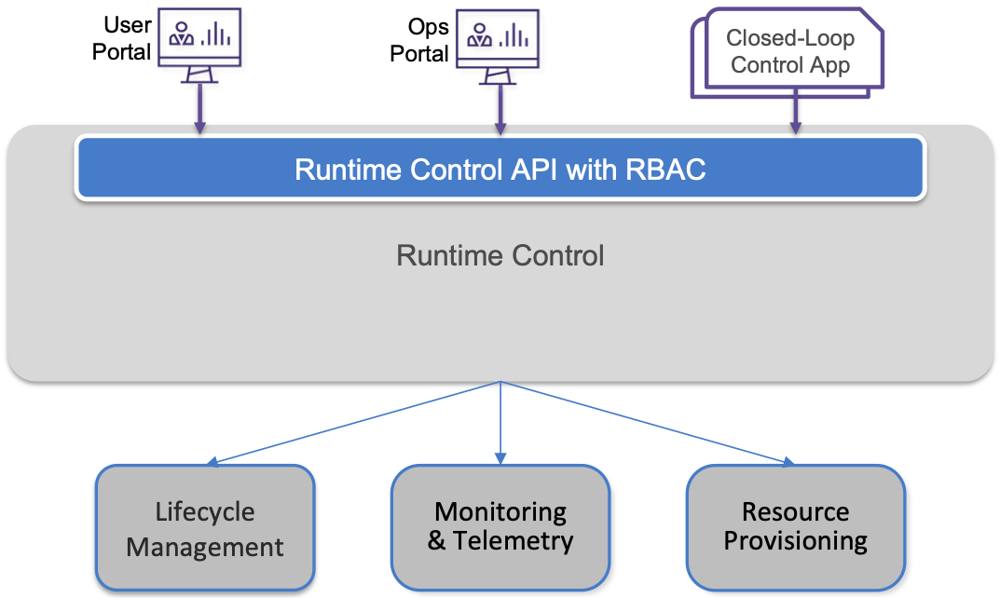

Chapter 5:  Runtime Control
===========================
	
Runtime Control provides an API by which various principals, such as
end-users, enterprise admins, and cloud operators, can make changes to
a running system, by specifying new values for one or more runtime
parameters.

Using Aether’s 5G connectivity service as an example, suppose an
end-user wants to change the *QoS-Profile* setting for their mobile
device. This might include modifying the *Uplink* or *Downlink*
bandwidth, or even selecting a different *Traffic Class*. Similarly,
imagine an enterprise admin wants to add a new *Mission-Critical*
option to the existing set of *Traffic Classes* that *QoS-Profiles*
can adopt. Without worrying about the exact syntax of the API call(s)
for these operations, the Runtime Control subsystem needs to

1. Authenticate the principal wanting to perform the operation.
   
2. Determine if that principal has sufficient privilege to carry out the
   operation.
   
3. Push the new parameter setting(s) to one or more backend components.

4. Record the specified parameter setting(s), so the new value(s)
   persist.
   
In this example, *QoS-Profile* is an abstract object being operated
upon, and while this object must be understood by Runtime Control,
making changes to this object might involve invoking low-level control
operations on multiple subsystems, such as the SD-RAN (which is
responsible for QoS in the RAN), the SD-Fabric (which is responsible
for QoS through the switching fabric), SD-Core UP (which is
responsible for QoS in the mobile core user plane), and SD-Core CP
(which is responsible for QoS in the mobile core control plane).

In short, Runtime Control defines an abstraction layer on top of a
collection of backend components, effectively turning them into
externally visible (and controllable) cloud services. Sometimes a
single backend component implements the entirety of a service, in
which case Runtime Control may add little more than a Triple-A
layer. But for a cloud constructed from a collection of disaggregated
components, Runtime Control is where we define an API that logically
integrates those components into a unified and coherent set of
abstract services. It is also an opportunity to “raise the level of
abstraction” for the underlying subsystems and hiding implementation
details.

One of the surprising challenges in defining abstractions is the
rather pedestrian chore of coming up with suitable names for those
abstractions. Terminology is often overloaded, and different
subsystems may use different names for the same concept. That is
certainly the case with our exemplar 5G connectivity service, starting
with how we refer to various principals. In the following, a *user*
refers to a person using the API or GUI portal (who may or may not
have privileged access), and a *subscriber* refers to someone who uses
a mobile device (it is a term borrowed from the Telco industry). There
is not necessarily a one-to-one relationship between these two
entities, and further to complicate matters, not all devices have
subscribers (e.g., IoT devices are often not associated with a
particular human).

5.1 Design Overview
-------------------

At a high level, the purpose of Runtime Control is to offer an API
that various stakeholders can use to configure and control cloud
services. In doing so, Runtime Control must:

* Support new end-to-end abstractions that may cross multiple backend
  subsystems.
  
* Associate control and configuration state with those abstractions.
  
* Support *versioning* of this configuration state, so changes can be
  rolled back as necessary, and an audit history may be retrieved of
  previous configurations.
  
* Adopt best practices of *performance*, *high availability*,
  *reliability*, and *security* in how this abstraction layer is
  implemented.
  
* Support *Role-Based Access Controls (RBAC)*, so that different
  principals have different visibility into and control over the
  underlying abstract objects.
  
* Be extensible, and so able to incorporate new services and new
  abstractions for existing services over time.
  
Central to this role is the requirement that Runtime Control be able
to represent a set of abstract objects, which is to say, it implements
a *data model*.  While there are several viable options for the
specification language used to represent the data model, for Runtime
Control we use YANG. This is for three reasons. First, YANG is a rich
language for data modeling, with support for strong validation of the
data stored in the models and the ability to define relations between
objects. Second, it is agnostic as to how the data is stored (i.e.,
not directly tied to SQL/RDBMS or NoSQL paradigms), giving us a
generous set of engineering options. Finally, YANG is widely used for
this purpose, meaning there is a robust collection of YANG-based tools
that we can build upon.

.. sidebar:: Web Frameworks

	*The role Runtime Control plays in operationalizing a cloud is
	similar to the role a Web Framework plays in operationalizing
	a web service. If you start with the assumption that certain
	classes of users will interact with your system (in our case,
	an edge cloud) via a GUI, then either you write that GUI in a
	language like PHP (as early web deverlopers did), our you take
	advantage of a framework like Django or Ruby on Rails. What
	such frameworks provide is a way to define a set of
	user-friendely abstractions (these are called Models), a means
	to visualize those abstractions in a GUI (these are called
	Views), and a means to affect change on collection of backend
	systems based on user input (these are called Controllers). It
	is not an accident that Model-View-Controller (MVP) is a
	well-understood design paradigm.*

	*The Runtime Control system described in this chapter adopts a
	similar approach, but instead of defining the models in Python
	(as with Django) or Ruby (as with Ruby on Rails), we define
	models using a declarative language—YANG—which is in turn used
	to generate a programmatic API. This API can then be invoked
	from (1) a GUI, which is itself typically built using another
	framework, such as AngularJS; (2) a CLI; or (3) a closed-loop
	control program. There are other differences—for example,
	Adaptors (a kind of Controller) use gNMI as a standard
	interface for controlling backend components, and persistent
	state is stored in a K/V Store instead of a SQL DB—but the
	biggest difference is the use of a declarative rather than an
	imparative language to define models.*

With this background, :numref:`Figure %s <fig-roc>` shows the internal
structure of Runtime Control for Aether, which has **x-config**\—a
microservice that maintains a set of YANG models—at its core.\ [#]_
x-config, in turn, uses Atomix (a Key/Value-Store microservice), to
make configuration state persistent. Because x-config was originally
designed to manage configuration state for devices, it uses gNMI as
its southbound interface to communicate configuration changes to
devices (or in our case, software services). An Adaptor has to be
written for any service/device that does not support gNMI
natively. These adaptors are shown as part of Runtime Control in
:numref:`Figure %s <fig-roc>`, but it is equally correct to view each
adaptor as part of the backend component, responsible for making that
component management-ready. Finally, Runtime Control includes a
Workflow Engine that is responsible for executing multi-step
operations on the data model. This happens, for example, when a change
to one model triggers some action on another model. Each of these
components are described in more detail in the next section.

.. [#] x-config is a general-purpose, model-agnostic tool. In AMP, it
       manages YANG models for cloud services, but it is also used by
       SD-Fabric to manage YANG models for a set of network switches
       and by SD-RAN to manage YANG models for a set of RAN elements.
       This means multiple instances of the x-config microservice run
       in a given Aether edge cluster.
       
.. _fig-roc:
.. figure:: figures/Slide15.png
   :width: 500px
   :align: center

   Internal structure of Runtime Control, and its relationship to
   backend subsystems (below) and user portals/apps (above).

The Runtime Control API is auto-generated from the YANG-based data
model, and as shown in :numref:`Figure %s <fig-roc>`, supports two
portals and a set of closed-loop control applications. There is also a
CLI (not shown). This API provides a single point-of-entry for **all**
control information that can be read or written in Aether, and as a
consequence, Runtime Control also mediates access to the other
subsystems of the Control and Management Platform (not just the
subsystems shown in :numref:`Figure %s <fig-roc>`). This situation is
illustrated in :numref:`Figure %s <fig-roc2>`, where the key takeaway
is that (1) we want RBAC and auditing for all operations; (2) we want
a single source of authoritative configuration state; and (3) we want
to grant limited (fine-grained) access to management functions to
arbitrary principals rather than assume that only a single privileged
class of operators.

Of course, the private APIs of the underlying subsystems still exist,
and operators can directly use them. This can be especially useful
when diagnosing problems. But for the three reasons given above, there
is a strong argument in favor of mediating all control activity using
the Runtime Control API. This is related to the “What About GitOps?”
question raised at the end of Chapter 4. Now that we have the option
of Runtime Control maintaining authoritative configuration and control
state for the system in its K/V store, how do we “share ownership” of
configuration state with the repositories that implement Lifecycle
Management?

One option is to decide on a case-by-case basis: Runtime Control
maintains authoritative state for some parameters and the code repos
maintain authoritative state for other parameters. We just need to be
clear about which is which, so each backend component knows which
“configuration path” it needs to be responsive to. Then, for any
repo-maintained state for which we want Runtime Control to mediate
access (e.g., to provide fine-grain access for a more expansive set of
principals), we need to be careful about the consequences of any
backdoor (direct) changes to that repo-maintained state, for example,
by storing only a cached copy of that state in Runtime Control’s
K/V-store (as an optimization).

.. _fig-roc2:

   Runtime Control also mediates access to the other Management
   Services.

Another aspect of :numref:`Figure %s <fig-roc2>` worth noting is
that, while Runtime Control mediates all control-related activity, it
is not in the “data path” for the subsystems it controls. This means,
for example, that monitoring data returned by the Monitoring & Logging
subsystem does not pass through Runtime Control; it is delivered
directly to dashboards and applications running on top of the
API. Runtime Control is only involved in authorizing access to such
data. It is also the case that Runtime Control and the Monitoring
subsystem have their own, independent data stores: it is the Atomix
K/V-Store for Runtime Control and a Time-Series DB for Monitoring (as
discussed in more detail in Chapter 6).

In summary, the value of a unified Runtime Control API is best
illustrated by the ability to implement closed-loop control
applications (and other dashboards) that "read" data collected by the
Monitoring subsystem; perform some kind of analysis on that data,
possibly resulting in a decision to take corrective action; and then
"write" new control directives, which x-config passes along to some
combination of SD-RAN, SD-Core, and SD-Fabric, or sometimes even to
the Lifecycle Management subsystem. (We'll see an example the latter
in Section 5.3.) This closed-loop scenario is depicted in
:numref:`Figure %s <fig-roc3>`, which gives a different perspective by
showing the Monitoring subsystem as a "peer" of Runtime Control
(rather than below it), although both perspectives are valid.

.. _fig-roc3:
.. figure:: figures/Slide17.png
   :width: 500px
   :align: center

   Another perspective of Runtime Control, illustrating the value of a
   unified API that supports closed-loop control applications.

5.2 Implementation Details
--------------------------

This section describes each of the components in Runtime Control,
focusing on the role each plays in cloud management.

Models & State
~~~~~~~~~~~~~~

x-config is the core of the Runtime Control. Its job is to store
and version configuration data. Configuration is pushed to x-config
through its northbound gNMI interface, stored in an persistent
Key/Value-store, and pushed to backend subsystems using a southbound
gNMI interface.

A collection of YANG-based models define the schema for this
configuration state. These models are loaded into x-config, and
collectively define the data model for all the configuration and
control state that Runtime Control is responsible for. As an example,
the data model (schema) for Aether is sketched in Section 5.3, but
another example would be the set of OpenConfig models used to manage
network devices.

There are three details of note:

* **Persistent Store:** Atomix is the cloud native K/V-store used to
  persist data in x-config. Atomix supports a distributed map
  abstraction, which implements the Raft consensus algorithm to
  achieve fault-tolerance and scalable performance. x-config writes
  data to and reads data from Atomix using a simple GET/PUT interface
  common to NoSQL databases.
  
* **Loading Models:** A Kubernetes Operator (not shown in the figure),
  is responsible for configuring the models within x-config. Models
  to load into x-config are specified by a Helm chart. The operator
  compiles them on demand and incorporates them into x-config. This
  eliminates dynamic load compatibility issues that are a problem when
  models and x-config are built separately.
  
* **Migration:** All the models loaded into x-config are versioned,
  and the process of updating those models triggers the migration of
  persistent state from one version of the data model to another. The
  migration mechanism supports simultaneous operation of multiple
  versions.

Note that because Atomix is fault-tolerant as long as it runs on
multiple physical servers, it can be built on top of unreliable local
(per-server) storage. There is no reason to use highly available
cloud storage. On the other hand, prudence dictates that all the state
the Runtime Control subsystem maintains be backed up periodically, in
case it needs to be restarted from scratch due to a catastrophic
failure. These checkpoints, plus all the configuration-as-code files
stored in GitHub, collectively define the entirety of the
authoritative state needed to (re-)instantiate a cloud deployment.
  
Runtime Control API
~~~~~~~~~~~~~~~~~~~

An API provides an *interface wrapper* that sits between x-config and
higher-layer portals and applications. Northbound, it offers a RESTful
API. Southbound, it speaks gNMI to x-config. It is entirely possible
to auto-generate the REST API from the set of models loaded into
x-config, although one is also free to augment this set with
additional “hand-crafted” calls for the sake of convenience (although
typically this will mean the API is no longer RESTful).

The Runtime Control API layer serves multiple purposes:

* Unlike gNMI (which supports only **GET** and **SET** operations), a
  RESTful API (which supports **GET**, **PUT**, **POST**, **PATCH**,
  and **DELETE** operations)  is expected for GUI development.
  
* The API layer is an opportunity to implement early parameter
  validation and security checks. This makes it possible to catch
  errors closer to the user, and generate more meaningful error
  messages than is possible with gNMI.
  
* The API layer is an opportunity to implement semantic translation,
  adding methods that go beyond the auto-generated calls.
  
Identity Management
~~~~~~~~~~~~~~~~~~~

Runtime Control leverages an external identity database (i.e. LDAP
server) to store user data such as account names and passwords for
users who are able to log in. This LDAP server also has the capability
to associate users with groups. For example, adding administrators to
the ``AetherAdmin`` group would be an obvious way to grant those
individuals with administrative privileges within Runtime Control.

An external authentication service, Keycloak, serves as a frontend to
a database like LDAP. It authenticates the user, handles the mechanics
of accepting the password, validating it, and securely returning the
group the user belongs to.

.. _reading_dex:
.. admonition:: Further Reading

   `Keycloak: Open Source Identity and Access Management
   <https://www.keycloak.org/>`__.

The group identifier is then used to grant access to resources within
Runtime Control, which points to the related problem of establishing
which classes of users are allowed to create/read/write/delete various
collections of objects. Like identity management, defining such RBAC
policies is well understood, and supported by open source tools. In
the case of Aether, Open Policy Agent (OPA) serves this role.

.. _reading_opf:
.. admonition:: Further Reading

   `Policy-based control for cloud native environments
   <https://www.openpolicyagent.org/>`__.

Adapters
~~~~~~~~

Not every service or subsystem beneath Runtime Control supports gNMI,
and in the case where it is not supported, an adapter is written to
translate between gNMI and the service’s native API. In Aether, for
example, a gNMI :math:`\rightarrow` REST adapter translates between
the Runtime Control’s southbound gNMI calls and the SD-Core
subsystem’s RESTful northbound interface. The adapter is not
necessarily just a syntactic translator, but may also include its own
semantic layer. This supports a logical decoupling of the models
stored in x-config and the interface used by the southbound
device/service, allowing the southbound device/service and Runtime
Control to evolve independently. It also allows for southbound
devices/services to be replaced without affecting the northbound
interface.

Workflow Engine
~~~~~~~~~~~~~~~

The workflow engine, to the left of the x-config in :numref:`Figure %s
<fig-roc>`, is where multi-step workflows are implemented. For
example, defining a new 5G connection or associating devices with an
existing connection is a multi-step process, using several models and
impacting multiple backend subsystems. In our experience, there may
even be complex state machines that implement those steps.

There are well-known open source workflow engines (e.g., Airflow), but
our experience is that they do not match up with the types of
workflows typical of systems like Aether. As a consequence, the
current implementation is ad hoc, with imperative code watching a
target set of models and taking appropriate action whenever they
change. Defining a more rigorous approach to workflows is a subject of
ongoing development.

Secure Communication
~~~~~~~~~~~~~~~~~~~~

gNMI naturally lends itself to mutual TLS for authentication, and that
is the recommended way to secure communications between components
that speak gNMI. For example, communication between x-config and
its adapters uses gNMI, and therefore, uses mutual TLS. Distributing
certificates between components is a problem outside the scope of
Runtime Control. It is assumed that another tool will be responsible
for distributing, revoking, and renewing certificates.

For components that speak REST, HTTPS is used to secure the
connection, and authentication can take place using mechanisms within
the HTTPS protocol (basic auth, tokens, etc). Oath2 and OpenID Connect
are leveraged as an authorization provider when using these REST APIs.

5.3 Modeling Connectivity Service
----------------------------------------

This section sketches the data model for Aether's connectivity service
as a way of illustrating the role Runtime Control plays. These models
are specified in YANG (for which we include a concrete example of one
of the models), but since the Runtime Control API is generated from
these specs, it is equally valid to think in terms of an API that
supports REST's GET, POST, PATCH, DELETE operations on a set of
objects (resources):

* GET: Retrieve an object.
* POST: Create an object.
* PUT,  PATCH: Modify an existing object.
* DELETE: Delete an object.

Each object is an instance of one of the YANG-defined models, where
every object contains an `id` field that is used to identify the
object. These identifiers are unique to the model, but not necessarily
across all models.

Some objects contain references to other objects. For example, many
objects contain references to the `Enterprise` object, which allows
them to be associated with a particular enterprise. That is,
references are constructed using the `id` field of the referenced
object. Note that one of the features of the mechanisms described in
the previous section is that they flag attempts to create a reference
to an object that does not exist and attempts to delete an object
while there are open references to it from other objects as errors.

In addition to the `id` field, several other fields are also common to
all models. These include:

* `description`: A human-readable description, used to store additional context about the object.
* `display-name`: A human-readable name that is shown in the GUI.

As these fields are common to all models, we omit from the per-model
descriptions that follow. Note that in the model-specific details that
follow, we use upper case to denote a model (e.g., `Enterprise`) and
lower case to denote a field within a model (e.g., `enterprise`).

Enterprises
~~~~~~~~~~~~

Aether is deployed in enterprises, and so needs to define
representative set of organizational abstractions. These include
`Enterprise`, which forms the root of a customer-specific
hierarchy. The `Enterprise` model is referenced by many other objects,
and allows those objects to be scoped to a particular Enterprise for
ownership and role-based access control purposes. `Enterprise`
contains the following fields:

* `connectivity-service`: A list of backend subsystems that implement
  connectivity for this enterprise. Corresponds to an API endpoint to
  the SD-Core, SD-Fabric, and SD-RAN.

`Enterprises` are further divided into `Sites`. A site is a point of
presence for an `Enterprise` and may be either physical or logical
(i.e. a single geographic location could contain several logical
sites). `Site` contains the following fields:

* `enterprise`: A link to the `Enterprise` that owns this site.
* `imsi-definition`: A description of how IMSIs are constructed for
  this site. Contains the following sub-fields:

   * `mcc`: Mobile country code.
   * `mnc`: Mobile network code.
   * `enterprise`: A numeric enterprise id.
   * `format`: A mask that allows the above three fields to be
     embedded into an IMSI. For example `CCCNNNEEESSSSSS` will
     construct IMSIs using a 3-digit MCC, 3-digit MNC, 3-digit ENT,
     and a 6-digit subscriber.

The `imsi-definition` is specific to the mobile cellular network, and
corresponds to the unique identifier burned into every SIM card.

Connectivity Service
~~~~~~~~~~~~~~~~~~~~~~~~

The managed service Aether offers enterprises is 5G connectivity,
which we can abstractly think of a means to connect mobile devices to
application programs. This results in the following model definitions,
starting with `Virtual Cellular Service (VCS)`. The `VCS` model
connects a `Device-Group` to an `Application`, and has the following
fields:

* `device-group`: A list of `Device-Group` objects that can participate in this `VCS`. Each
  entry in the list contains both the reference to the `Device-Group` as well as an `enable`
  field which may be used to temporarily remove access to the group.
* `application`: A list of `Application` objects that are either allowed or denied for this
  `VCS`. Each entry in the list contains both a reference to the `Application` as well as an
  `allow` field which can be set to `true` to allow the application or `false` to deny it.
* `template`: Reference to the `Template` that was used to initialize this `VCS`.
* `upf`: Reference to the User Plane Function (`UPF`) that should be used to process packets
  for this `VCS`. It's permitted for multiple `VCS` to share a single `UPF`.
* `ap`: Reference to an Access Point List (`AP-List`) that lists the access points for this
  `VCS`.
* `enterprise`: Reference to the `Enterprise` that owns this `VCS`.
* `sst`, `sd`, `uplink`, `downlink`, `traffic-class`: Parameters that
  are initialized using a selected `template` (described below).

At one end of the connectivity service is a `Device-Group`, which
identifies a set of devices that are to be treated the same.
`Device-Group` contains the following fields:

* `imsis`: A list of IMSI ranges. Each range has the following
  fields:

   * `name`: Name of the range. Used as a key.
   * `imsi-range-from`: First subscriber in the range.
   * `imsi-range-to`: Last subscriber in the range. Can be omitted if
     the range only contains one IMSI.
* `ip-domain`: Reference to an `IP-Domain` object that describes the
  IP and DNS settings for UEs within this group.
* `site`: Reference to the site where this `Device-Group` may be
  used. Indirectly identifies the `Enterprise` as `Site` contains a
  reference to `Enterprise`.

At the other end of the connectivity service is an `Application`,
which specifies the endpoints for the program devices talk to. It
contains the following fields:

* `endpoint`: A list of endpoints. Each has the following
  fields:

   * `name`: Name of the endpoint. Used as a key.
   * `address`: The DNS name or IP address of the endpoint.
   * `port-start`: Starting port number.
   * `port-end`. Ending port number.
   * `protocol`: `TCP|UDP`, specifies the protocol for the endpoint.
* `enterprise`: Link to an `Enterprise` object that owns this application. May be left empty
  to indicate a global application that may be used by multiple enterprises.

QoS Profiles
~~~~~~~~~~~~~~~~~~~~~

Associated with each connection is a QoS-related profile that governs
how traffic that connection carries is to be treated. This starts with
a `Template` model, which defines the valid (accepted) connectivity
settings. Aether Operations is responsible for defining these (the
features they offer must be supported by the backend subsystems), with
enterprises selecting the template they want applied to any instances
of the connectivity service they create (e.g., via a drop-down
menu). That is, templates are used to initialize `VCS` objects. The
`Template` model has the following fields:

* `sst`, `sd`: Slice identifiers.
* `uplink`, `downlink`: Guaranteed uplink and downlink bandwidth.
* `traffic-class`: Link to a `Traffic-Class` object that describes the
  type of traffic.

Note that a `slice`, like an `imsi`, is a 5G-specific term, which you
can think of as representing an isolated channel with associated QoS
parameters. It is of particular note to our discussion because,
although it is "hidden" within the `Template` model (i.e., it is an
implementation detail), it is realized by spinning up an entirely new
copy of the SD-Core. This is done to ensure isolation, but it also
illustrates a touch-point between Runtime Control and the Lifecycle
Management subsystem: Runtime Control, via an Adaptor, engages
Lifecycle Management to launch the necessary set of Kubernetes
containers that implement an isolated slice.
  
The `Traffic-Class` model, in turn, specifies the classes of traffic,
and includes the following fields:

* `qci`: QoS class identifier.
* `pelr`: Packet error loss rate.
* `pdb`: Packet delay budget.

For completeness, the following shows the corresponding YANG for the
`Template` model. The example omits some introductory boilerplate for
the sake of brevity. The example highlights the nested nature of the
model declarations, with both ``container`` and ``leaf`` fields.

.. literalinclude:: code/template.yang

Other Models
~~~~~~~~~~~~~~~~

The above description references other models, which we do not fully
described here. They include `AP-List`, which specifies a list of
access points (radios); `IP-Domain`, which specifies IP and DNS
settings; and `UPF`, which specifies the User Plane Function (the data
plane element of the SD-Core) that should forward packets on behalf of
this particular instance of the connectivity service. The `UPF` model
is necessary because Aether supports two different implementations:
one runs as a microservice on a server and the other runs as a P4
program loaded into the switching fabric, as described in a companion
book.

.. _reading_sdn:
.. admonition:: Further Reading 

   `Software-Defined Networks: A Systems Approach 
   <https://sdn.systemsapproach.org>`__

