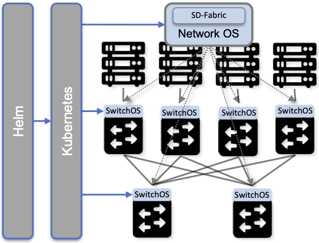

Chapter 1:  Introduction
========================
	
Clouds provide a set of tools for bringing up and operating scalable
services, but how do you operationalize a cloud in the first place?
The two problems are not mutually exclusive—after all, a cloud is
realized as a set of services—but asking the question this way
eliminates the temptation to give the answer “the cloud takes care of
that for you.” This book describes how to operationalize a cloud,
starting with bare-metal hardware, all the way to offering one or more
managed services to users.

Few of us are likely to have reason to instantiate a hyperscale
datacenter, but deploying private edge clouds in an enterprise—and
optionally connecting that edge to a datacenter to form a hybrid
cloud—is becoming increasingly common. We use the term "edge cloud" to
distinguish our focus from the "core", which is the traditional domain
of they hyperscale operators. The edge is more likely to be in a
enterprise or an "Internet of Things" setting such as a factory. The
edge is the place where the cloud services connect to the real world,
e.g., via sensors and actuators, and where latency-sensitive services
are deployed to be close to the consumers of those services. 

The hyperscalers are indeed willing to manage your edge cloud for you,
as an extension of their core datacenters. And correspondingly, there
is significant activity to provide such products, with Google’s
Anthos, Microsoft’s Azure Arc, and Amazon’s ECS-Anywhere as prime
examples. But the barrier to operationalizing a cloud is not so high
that only a hyperscaler has the wherewithal to do it. It is possible
to build a cloud—and all the associated lifecycle management and
runtime controls that are required to operate it—using readily
available open source software packages.

This book describes what such a cloud management platform looks
like. Our approach is to focus on the fundamental problems that must
be addressed—design issues that are common to all clouds—but then
couple this conceptual discussion with specific engineering choices
made while operationalizing a specific enterprise cloud. Our example
is Aether, an ONF project to support 5G-enabled edge clouds as a
managed service. Aether has the following properties that make it an
interesting use case to study:

* Aether starts with bare-metal hardware (servers and switches)
  deployed in edge sites (e.g., enterprises). This on-prem cloud can
  range in size from a partial rack to multi-rack cluster, assembled
  according to the best practices used in datacenters.

* Aether supports both “edge services” running on these on-prem
  clusters and “centralized services” running in commodity cloud
  datacenters. In this sense it is a hybrid cloud.\ [#]_
  
* Aether augments this edge cloud with 5G-Connectivity-as-a-Service,
  giving us a service that must be operationalized (in addition to the
  underlying cloud). The end result is that Aether provides managed
  Platform-as-a-Service (PaaS).
  
* Aether is built entirely from open source components. The only thing
  it adds is the “glue code” and “specification directives” required
  to make it operational. This means the recipe is fully reproducible
  by anyone.
  
.. [#] Technically, Aether is also a multi-cloud because it is
       designed to take advantage of services provided by multiple
       public clouds, but the private/public (edge/central) aspect is
       the most relevant, so we use hybrid terminology throughout this book.

There is another important reason Aether makes for an interesting
example. It is a system being deployed at the confluence of three
traditionally distinct management domains: enterprises (where system
admins have long been responsible for installing and maintaining
purpose-built appliances), network operators (where access
technologies have historically been delivered as Telco-based
solutions), and cloud providers (where commodity hardware and cloud
native software is now readily available). This complicates our job,
because each of these three domains brings its own conventions and
terminology to the table. But understanding how these three
stakeholders approach operationalization gives us a broader
perspective on the problem. We return to the confluence of enterprise,
cloud, access technologies later in this chapter, but we start by
addressing the terminology challenge.

.. _reading_aether:
.. admonition:: Further Reading

   `Aether: 5G-Connected Edge Cloud
   <https://opennetworking.org/aether/>`__.

1.1 Terminology
---------------

The terminology used to talk about operationalizing cloud services
represents a mix of “modern” concepts that are native to the cloud,
and “traditional” concepts that are artifacts from earlier systems
(many of which are now being subsumed by the cloud, but retain some of
their original operational language). This is especially true at the
intersection of the cloud and network operators (e.g., Telcos),
who—like the Sami of Scandinavia that have over 180 words for
snow—have an exceedingly rich vocabulary for *operating* a network.

A major source of confusion is that we are in the midst of a
transition from network systems being built from purpose-built
*devices* to software-based *services* running on commodity
hardware. This often results in multiple terms being used for the same
concept, or more problematically, having one domain subtly repurpose a
term from another domain. To avoid talking past each other, it is
important to first define a few concepts and introduce the related
terminology.

* **Operations & Maintenance (O&M):** A traditional term used to
  characterize the overall challenge of operationalizing a network,
  where generally speaking, operators use an O&M Interface to manage
  the system.
  
  * **FCAPS:** An acronym (Fault, Configuration, Accounting, Performance,
    Security) historically used in the Telco industry to enumerate the
    requirements for an operational system. The O&M interface must
    provide a means to detect and manage faults, configure the system,
    account for usage, and so on.

  * **OSS/BSS:** Another Telco acronym (Operations Support System,
    Business Support System), referring to the subsystem that
    implements both operational logic (OSS) and business logic
    (BSS). It is usually the top-most component in the overall O&M
    hierarchy.
    
  * **EMS:**  Yet another Telco acronym (Element Management System),
    corresponding to an intermediate layer in the overall O&M
    hierarchy. An EMS is to a particular type of device what an
    OSS/BSS is to the network as a whole.

* **Orchestration:** A general term similar to O&M, but originating in
  the cloud context. Involves assembling (e.g., allocating,
  configuring, connecting) a collection of physical or logical
  resources on behalf of some workload. If only a single resource or
  device is involved, we would probably use a term like
  “configuration” instead, so orchestration typically implies
  “orchestrating” across multiple components.
  
  Narrowly defined, an orchestrator is responsible for spinning up
  virtual machines (or containers) and logically interconnecting them
  (with virtual networks). More broadly, orchestration encompasses all
  the management-related functions described in this book, which is to
  say, the terms “orchestrating” and “operationalizing” can be used as
  synonyms. Finally, if you are trying to map cloud terminology onto
  Telco terminology, an orchestrator is often equated with a
  cloudified OSS/BSS mechanism.
  
  * **Playbook/Workflow:** A program or script that implements a
    multi-step orchestration process. (The term workflow is also used
    in a UX context to describe a multi-step operation that a user
    performs on a system using a GUI.)
    
* **Provisioning:** Adding capacity (either physical or virtual
  resources) to a system, usually in response to changes in workload,
  including the initial deployment.
  
  * **Zero-Touch Provisioning:** Usually implies adding new hardware
    without requiring a human to configure it (beyond physically
    connecting the device). This implies the new component
    auto-configures itself, which means the term can also be applied
    to virtual resources (e.g., virtual machines, services) to
    indicate that no manual configuration step is needed to
    instantiate the resource.
    
  * **Remote Device Management:** A standard (e.g., IPMI, Redfish) that
    defines a way to remotely manage hardware devices in support of
    zero-touch provisioning. The idea is to send and receive
    out-of-band messages over the LAN in place of having serial
    console access to the device.
    
  * **Inventory Management:** Tracking deployed physical hardware is a
    sub-step of the provisioning process.
    
* **Lifecycle Management:** Upgrading and replacing functionality (e.g.,
  new services, new features to existing services) over time.
  
  * **Continuous Integration / Continuous Deployment (CI/CD):** An
    approach to Lifecycle Management in which the path from
    development (producing new functionality) to testing, integration,
    and ultimately deployment is an automated pipeline. CI/CD
    typically implies continuously making small incremental changes
    rather than performing large disruptive upgrades.
    
  * **DevOps:** An engineering discipline (usually implied by CI/CD)
    that balances feature velocity against system stability. It is a
    practice typically associated with container-based (also known as
    *cloud native*) systems, as typified by *Site Reliability
    Engineering (SRE)* practiced by cloud providers like Google.
    
  * **In-Service Software Upgrade (ISSU):** A requirement that a
    component continue running during the deployment of an upgrade,
    with minimal disruption to the service delivered to
    end-users. ISSU generally implies the ability to incrementally
    roll-out (and roll-back) an upgrade, but is specifically a
    requirement on individual components (as opposed to the underlying
    platform used to manage a set of components).
    
* **Monitoring & Logging:** Collecting data from system components to aid
  in management decisions. This includes diagnosing faults, tuning
  performance, doing root cause analysis, performing security audits,
  and provisioning additional capacity.
  
  * **Analytics:** A program (often using statistical models) that
    produces additional insights (value) from raw data. It can be used
    to close a control loop (i.e., auto-reconfigure a system based on
    these insights), but could also be targeted at a human operator
    that subsequently takes some action.
    
Another way to talk about operations is in terms of stages, leading to
a characterization that is common for traditional network devices:

* **Day (-1):** Hardware configuration that is applied to a device (e.g.,
  via a serial console) when it is first powered on. These
  configurations correspond to BIOS settings, and often need knowledge
  of how the device is physically connected to the network (e.g., the
  port being used).
  
* **Day 0:** Connectivity configuration required to establish
  communication between the device and the available network services
  (e.g., setting a device’s IP address and default router). While such
  information may be provided manually, this is an opportunity to
  auto-configure the device, in support of Zero-Touch Provisioning.
  
* **Day 1:** Service-level configuration needed by the device, including
  parameters that allow the device to take advantage of other services
  (e.g., NTP, Syslog, SMTP, NFS), as well as setting the parameters
  this device needs to perform whatever service it provides. At the
  end of Day-1 operationalization, the device is considered
  up-and-running, and able to support user traffic. This is also an
  opportunity for zero-touch provisioning, in the sense that
  pre-programmed playbooks (workflows) should be able to
  auto-configure the device rather than depending on human
  intervention.
  
* **Day 2..N:** On-going management in support of day-to-day operations,
  coupled with monitoring the network to detect failures and service
  degradation, with the goal of sustaining the service. This may
  involve some closed-loop control, but is often human-intense, which
  involves monitoring a dashboard and fielding alerts, and then
  re-configuring the system as necessary. This is often referred to
  simply as "Day 2 Operations".
  
Again, “Day x” is how traditional network vendors characterize the
process of operationalizing the devices they sell, which in turn
dictates how network operators and enterprise system admins bring
those devices online. While the general framework has been extended to
Virtual Network Functions (VNFs), it is still a device-centric view of
operations. But once a system becomes cloud native, two things happen
that shift the balance of concerns. First, all hardware is commodity,
and so Days 0 and 1 configurations become fully automated (and Day -1
is minimized since all devices are identical).\ [#]_ Second, Day 2
operations become a much more sophisticated process. This is because
software-based systems are more agile, making functional upgrades more
commonplace. This focus on *feature velocity* is one of the inherent
values of cloud-based systems, but not surprisingly, it brings its own
set of challenges to management.

.. [#] Colloquially, this is sometimes referred to as a shift from
       taking care of pets to one of herding cattle.
       
1.2 Disaggregation
------------------

To fully understand the challenge of operationalizing a cloud, we have
to start with the underlying building blocks: a collection of
software-based microservices running on commodity hardware. These
building blocks are the consequence of having *disaggregated* the
bundled and purpose-built network appliances that came before, and so
from the management perspective, it is helpful to identify what
becomes easier and what becomes harder when you make this
transition. This is both the challenge and the opportunity of
disaggregation.

Broadly speaking, disaggregation is the process of breaking large
bundled components into a set of smaller constituent parts. SDN is one
example of disaggregation—it decouples the network’s control and data
planes, with the former running as a cloud service and the latter
running in commodity switches. The microservice architecture is
another example of disaggregation—it breaks monolithic cloud
applications into a mesh of single-function components. Disaggregation
is widely viewed as an essential step in accelerating feature velocity.
This is the opportunity side of the story, which is nicely summarized
by Weaveworks.

.. _reading_disaggregate:
.. admonition:: Further Reading

   Weaveworks. `What You Need to Know for Cloud Native
   <https://www.weave.works/technologies/going-cloud-native-6-essential-things-you-need-to-know>`__.
   
The challenge side of the story is that there are many more moving
parts that have to be integrated, coordinated, and managed. Circling
back to terminology, Orchestration and Lifecycle Management become the
dominant issues because (a) many smaller parts have to be assembled,
and (b) these individual parts are expected to change more
frequently. Much of this book focuses on these two issues.

The good news is that the industry seems to have converged on
*containers* as the common representation for “component packaging”
and Kubernetes as the first-level *container orchestrator*. (We say
“first-level” because Kubernetes is not sufficient by itself.) This
foundation, in turn, makes many of the other challenges more
manageable:

* Monitoring and Logging mechanisms are themselves realized as a set
  of container-based microservices, deployed within the cloud they
  observe.
  
* ISSU becomes more tractable because the microservice architecture
  encourages stateless components, with persistent state isolated in a
  single function-agnostic storage service, such as a key/value store.
  
* Zero-Touch Provisioning is more tractable because the hardware is
  commodity, and hence, (nearly) identical. This also means the vast
  majority of configuration involves initiating software parameters,
  which is more readily automated.
  
* Cloud native implies a set of best-practices for addressing many of
  the FCAPS requirements, especially as they relate to availability
  and performance, both of which are achieved through horizontal
  scaling. Secure communication is also typically built into cloud RPC
  mechanisms.
  
Another way to say this is that by rearchitecting bundled appliances
and devices as horizontally scalable microservices running on
commodity hardware, what used to be a set of one-off O&M problems are
now solved by widely applied best-practices from distributed systems,
which have in turn been codified in state-of-the-art cloud management
frameworks (like Kubernetes). This leaves us with the problem of (a)
provisioning commodity hardware, (b) orchestrating the container
building blocks, (c) deploying microservices to collect and archive
monitoring data in a uniform way, and (d) continually integrating and
deploying individual microservices as they evolve over time.

Finally, because a cloud is infinitely programmable, the system being
managed has the potential to change substantially over time.\ [#]_
This means that the cloud management system must itself be easily
extended to support new features (as well as the refactoring of
existing features). This is accomplished in part by implementing the
cloud management system as a cloud service, which means we will see a
fair amount of recursive dependencies throughout this book. It also
points to taking advantage of declarative specifications of how all
the disaggregated pieces fit together. These specifications can then
be used to generate elements of the management system, rather than
having to manually recode them. This is a subtle issue we will return
to in later chapters, but ultimately, we want to be able to
auto-configure the subsystem responsible for auto-configuring the rest
of the system.

.. [#] For example, compare the two services Amazon offered ten years
       ago (EC2 and S3) with the well over 100 services available on
       the AWS console today (not counting the marketplace of
       partner-provided services).
       

1.3 Cloud Technology
--------------------

Being able to operationalize a cloud starts with the building blocks
used to construct the cloud in the first place. This section
summarizes the available technology, with the goal of identifying the
baseline capabilities of the underlying system. This baseline is then
assumed by the collection of management-related subsystems described
throughout this book.

Before identifying these building blocks, we need to acknowledge that
we are venturing into a gray area, having to do with what you consider
to be “part of the platform being managed” versus “part of the
subsystem that manages the platform.” To further complicate matters,
where you draw the line shifts over time as technology matures and
becomes ubiquitous.

For example, if you start with the premise that a cloud hosts a set of
containers, then your management layer would be responsible for
detecting and restarting failed containers. On the other hand, if you
assume containers are resilient (i.e., able to auto-recover), then the
management layer would not need to include that functionality
(although it probably still needs to detect when the auto-recovery
mechanism fails and correct for that). This is not a unique
situation—complex systems often include mechanisms that address
problems at multiple levels. For the purpose of this book, we just
need to decide on a line that separates “technology that is assumed”
from “problems that remain and how we address them.” The following
identifies the technology we assume.

1.3.1 Hardware Platform
~~~~~~~~~~~~~~~~~~~~~~~

The assumed hardware building blocks are straightforward. We start
with bare-metal servers and switches, built using merchant silicon
chips. These might, for example, be ARM or x86 processor chips and
Tomahawk or Tofino switching chips, respectively. The bare-metal boxes
also include a bootstrap mechanism (e.g., BIOS for servers and ONIE
for switches), and a remote device management interface (e.g., IPMI or
Redfish).

.. _reading_redfish:
.. admonition:: Further Reading

   Distributed Management Task Force (DMTF) `Redfish
   <https://www.dmtf.org/standards/redfish>`__.

A physical cloud cluster is then constructed with the hardware
building blocks arranged as shown in :numref:`Figure %s <fig-hw>`: one
or more racks of servers connected by a leaf-spine switching
fabric. The servers are shown above the switching fabric to emphasize
that software running on the servers controls the switches.

.. _fig-hw:

   Example building block components used to construct a cloud,
   including commodity servers and switches, interconnected by a
   leaf-spine switching fabric.
   
:numref:`Figure %s <fig-hw>` also includes the assumed low-level
software components, which we describe next. Collectively, all the
hardware and software components shown in the figure form the
*platform*. Where we draw the line between what's *in the platform*
and what runs *on top of the platform*, and why it is important, will
become clear in later chapters, but the summary is that different
mechanisms will be responsible for (a) bringing up the platform and
prepping it to host workloads, and (b) managing the various workloads
that need to be deployed on that platform.

1.3.2 Software Building Blocks
~~~~~~~~~~~~~~~~~~~~~~~~~~~~~~

We assume three foundational software technologies, all running on the commodity processors in the cluster:

1. Docker containers package software functionality.
   
2. Kubernetes instantiates and interconnects containers.

3. Helm charts specify how collections of related containers are
   interconnected to build applications.
   
These are all well known and ubiquitous, and so we only summarize them
here. Links to related information for anyone that is not familiar
with them (including excellent hands-on tutorials for the three
software building blocks) are given below.

Docker is a platform for instantiating and running a set of
containers, each of which defines a self-contained software package,
called a Docker image. Docker images are specified by a Dockerfile,
which effectively defines all the dependencies required by the
software that’s to run in the container, making the corresponding
container image portable across servers. We also assume one or more
repositories of Docker containers that we will want to deploy in our
cloud, of which `<https://hub.docker.com/>`__ is the best known
example.

.. _reading_docker:
.. admonition:: Further Reading

   `Docker Tutorial
   <https://www.docker.com/101-tutorial>`__.

Kubernetes is a container management system. It provides a
programmatic interface for scaling container instances up and down,
setting up virtual networks to interconnect those instances, and
opening service ports that external clients can use to access those
instances. Behind the scenes, Kubernetes monitors the liveness of
those containers, and automatically restarts any that have failed. In
other words, if you instruct Kubernetes to spin up three instances of
microservice X, Kubernetes will do its best to keep three instances of
the container that implements X running at all times.

.. _reading_k8s:
.. admonition:: Further Reading

   `Kubernetes Tutorial
   <https://kubernetes.io/docs/tutorials/kubernetes-basics/>`__.

Helm is a package manager that runs on top of Kubernetes. It issues
calls against the Kubernetes API according to an operator-provided
specification, known as a *Helm Chart*. It is now common practice for
cloud applications built from a set of microservices to publish a Helm
chart that defines how the application is to be deployed on a
Kubernetes cluster. See `<https://artifacthub.io/>`__ for a collection of
publicly available Helm Charts.

.. _reading_helm:
.. admonition:: Further Reading

   `Helm Tutorial
   <https://helm.sh/docs/intro/quickstart/>`__.

The cloud management software described in this book is available in
the form of a set of Docker containers, plus the associated Helm
Charts that specify how they are to be deployed in a Kubernetes
cluster. Overall, we make use of over 20 such open source software
packages in the chapters that follow. Our goal is to show how all
these open building blocks can be assembled into a comprehensive cloud
management platform. We describe each tool in enough detail to
appreciate how all the parts fit together—providing end-to-end
coverage by connecting all the dots—plus links to full documentation
for those that want to dig deeper into the details.

..
   List: NexBox, Ansible, Netplan, Terraform, Rancher, Fleet,
   Prometheus, Grafana, AlertManager, Jenkins, Robot, Selenium,
   onos-config, Atomix, OPF, Kibana, Logstash, Elasticsearch,
   Kubernetes, Helm, Docker (21)

1.3.3 Switching Fabric
~~~~~~~~~~~~~~~~~~~~~~

We assume the cloud is constructed using an SDN-based switching
fabric, with a disaggregated control plane running in the same cloud
as the fabric interconnects. For the purpose of this book, we assume
the following SDN software stack:

* A Network OS hosts a set of control applications, including a
  control application that manages the leaf-spine switching fabric. We
  use ONOS as an open source exemplar Network OS. ONOS, in turn, hosts
  the SD-Fabric control app.
  
* A Switch OS runs on each switch, providing a northbound gNMI and
  gNOI interface through which the Network OS controls and configures
  each switch. We use Stratum as an open source exemplar Switch OS.
  
Building a cloud using an SDN-based switching fabric is a best
practice adopted by hyperscaler cloud providers. Their solutions
remain proprietary, so we use ONOS and Stratum as open source
examples. It is noteworthy that ONOS and Stratum are both packaged as
Docker containers, and so can be orchestrated (on *both* servers and
switches) by Kubernetes and Helm.\ [#]_

.. [#] Switches often include a commodity processor, typically running
       Linux and hosting control software, in addition to any
       switching chip that implements the data plane. Stratum runs on
       this processor, and exports a northbound API that ONOS uses to
       configure and control the switch.
       
1.3.4 Repositories
~~~~~~~~~~~~~~~~~~

For completeness, we need to mention that nearly every mechanism
described in this book takes advantage of cloud-hosted repositories,
most notably GitHub, but also artifact-specific repos like DockerHub
and ArtifactHub. We also assume complementary systems like Gerrit,
which layer a code-review mechanism on top GitHub, but having direct
experience with Gerrit is not critical to understanding the material.

.. _reading_github:
.. admonition:: Further Reading

   `GitHub Tutorial
   <https://guides.github.com/activities/hello-world/>`__.

   `Gerrit Code Review
   <https://www.gerritcodereview.com/>`__.

1.3.5 Other Options
~~~~~~~~~~~~~~~~~~~

Just as important as what building blocks we take for granted are the
technologies we do not include. We discuss three here.

First, you might have expected Service Mesh frameworks like Istio or
Linkerd to be included. While it is true that anyone running
applications on top of Kubernetes might decide to use Istio or Linkerd
to help do that job—and this includes us, since much of the management
system described in this book is implemented as a set of
microservices—we happen to not take that approach. This is primarily
an engineering choice: Service Meshes provide more features than we
need, and correspondingly, we are able to realize the necessary
functionality using more narrowly focused mechanisms. There is also a
pedagogical reason: The fine-grain components we use are more
consistent with our goal of identifying the elemental pieces of
operations and management, rather than having those components bundled
in a comprehensive package. We do, however, return to the role of
service meshes in later chapters.

Second, we assume a container-based cloud platform. An alternative
would have been VM-based. The main reason for this choice is that
containers are rapidly becoming the de facto way to deploy scalable
and highly available functionality, and operationalizing such
functionality in enterprises is our primary use case. Containers are
sometimes deployed inside of VMs (rather than directly on physical
machines), but in that case, the VMs can be viewed as part of the
underlying infrastructure (rather than a service that is offered to
users). Another way of saying this is that this book focuses on how to
operationalize a Platform-as-as-Service (PaaS) rather than a
Infrastructure-as-a-Service (IaaS), although later chapters will
describe how to introduce VMs as an optional way to provision the
underlying infrastructure for that PaaS.

.. sidebar:: What's the Master Plan?

  *There is a general issue of how one makes engineering choices about
  the combination of software packages to use in a cloud-based system
  like this book describes. Ignoring the plethora of commercial
  offerings, just the number of open source projects at the Linux
  Foundation and the Apache Foundation available to help you build and
  operate a cloud is (by our count) approaching 100. These projects
  are largely independent, and in many cases, competing for mindshare.
  This results in significant overlap in functionality, with any Venn
  diagram you try to draw constantly shifting over time as projects
  add and deprecate features.*

  *This is all to say, there is no master plan for what a cloud
  management stack should look like. If you start with component X as
  the centerpiece of your approach—perhaps because it solves your most
  immediate problem—you will end up adding dozens of other components
  over time to fully complete the system.  Moreover, the end result
  will likely look different from the system someone else constructs
  starting with component Y. There simply is no consensus framework
  for which you get to select a component from column A, a second
  complementary component from column B, and so on.  This is also true
  for the Aether managed service we use as an exemplar.*
  
  *This makes it all the more important that we take a first
  principles approach, which starts by identifying the set of
  requirements and exploring the design space. Only as a final step do
  we select an existing software component.  This approach naturally
  results in an end-to-end solution that assembles many smaller
  components, and tends to avoid bundled/multi-faceted solutions. This
  does not inoculate us from having to evolve the system over time,
  but it does help to approach the topic with visibility into the full
  scope and complexity of the design space. And even if one ends up
  adopting a bundled solution, understanding all the trade-offs being
  made under the covers will help to make a more informed decision.*

Finally, the Aether edge cloud we use as an example is similar to many
other edge cloud platforms now being promoted as an enabling
technology for Internet-of-Things. That Kubernetes-based on-prem/edge
clouds are becoming so popular is one reason they make for such a good
case study. For example, *Smart Edge Open* (formerly known as
OpenNESS) is another open source edge platform, unique in that it
includes several Intel-specific acceleration technologies (e.g., DPDK,
SR-IOV, OVS/OVN). For our purposes, however, the exact set of
components that make-up the platform is less important how the
platform, along with all the cloud services that run on top of it, are
managed as a whole. The Aether example allows us to be specific, but
hopefully not at the expense of general applicability.

.. _reading_openness:
.. admonition:: Further Reading

   `OpenNESS: Open Network Edge Services Software
   <https://www.openness.org/>`__.

1.4 Future of the Sys-Admin
---------------------------

System administrators have been responsible for operating enterprise
networks since the first file servers, client workstations, and LANs
were deployed over 30 years ago. Throughout that history, a robust
vendor ecosystem has introduced an increasingly diverse set of network
appliances, compounding the challenge of the admin’s job. The
introduction of virtualization technology led to server consolidation,
but did not reduce the management overhead. This is because each
virtual appliance remains in a management silo.

Cloud providers, because of the scale of the systems they build,
cannot survive with operational silos, and so they introduced
increasingly sophisticated cloud orchestration
technologies. Kubernetes and Helm are two high-impact examples. These
cloud best-practices are now available to enterprises as well, but
they are often bundled as a managed service, with the cloud provider
playing an ever-greater role in operating the enterprise’s
services. Outsourcing IT responsibility to a cloud provider is an
attractive value proposition for many enterprises, but comes with the
risk of increased dependence on a single provider. This equation is
complicated by the increased likelihood that Mobile Network Operators
(MNOs) also participate in the rollout of private 5G connectivity
within the enterprise, deployed as yet another cloud service.

The approach this book takes is to explore a best-of-both-worlds
opportunity. It does this by walking you through the collection of
subsystems, and associated management processes, required to
operationalize an on-prem cloud, and then provide on-going support for
that cloud and the services it hosts (including 5G connectivity). Our
hope is that understanding what’s under the covers of cloud-managed
services will help enterprises better share responsibility for
managing their IT infrastructure with cloud providers, and potentially
MNOs.

