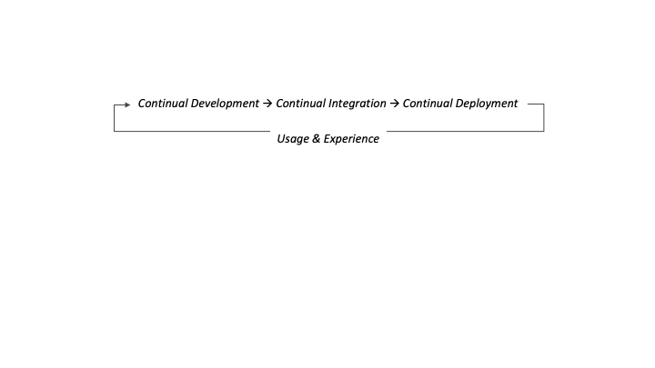
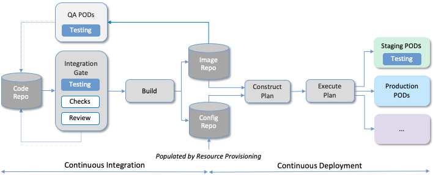
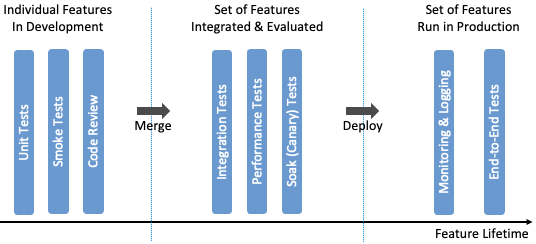
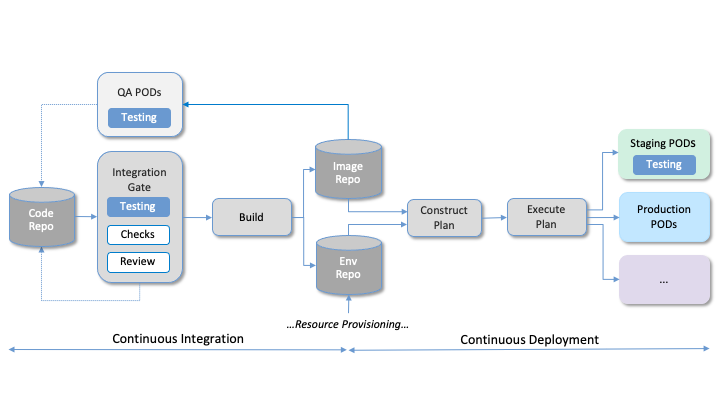
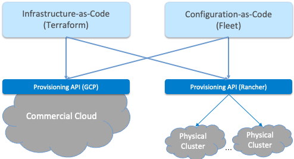

Chapter 4:  Lifecycle Management
================================

Lifecycle Management is concerned with updating and evolving a running
system over time. We have carved out the bootstrapping step of
provisioning the hardware and installing the base software platform
(Chapter 3), and so now we turn our attention to continually upgrading
the software running on top of that platform. And as a reminder, we
assume the base platform includes Linux running on each server and
switch, plus Docker, Kubernetes, and Helm, with SD-Fabric controlling
the network.

While we could take a narrow view of Lifecycle Management, and assume
the software we want to roll out has already gone through an off-line
integration-and-testing process (this is the traditional model of
vendors releasing a new version of their product), we take a more
expansive approach that starts with the development process—the creation
of new features and capabilities. Including the “innovation” step
closes the virtuous cycle depicted in :numref:`Figure %s<fig-cycle>`,
which the cloud industry has taught us leads to greater *feature
velocity*.

.. _fig-cycle:

   Virtuous cycle with the goal of improving feature velocity.

Of course, not every enterprise has the same army of developers at
their disposal that cloud providers do, but that does not shut them
out of this opportunity. The innovation can come from many sources,
including open source, so the real objective is to democratize the
integration and deployment end of the pipeline. This is precisely the
goal of the Lifecycle Management subsystem described in this chapter.

4.1 Design Overview
-------------------

:numref:`Figure %s <fig-pipeline>` gives an overview of the
pipeline/toolchain that make up the two halves of Lifecycle
Management—Continuous Integration (CI) and Continuous Deployment
(CD)—expanding on the high-level introduction presented in
Chapter 2. The key thing to focus on is the Image and Config Repos in
the middle. They represent the “interface” between the two halves: CI
produces Docker Images and Helm Charts, storing them in the respective
Repositories, while CD consumes Docker Images and Helm Charts, pulling
them from the respective Repositories.

.. _fig-pipeline:

   Overview of the CI/CD pipeline.

The Config Repo also contains declarative specifications of the
infrastructure artifacts produced by Resource Provisioning,
specifically, the Terraform templates and variable files.\ [#]_ While
the "hands-on" and "data entry" aspects of Resource Provisioning
described in Section 3.1 happen outside the CI/CD pipeline, the
ultimate output of provisioning is the Infrastructure-as-Code that
gets checked into the Config Repo. These files are input to Lifecycle
Management, which implies that Terraform gets invoked as part of CI/CD
whenever these files change. In other words, CI/CD keeps both the
software-related components in the underlying cloud platform and the
microservice workloads that run on top of that platform up to date.

.. [#] We use the term "Config Repo" generically to denote one or more
       repositories storing all the configuration-related files.  In
       practice, there might be one repo for Helm Charts and another
       for Terraform Templates.

.. sidebar:: Continuous Delivery vs Deployment

    *You will also hear CD refer to "Continuous Delivery" instead of
    "Continuous Deployment", but we are interested in the complete
    end-to-end process, so CD will always imply the latter in this
    book. But keep in mind that "continuous" does not necessarily mean
    "instantaneous"; there can be a variety of gating functions
    injected into the CI/CD pipeline to control when and how upgrades
    get rolled out. The important point is that all the stages in the pipeline
    are automated.*

    *So what exactly does "Continuous Delivery" mean? Arguably, it's
    redundant when coupled with "Continuous Integration" since the
    set of artifacts being produced by the CI half of the pipeline
    (e.g., Docker images) is precisely what's being delivered. There
    is no "next step" unless you also deploy those artifacts. It's
    hair-splitting, but some would argue CI is limited to testing new
    code and Continuous Delivery corresponds to the final "publish
    the artifact" step. For our purposes, we lump "publish the
    artifact" into the CI half of the pipeline.*

There are three takeaways from this overview. The first is that by
having well-defined artifacts passed between CI and CD (and between
Resource Provisioning and CD), all three subsystems are loosely
coupled, and able to perform their respective tasks independently. The
second is that all authoritative state needed to successfully build
and deploy the system is contained within the pipeline, specifically,
as declarative specifications in the Config Repo. This is the
cornerstone of *Configuration-as-Code* (also sometimes called
*GitOps*), the cloud native approach to CI/CD that we are describing
in this book. The third is that there is an opportunity for operators
to apply discretion to the pipeline, as denoted by the *"Deployment
Gate"* in the Figure, controlling what features get deployed
when. This topic is discussed in the sidebar, as well as at other
points throughout this chapter.

.. _reading_gitops:
.. admonition:: Further Reading

   Red Hat. `An Illustrated Guide to GitOps
   <https://www.redhat.com/architect/illustrated-guide-gitops/>`__.

The third repository shown in :numref:`Figure %s <fig-pipeline>` is
the Code Repo (on the far left). Although not explicitly indicated,
developers are continually checking new features and bug fixes into
this repo, which then triggers the CI/CD pipeline. A set of tests and
code reviews are run against these check-ins, with the output of those
tests/reviews reported back to developers, who modify their patch sets
accordingly. (These develop-and-test feedback loops are implied by the
dotted lines in :numref:`Figure %s <fig-pipeline>`.)

The far right of :numref:`Figure %s <fig-pipeline>` shows the set of
deployment targets, with *Staging* and *Production* called out as two
illustrative examples. The idea is that a new version of the software
is deployed first to a set of Staging clusters, where it is subjected to
realistic workloads for a period of time, and then rolled out to the
Production clusters once the Staging deployments give us confidence that the
upgrade is reliable.

This is a simplified depiction of what happens in practice. In
general, there can be more than two distinct versions of the cloud
software deployed at any given time. One reason this happens is that
upgrades are typically rolled out incrementally (e.g., a few sites at
a time over an extended period of time), meaning that even the
production system plays a role in “staging” new releases. For example,
a new version might first be deployed on 10% of the production
machines, and once it is deemed reliable, is then rolled out to the
next 25%, and so on. The exact rollout strategy is a controllable
parameter, as described in more detail in Section 4.4.

Finally, two of the CI stages shown in :numref:`Figure %s
<fig-pipeline>` identify a *Testing* component. One is a set of
component-level tests that are run against each patch set checked into
the Code Repo. These tests gate integration; fully merging a patch
into the Code Repo requires first passing this preliminary round of
tests. Once merged, the pipeline runs a build across all the
components, and a second round of testing happens on a *Quality
Assurance (QA)* cluster. Passing these tests gate deployment, but note
that testing also happens in the Staging clusters, as part of the CD
end of the pipeline. One might naturally wonder about the Production
clusters. How do we continue to test the software after it is running
in production?  That happens, of course, but we tend to call it
Monitoring & Telemetry (and subsequent diagnostics) rather than
testing. This is the subject of Chapter 6.

We explore each of the stages in :numref:`Figure %s <fig-pipeline>` in
more detail in the sections that follow, but as we dig into the
individual mechanisms, it is helpful to keep a high-level,
feature-centric perspective in the back of our minds. After all, the
CI/CD pipeline is just an elaborate mechanism to help us manage the
set of features we want our cloud to support.  Each feature starts in
development, which corresponds to everything left of the Integration
Gate in :numref:`Figure %s <fig-pipeline>`. Once a candidate feature
is mature enough to be officially accepted into the main branch of the
code repo (i.e., merged), it enters an integration phase, during which
it is evaluated in combination with all the other candidate features,
both new and old. Finally, whenever a given subset of features are
deemed stable and have demonstrated value, they are deployed and
finally run in production. Because of the centrality of testing
throughout this entire lifetime of a set of features, we start there.

4.2 Testing Strategy
--------------------

Our goal for Lifecycle Management is to improve feature velocity, but
that always has to be balanced against delivering high-quality
code—software that is reliable, scales, and meets performance
requirements. Ensuring code quality requires that it be subjected to a
battery of tests, but the linchpin for doing so “at speed” is the
effective use of automation. This section introduces an approach to
test automation, but we start by talking about the overall testing
strategy.

The best-practice for testing in the Cloud/DevOps environment is to
adopt a *Shift Left* strategy, which introduces tests early in the
development cycle, that is, on the left side of the pipeline shown in
:numref:`Figure %s <fig-pipeline>`. To apply this principle, you first
have to understand what types of tests you need. Then you can set up
the infrastructure required to automate those tests.

4.2.1 Categories of Tests
~~~~~~~~~~~~~~~~~~~~~~~~~

With respect to the types of tests, there is a rich vocabulary for
talking about QA, but unfortunately, the definitions are often vague,
overlapping, and not always uniformly applied. The following gives a
simple taxonomy that serves our purposes, with different categories of
tests organized according to the three stages of the CI/CD
pipeline where they happen (relative to :numref:`Figure %s
<fig-pipeline>`):

* **Integration Gate:** These tests are run against every attempt to
  check in a patch set, and so must complete quickly. This means they
  are limited in scope. There are two categories of pre-merge tests:

  * **Unit Tests:** Developer-written tests that narrowly test a
    single module. The goal is to exercise as many code paths as
    possible by invoking “test calls” against the module’s public
    interface.

  * **Smoke Tests:** A form of functional testing, typically run
    against a set of related modules, but in a shallow/superficial way
    (so they can run quickly). The etymology of the term "smoke tests"
    is said to come from hardware tests, as in, "does smoke come out
    of the box when you turn it on?"

* **QA Cluster:** These tests are run periodically (e.g., once day, once a
  week) and so can be more extensive. They typically test whole
  subsystems, or in some cases, the entire system. There are two
  categories of post-merge/pre-deploy tests:

  * **Integration Tests:** Ensures one or more subsystems function
    correctly, and adheres to known invariants. These tests exercise
    the integration machinery in addition to end-to-end (cross-module)
    functionality.

  * **Performance Tests:** Like functional tests in scope (i.e., at
    the subsystem level), but they measure quantifiable performance
    parameters, including the ability to scale the workload, rather than
    correctness.

* **Staging Cluster:** Candidate releases are run on the Staging cluster for
  an extensive period of time (e.g., multiple days) before being
  rolled out to Production. These tests are run against a complete and
  fully integrated system, and are often used to uncover memory leaks
  and other time-variant and workload-variant issues. There is just
  one category of tests run in this stage:

  * **Soak Tests:** Sometimes referred to as *Canary Tests*, these
    require realistic workloads be placed on a complete system,
    through a combination of artificially generated traffic and
    requests from real users. Because the full system is integrated
    and deployed, these tests also serve to validate the CI/CD
    mechanisms, including for example, the specs checked into the
    Config Repo.

:numref:`Figure %s <fig-testing>` summaries the sequence of tests,
highlighting the relationship among them across the lifecycle
timeline. Note that the leftmost tests typically happen repeatedly as
part of the development process, while the rightmost tests are part of
the ongoing monitoring of a production deployment. For simplicity, the
figure shows the Soak tests as running before deployment, but in
practice, there is likely a continuum whereby new versions of the
system are incrementally rolled out.

.. _fig-testing:

   Sequence of tests along the feature timeline, as implemented by
   the CI/CD pipeline.

One of the challenges in crafting a testing strategy is deciding
whether a given test belongs in the set of Smoke tests that gate
merging a patch, or the set of Integration tests that happen after a
patch is merged into the code repo, but before it is deployed. There
is no hard-and-fast rule; it’s a balancing act. You want to test new
software as early as you realistically can, but full integration takes
both time and resources (i.e., a realistic platform for running the
candidate software).

Related to this trade-off, testing infrastructure requires a
combination of virtual resources (e.g., VMs that are pre-configured
with much of the underlying platform already installed) and physical
resources (e.g., small clusters that faithfully represent the eventual
target hardware). Again, it’s not a hard-and-fast rule, but early
(Smoke) tests tend to use virtual resources that are pre-configured,
while later (Integration) test tend to run on representative hardware
or clean VMs, with the software built from scratch.

You will also note that we did not call out *Regression* tests in this
simple taxonomy, but our view is that Regression tests are designed to
ensure that a bug is not re-introduced into the code once it has been
identified and fixed, meaning it is a common *source* of new tests that
can be added to Unit, Smoke, Integration, Performance, or Soak
tests. Most tests, in practice, are Regression tests, independent of
where they run in the CI/CD pipeline.

4.2.2 Testing Framework
~~~~~~~~~~~~~~~~~~~~~~~

With respect to a testing framework, :numref:`Figure %s
<fig-tests>` shows an illustrative example drawn from
Aether. Specifics will vary substantially, depending on the kind of
functionality you need to test. In Aether, the relevant components are
shown on the right—rearranged to highlight top-down dependencies
between subsystems—with the corresponding test-automation tool shown
on the left. Think of each of these as a framework for a
domain-specific class of tests (e.g., NG40 puts a 5G workload on
SD-Core and SD-RAN, while TestVectors injects packet traffic into the
switches).

.. _fig-tests:

   Example Testing Frameworks used in Aether.

Some of the frameworks shown in :numref:`Figure %s
<fig-tests>` were co-developed with the corresponding software
component. This is true of TestVectors and TestON, which put
customized workloads on Stratum (SwitchOS) and ONOS (NetworkOS),
respectively. Both are open source, and hence available to pursue for
insights into the challenges of building a testing framework. In
contrast, NG40 is a proprietary framework for emulating 3GPP-compliant
cellular network traffic, which due to the complexity and value in
demonstrating adherence to the 3GPP standard, is a closed, commercial
product.

Selenium and Robot are the most general of the five examples. Each is an
open source project with an active developer community. Selenium is a
tool for automating the testing of web applications, while Robot is a more
general tool for generating requests to any well-defined interface.
Both systems are frameworks in the sense that developers can write
extensions, libraries, drivers, and plugins to test specific features
of the User Portal and the Runtime API, respectively.\ [#]_ They both
illustrate the purpose of a testing framework, which is to provide a
means to (1) automate the execution of a range of tests; (2) collect
and archive the resulting test results; and (3) evaluate and analyze
the test results. In addition, is it necessary for such frameworks to
be scalable when they are used to test systems that are themselves intended to be
scalable, as is the case for cloud services.

.. [#] Selenium is actually available as a library that can be called
    from within the Robot framework, which makes sense when you
    consider that a web GUI invokes HTTP operations on a set of
    HTML-defined elements, such as textboxes, buttons, drop-down
    menus, and so on.

Finally, as discussed in the previous subsection, each of these
testing frameworks requires a set of resources. These resources are
for running both the suite of tests (which generates workload) and the
subsystem(s) being tested. For the latter, reproducing a full replica
of the target cluster for every development team is ideal, but it is
more cost-effective to implement virtual environments that can be
instantiated on-demand in a cloud. Fortunately, because the software
being developed is containerized and Kubernetes can run in a VM,
virtual testing environments are straightforward to support. This
means dedicated hardware can be reserved for less-frequent (e.g.,
daily) integration tests.

4.3 Continuous Integration
--------------------------

The Continuous Integration (CI) half of Lifecycle Management is all
about translating source code checked in by developers into a
deployable set of Docker Images. As discussed in the previous section,
this is largely an exercise in running a set of tests against the
code—first to test if it is ready to be integrated and then to test if
it was successfully integrated—where the integration itself is
entirely carried out according to a declarative specification. This is
the value proposition of the microservices architecture: each of the
components is developed independently, packaged as a container
(Docker), and then deployed and interconnected by a container
management system (Kubernetes) according to a declarative integration
plan (Helm).

But this story overlooks a few important details that we now discuss,
in part by filling in some specific mechanisms.

4.3.1 Code Repositories
~~~~~~~~~~~~~~~~~~~~~~~

Code Repositories (of which GitHub and Gerrit are two examples),
typically provide a means to tentatively submit a patch set,
triggering a set of static checks (e.g., passes linter, license, and
CLA checks), and giving code reviewers a chance to inspect and comment
on the code. This mechanism also provides a means to trigger the
build-integrate-test processes discussed next. Once all such checks
complete to the satisfaction of the engineers responsible for the
affected modules, the patch set is merged. This is all part of the
well-understood software development process, and so we do not discuss
it further. The important takeaway for our purposes is that there is a
well-defined interface between code repositories and subsequent stages
of the CI/CD pipeline.

4.3.2 Build-Integrate-Test
~~~~~~~~~~~~~~~~~~~~~~~~~~

The heart of the CI pipeline is a mechanism for executing a set of
processes that (a) build the component(s) impacted by a given patch
set, (b) integrate the resulting executable images (e.g, binaries)
with other images to construct larger subsystems, (c) run a set of
tests against those integrated subsystems and post the results,
and (d) optionally publish new deployment artifacts (e.g, Docker
images) to the downstream image repository. This last step happens
only after the patch set has been accepted and merged into the repo
(which also triggers the *Build* stage in :numref:`Figure %s
<fig-pipeline>` to run).  Importantly, the manner in which images are
built and integrated for testing is exactly the same as the way they are
built and integrated for deployment. The design principle is that there
are no special cases, just different “off-ramps” for the end-to-end
CI/CD pipeline.

There is no topic on which developers have stronger opinions than the
merits (and flaws) of different build tools. Old-school C coders
raised on Unix prefer Make. Google developed Bazel, and made it
available as open source. The Apache Foundation released Maven, which
evolved into Gradle. We prefer to not pick sides in this unwinnable
debate, but instead acknowledge that different teams will pick
different build tools for their individual projects (which we've been
referring to in generic terms as subsystems), and we will employ a
simple second-level tool to integrate the output of all those
sophisticated first-level tools. Our choice for the second-level
mechanism is Jenkins, a job automation tool that system admins have
been using for years, but which has recently been adapted and extended
to automate CI/CD pipelines.

.. _reading_jenkins:
.. admonition:: Further Reading

   `Jenkins <https://www.jenkins.io/doc/>`__.

At a high level, Jenkins is little more than a mechanism that executes
a script, called a *job*, in response to some *trigger*.  Like many
of the tools described in this book, Jenkins has a graphical dashboard
that can be used to create, execute, and view the results of a set of
jobs, but this is mostly useful for simple examples. Because Jenkins
plays a central role in our CI pipeline, it is managed like all the
other components we are building—via a collection of declarative
specification files that are checked into a repo. The question, then,
is exactly what do we specify?

Jenkins provides a scripting language, called *Groovy*, that can be
used to define a *Pipeline* consisting of a sequence of *Stages*. Each
stage executes some task and tests whether it succeeded or failed. In
principle then, you could define a single CI/CD pipeline for the
entire system. It would start with "Build" stage, followed by a "Test"
stage, and then conditional upon success, conclude with a "Deliver"
stage. But this approach doesn't take into account the loose coupling
of all the components that go into building a cloud. Instead, what
happens in practice is that Jenkins is used more narrowly to (1)
build and test individual components, both before and after they are
merged into the code repository; (2) integrate and test various
combinations of components, for example, on a nightly basis; and (3)
under limited conditions, push the artifact that has just been built
(e.g., a Docker Image) to the Image Repo.

This is a non-trivial undertaking, and so Jenkins supports tooling to
help construct jobs. Specifically, *Jenkins Job Builder (JJB)*
processes declarative YAML files that "parameterize" the Pipeline
definitions written in Groovy, producing the set of jobs that Jenkins
then runs.  Among other things, these YAML files specify the
triggers—such as a patch being checked into the code repo—that launch
the pipeline.

Exactly how developers use JJB is an engineering detail, but in
Aether, the approach is for each major component to define three or
four different Groovy-based pipelines, each of which you can think of
as corresponding to one of the top-level stages in the overall CI/CD
pipeline shown in :numref:`Figure %s <fig-pipeline>`. That is,
one Groovy pipeline corresponds to pre-merge build and test, one for
post-merge build and test, one for integrate and test, and one for
publish artifact. Each major component also defines a collection of
YAML files that link component-specific triggers to one of the
pipelines, along with the associated set of parameters for that
pipeline. The number of YAML files (and hence triggers) varies from
component to component, but one common example is a specification to
publish a new Docker image, triggered by a change to a ``VERSION``
file stored in the code repo. (We'll see why in Section 4.5.)

As an illustrative example, the following is from a Groovy script that
defines the pipeline for testing the Aether API, which as we'll see in
the next chapter, is auto-generated by the Runtime Control
subsystem. We're interested in the general form of the pipeline, so
omit most of the details, but it should be clear from the example what
each stage does. (Recall that ``Kind`` is Kubernetes in Docker.)  The
one stage fully depicted in the example invokes the Robot testing
framework introduced in Section 4.2.2, with each invocation exercising
a different feature of the API. (To improve readability, the example
does not show the *output*, *logging*, and *report* arguments to
Robot, which collect the results.)

.. literalinclude:: code/roc-api-tests.groovy

One thing to notice is that this is another example of a tool using
generic terminology in a specific way, which does not align with our
conceptual use. Each conceptual *stage* in :numref:`Figure %s
<fig-pipeline>` is implemented by one or more Groovy-defined
*pipelines*, each of which consists of a sequence of Groovy-defined
*stages*. And as we can see in this example, these Groovy stages are
quite low-level.

This particular pipeline is part of the post-build QA testing stage
shown in :numref:`Figure %s <fig-pipeline>`, and so is invoked by a
time-based trigger. The following snippet of YAML is an example of a
job template that specifies such a trigger. Note that the value of the
``name`` attribute is what you would see if you looked at the set of
jobs in the Jenkins dashboard.

.. literalinclude:: code/trigger-time.yaml

To complete the picture, the follow code snippet from another YAML
file shows how a repo-based trigger is specified. This example
executes a different pipeline (not shown), and corresponds to a
pre-merge test that runs when a developer submits a candidate
patch set.

.. literalinclude:: code/trigger-event.yaml

The important takeaway from this discussion is that there is no
single or global CI job. There are many per-component jobs that
independently publish deployable artifacts when conditions dictate.
Those conditions include: (1) the component passes the required tests,
and (2) the component's version indicates whether or not a new
artifact is warranted. We have already talked about the testing
strategy in Section 4.2 and we describe the versioning strategy in
Section 4.5. These two concerns are at the heart of realizing a sound
approach to Continuous Integration. The tooling—in our case Jenkins—is
just a means to that end.

.. sidebar:: Balancing DIY Tools with Cloud Services

    *We use Jenkins as our CI tool, but another popular option is
    GitHub Actions. This is a relatively new feature of GitHub (the
    cloud service, not the open source software package) that nicely
    integrates the code repo with a set of workflows that can be
    exectued every time a patch is submitted. In this setting, a
    workflow is roughly analogous to a Groovy pipeline.*

    *GitHub actions are especially convenient for open source projects
    because they include spinning up containers in which each workflow
    runs (for free, but with limits). A mixed strategy would be to run
    simple GitHub Actions for unit and smoke tests when code is
    checked in, but then use Jenkins to manage complex integration
    tests that require additional testing resources (e.g., a full QA
    cluster).*

    *GitHub Actions are not unique. Many of the open source options
    described in this book are paired with a cloud service
    counterpart. The key consideration is how much you want to depend
    on a service someone provides versus depend entirely on services
    you stand up and manage yourself. The former can be easier, but
    comes with the risk that the provider changes (or discontinues)
    their service over time. The same can be said of open source
    projects, but having access to source code does give you more
    control.*

4.4 Continuous Deployment
-------------------------

We are now ready to act on the configuration specs checked into the
Config Repo, which includes both the set of Terraform Templates that
specify the underlying infrastructure (we've been calling this the
cloud platform) and the set of Helm Charts that specify the collection
of microservices (sometimes called applications) that are to be
deployed on that infrastructure. We already know about Terraform from
Chapter 3: it's the agent that actually "acts on" the
infrastructure-related forms. For its counterpart on the application
side we use an open source project called Fleet.

:numref:`Figure %s <fig-fleet>` shows the big picture we are working
towards. Notice that both Fleet and Terraform depend on the
Provisioning API exported by each backend cloud provider, although
roughly speaking, Terraform invokes the "manage Kubernetes" aspects of
those APIs, and Fleet invokes the "use Kubernetes" aspects of those
APIs. Consider each in turn.

.. _fig-fleet:

   Relationship between the main CD agents (Terraform and Fleet) and
   the backend Kubernetes clusters.

The Terraform side of :numref:`Figure %s <fig-fleet>` is responsible
for deploying (and configuring) the latest platform level software.
For example, if the operator wants to add a server (or VM) to a given
cluster, upgrade the version of Kubernetes, or change the CNI plug-in
Kubernetes uses, the desired configuration is specified in the
Terraform config files. (Recall that Terraform computes the delta
between the existing and desired state, and executes the calls
required to bring the former in line with the latter.) Anytime new
hardware is added to an existing cluster, the corresponding Terraform file
is modified accordingly and checked into the Config Repo, triggering
the deployment job. We do not reiterate the mechanistic aspect of how
platform deployments are triggered, but it uses exactly the same set
of Jenkins machinery described in Section 4.3.2, except now watching
for changes to Terraform Forms checked into the Config Repo.

The Fleet side of :numref:`Figure %s <fig-fleet>` is responsible for
installing the collection of microservices that are to run on each
cluster. These microservices, organized as one or more applications,
are specified by Helm Charts. If we were trying to deploy a single
Chart on just one one Kubernetes cluster, then we'd be done: Helm is
exactly the right tool to carry out that task. The value of Fleet is
that it scales up that process, helping us manage the deployment of
multiple charts across multiple clusters. (Fleet is a spin-off from
Rancher, but is an independent mechanism that can be used directly
with Helm.)

.. _reading_fleet:
.. admonition:: Further Reading

   `Fleet: GitOps at Scale
   <https://fleet.rancher.io/>`__.

Fleet defines three concepts that are relevant to our discussion. The
first is a *Bundle*, which defines the fundamental unit of what gets
deployed. In our case, a Bundle is equivalent to a set of one or more
Helm Charts. The second is a *Cluster Group*, which identifies a set
of Kubernetes clusters that are to be treated in an equivalent way. In
our case, the set of all clusters labeled ``Production`` could be
treated as one such a group, and all clusters labeled ``Staging``
could be treated as another such group. (Here, we are talking about the
``env`` label assigned to each cluster in its Terraform spec, as
illustrated in the examples shown in Section 3.2.) The third is a
*GitRepo*, which is a repository to watch for changes to bundle
artifacts. In our case, new Helm Charts are checked into the
Config Repo (but as indicated at the beginning of this chapter, there
is likely a dedicated "Helm Repo" in practice).

Understanding Fleet is then straightforward. It provides a way to
define associations between Bundles, Cluster Groups, and GitRepos,
such that whenever an updated Helm chart is checked into a GitRepo,
all Bundles that contain that chart are (re-)deployed on all
associated Cluster Groups. That is to say, Fleet can be viewed as the
mechanism that implements the *Deployment Gate* shown in
:numref:`Figure %s <fig-pipeline>`, although other factors can also be
taken into account (e.g., not starting a rollout at 5pm on a Friday
afternoon). The next section describes a versioning strategy that can
be overlaid on this mechanism to control what features get deployed
when.

.. sidebar:: Implementation Details Matter

    *We are purposely not doing a deep-dive into the individual tools
    that are assembled into the Lifecycle Management subsystem, but
    details do often matter. Our experience with Fleet offers a good
    example.  As a careful reader may have noticed, we could have used
    Jenkins to trigger Fleet to deploy an upgraded application,
    similar to how we do with Terraform.  Instead, we decided to use
    Fleet's internal triggering mechanism because of the convenience
    of its Bundle and Cluster Group abstractions.*

    *After Fleet came online as the Deployment mechanism, developers
    noticed that the code repo became extremely sluggish. It turned
    out this is because Fleet polls the specified GitRepos to detect
    changes to the watched Bundles, and the polling was so frequent it
    overloaded the repo.  A "polling-frequency" parameter change
    improved the situation, but led people to wonder why Jenkins'
    trigger mechanism hadn't caused the same problem. The answer is
    that Jenkins is better integrated with the repo (specifically,
    Gerrit running on top of Git), with the repo pushing event
    notifications to Jenkins when a file check-in actually occurs.
    There is no polling.*

This focus on Fleet as the agent triggering the execution of Helm
Charts should not distract from the central role of the charts
themselves. They are the centerpiece of how we specify service
deployments. They identify the interconnected set of microservices to
be deployed, and as we'll see in the next section, are the ultimate
arbitrator of the version of each of those microservices.  Later
chapters will also describe how these charts sometimes specify a
Kubernetes *Operator* that is to run when a microservice is deployed,
configuring the newly started microservice in some component-specific
way.  Finally, Helm Charts can specify the resources (e.g., processor
cores) each microservice is permitted to consume, including both
minimal thresholds and upper limits. Of course, all of this is
possible only because Kubernetes supports the corresponding API calls,
and enforces resource usage accordingly.

Note that this last point about resource allocation shines a light on
a fundamental characteristic of the kind of edge/hybrid clouds we're
focused on: they are typically resource constrained, as opposed to
offering the seemingly infinite resources of a datacenter-based
elastic cloud.  As a consequence, provisioning and lifecycle
management are implicitly linked by the analysis used to decide (1)
what services we want to deploy, (2) how many resources those services
require, and (3) how the available resources are to be shared among the
curated set of services.

4.5 Versioning Strategy
-----------------------

The CI/CD toolchain introduced in this chapter works only when applied
in concert with an end-to-end versioning strategy, ensuring that the
right combination of source modules get integrated, and later, the
right combination of images gets deployed. Remember, the high-level
challenge is to manage the set of features that our cloud supports,
which is another way of saying that everything hinges on how we
version those features.

Our starting point is to adopt the widely-accepted practice of
*Semantic Versioning*, where each component is assigned a three-part
version number *MAJOR.MINOR.PATCH* (e.g., ``3.2.4``), where the
*MAJOR* version increments whenever you make an incompatible API
change, the *MINOR* version increments when you add functionality in a
backward compatible way, and the *PATCH* corresponds to a backwards
compatible bug fix.

.. _reading_semver:
.. admonition:: Further Reading

   `Semantic Versioning 2.0.0 <https://semver.org/>`__.

The following sketches one possible interplay between versioning and
the CI/CD toolchain, keeping in mind there are different approaches to
the problem. We break the sequence down to the three main phases of
the software lifecycle:

**Development Time**

* Every patch checked into a source code repo includes an up-to-date
  semantic version number in a ``VERSION`` file in the repository.
  Note that every *patch* does not necessarily equal every *commit*,
  as it is not uncommon to make multiple changes to an "in
  development" version, sometimes denoted ``3.2.4-dev``, for
  example. This ``VERSION`` file is used by developers to keep track
  of the current version number, but as we saw in Section 4.3.2, it
  also serves as a trigger for a Jenkins job that potentially
  publishes a new Docker or Helm artifact.

* The commit that does correspond to a finalized patch is also tagged
  (in the repo) with the corresponding semantic version number. In
  git, this tag is bound to a hash that unambiguously identifies the
  commit, making it the authoritative way of binding a version number
  to a particular instance of the source code.

* For repos that correspond to microservices, the repo also has a
  Dockerfile that gives the recipe for building a Docker image from
  that (and other) software module(s).

**Integration Time**

* The CI toolchain does a sanity check on each component's version
  number, ensuring it doesn't regress, and when it sees a new number
  for a microservice, builds a new image and uploads it to the image
  repo. By convention, this image includes the corresponding source
  code version number in the unique name assigned to the image.

**Deployment Time**

* The CD toolchain instantiates the set of Docker Images, as specified
  by name in one or more Helm Charts. Since these image names include
  the semantic version number, by convention, we know the
  corresponding software version being deployed.

* Each Helm Chart is also checked into a repository, and hence, has
  its own version number. Each time a Helm Chart changes, because the
  version of a constituent Docker Image changes, the chart's version
  number also changes.

* Helm Charts can be organized hierarchically, that is, with one Chart
  including one or more other Charts (each with their own version
  number), with the version of the root Chart effectively identifying
  the version of the system as a whole being deployed.

Note that a commit of a new version of the root Helm Chart could be
taken as the signal to the CD half of the pipeline—as denoted by the
the *"Deployment Gate"* in :numref:`Figure %s <fig-pipeline>`—that the
combination of modules (features) is now deployment-ready. Of course,
other factors can also be taken into consideration, such as time of
day as noted above.

While some of the *Source Code* :math:`\rightarrow` *Docker Image*
:math:`\rightarrow` *Kubernetes Container* relationships just outlined
can be codified in the toolchain, at least at the level of automated
sanity tests that catch obvious mistakes, responsibility ultimately
falls to the developers checking in source code and the operators
checking in configuration code; they must correctly specify the
versions they intend. Having a simple and clear versioning strategy is
a prerequisite for doing that job.

Finally, because versioning is inherently related to APIs, with the
*MAJOR* version number incremented whenever the API changes in a
non-backward-compatible way, developers are responsible for ensuring
their software is able to correctly consume any APIs they depend
on. Doing so becomes problematic when there is persistent state
involved, by which we mean state that must be preserved across
multiple versions of the software that accesses it. This is a problem
that all operational systems that run continuously have to deal with,
and typically requires a *data migration* strategy. Solving this
problem in a general way for application-level state is beyond the
scope of this book, but solving it for the cloud management system
(which has its own persistent state) is a topic we take up in the next
chapter.

4.6 Managing Secrets
--------------------

The discussion up this point has glossed over one important detail,
which is how secrets are managed. These include, for example, the
credentials Terraform needs to access remote services like GCP, as
well as the keys used to secure communication among microservices
within an edge cluster. Such secrets are effectively part of the hybrid
cloud's configuration state, which would imply they are stored in the
Config Repo, like all other Configuration-as-Code artifacts. But
repositories are typically not designed to be secure, which is
problematic.

At a high level, the solution is straightforward. The various secrets
required to operate a secure system are encrypted, and only the
encrypted versions are checked into the Config Repo. This reduces the
problem to worrying about just one secret, but effectively kicks the
can down the road. How, then, do we manage (both protect and distribute) the
secret needed to decrypt the secrets?  Fortunately, there are
mechanisms available to help solve that problem. Aether, for example,
uses two different approaches, each with its own strengths and
weaknesses.

One approach is exemplified by the ``git-crypt`` tool, which closely
matches the high-level summary outlined in the previous paragraph.  In
this case, the "central processing loop" of the CI/CD mechanism—which
corresponds to Jenkins in Aether—is the trusted entity responsible for
decrypting the component-specific secrets and passing them along to
various components at deployment time. This "pass along" step is
typically implemented using the Kubernetes *Secrets* mechanism, which
is an encrypted channel for sending configuration state to
microservices (i.e., it is similar to *ConfigMaps*). This mechanism
should not be confused with *SealedSecrets* (discussed next) because
it does not, by itself, address the larger issue we're discussing
here, which is how secrets are managed **outside** a running cluster.

This approach has the advantage of being general because it makes few
assumptions and works for all secrets and components. But it comes
with the downside of investing significant trust in Jenkins, or more
to the point, in the practices the DevOps team adopts for how they use
Jenkins.

The second approach is exemplified by Kubernetes' *SealedSecrets*
mechanism. The idea is to trust a process running within the
Kubernetes cluster (technically, this process is known as a
Controller) to manage secrets on behalf of all the other
Kubernetes-hosted microservices. At runtime, this process creates a
Private/Public key pair, and makes the Public key available to the
CI/CD toolchain. The Private key is restricted to the SealedSecrets
Controller, and is referred to as the *sealing key*. Without stepping
through the details of the full protocol, the Public key is used in
combination with a randomly-generated symmetric key to encrypt all the
secrets that need to be stored in the Config Repo, and later (at
deployment time), the individual microservices ask the SealedSecrets
Controller to use its sealing key to help them unlock those secrets.

While this approach is less general than the first (i.e., it is
specific to protecting secrets within a Kubernetes cluster), it has
the advantage of taking humans completely out-of-the-loop, with the
sealing key being programmatically generated at runtime. One
complication, however, is that it is generally preferable for that
secret to be written to persistent storage, to protect against having
to restart the SealedSecrets Controller. This potentially opens up an
attack surface that needs to be protected.

.. _reading_secrets:
.. admonition:: Further Reading

   `git-crypt - transparent file encryption in git
   <https://github.com/AGWA/git-crypt/blob/master/README.md>`__.

   `"Sealed Secrets" for Kubernetes <https://github.com/bitnami-labs/sealed-secrets>`__.

4.7 What about GitOps?
----------------------

The CI/CD pipeline described in this chapter is consistent with
GitOps, an approach to DevOps designed around the idea of
*Configuration-as-Code*\—making the code repo the single source of
truth for building and deploying a cloud native system. The approach
is premised on first making all configuration state declarative (e.g,
specified in Helm Charts and Terraform Templates), and then treating
this repo as the single source of truth for building and deploying a
cloud native system. It doesn't matter if you patch a Python file or
update a config file, the repo triggers the CI/CD pipeline as
described in this chapter.

While the approach described in this chapter is based on the GitOps
model, there are three considerations that mean GitOps is not the end
of the story. All hinge on the question of whether **all** state
needed to operate a cloud native system can be managed **entirely**
with a repository-based mechanism.

The first consideration is that we need to acknowledge the difference
between people who develop software and people who build and operate
systems using that software. DevOps (in its simplest formulation)
implies there should be no distinction. In practice, developers are
often far removed from operators, or more to the point, they are far
removed from design decisions about exactly how others will end up
using their software. For example, software is usually implemented
with a particular set of use cases in mind, but it is later integrated
with other software to build entirely new cloud apps that have their
own set of abstractions and features, and correspondingly, their own
collection of configuration state. This is true for Aether, where the
SD-Core subsystem was originally implemented for use in global
cellular networks, but is being repurposed to support private 4G/5G in
enterprises.

While it is true such state could be managed in a Git repository, the
idea of configuration management by pull request is overly
simplistic. There are both low-level (implementation-centric) and
high-level (application-centric) variables; in other words, it is
common to have one or more layers of abstraction running on top of the
base software. In the limit, it may even be an end-user (e.g., an
enterprise user in Aether) who wants to change this state, which
implies fine-grained access control is likely a requirement. None of
this disqualifies GitOps as a way to manage such state, but it does
raise the possibility that not all state is created equal—that there
is a range of configuration state variables being accessed at
different times by different people with different skill sets, and
most importantly, needing different levels of privilege.

The second consideration has to do with where configuration state
originates. For example, consider the addresses assigned to the
servers assembled in a cluster, which might originate in an
organization’s inventory system. Or in another example specific to
Aether, it is necessary to call a remote *Spectrum Access Service
(SAS)* to learn how to configure the radio settings for the small
cells that have been deployed. Naively, you might think that’s a
variable you could pull out of a YAML file stored in a Git repository.
In general, systems often have to deal with multiple—sometimes
external—sources of configuration state, and knowing which copy is
authoritative and which is derivative is inherently problematic. There
is no single right answer, but situations like this raise the
possibility that the authoritative copy of configuration state needs
to be maintained apart from any single use of that state.

The third consideration is how frequently this state changes, and
hence, potentially triggers restarting or possibly even re-deploying a
set of containers. Doing so certainly makes sense for “set once”
configuration parameters, but what about “runtime settable” control
variables? What is the most cost-effective way to update system
parameters that have the potential to change frequently? Again, this
raises the possibility that not all state is created equal, and that
there is a continuum of configuration state variables.

These three considerations point to there being a distinction between
build-time configuration state and runtime control state, the topic of
the next chapter. We emphasize, however, that the question of how to
manage such state does not have a single correct answer; drawing a
crisp line between “configuration” and “control” is notoriously
difficult. Both the repo-based mechanism championed by GitOps and
runtime control alternatives described in the next chapter provide
value, and it is a question of which is the better match for any given
piece of information that needs to be maintained for a cloud to
operate properly.

