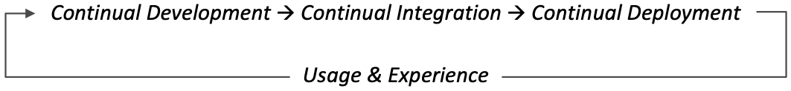
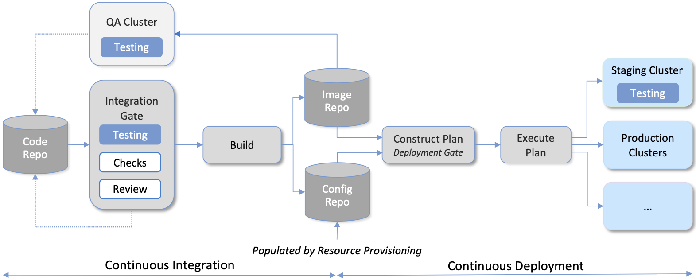
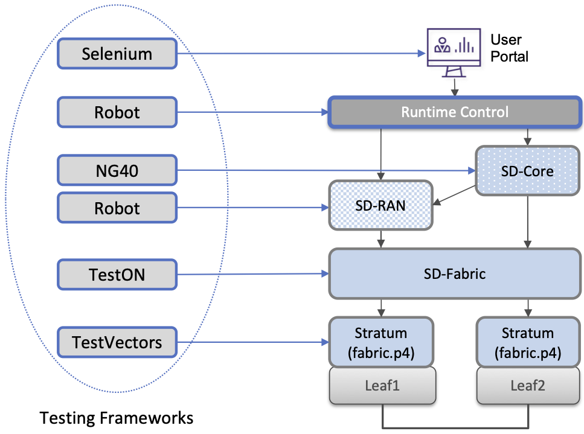
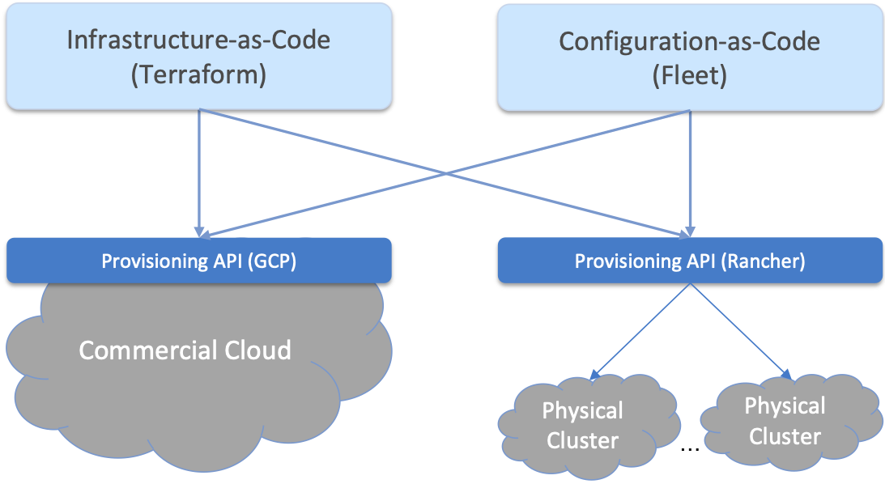

Chapter 4:  Lifecycle Management
================================
	
Lifecycle Management is concerned with updating and evolving a running
system over time. We have carved out the bootstrapping step of
provisioning the hardware and installing the base software platform
(Chapter 3), and so now turn our attention to continually upgrading
the software running on top of that platform. And as a reminder, we
assume the base platform includes Linux running on each server and
switch, plus Docker, Kubernetes, and Helm, with SD-Fabric controlling
the network.

While we could take a narrow view of Lifecycle Management, and assume
the software we want to rollout has already gone through an off-line
integration-and-testing process (this is the traditional model of
vendors releasing a new version of their product), we take a more
expansive approach that starts with development process—the creation
of new features and capabilities. Including the “innovation” step
closes the virtuous cycle depicted in :numref:`Figure %s<fig-cycle>`,
which the cloud industry has taught us leads to greater *feature
velocity*.

.. _fig-cycle:

   Virtuous cycle with the goal of improving feature velocity.

Of course, not every enterprise has the same army of developers at
their disposal that cloud providers do, but that does not shut them
out of this opportunity. The innovation can come from many sources,
including open source, so the real objective is to democratize the
integration and deployment end of the pipeline. This is precisely the
goal of the Lifecycle Management subsystem described in this chapter.

4.1 Design Overview
-------------------

:numref:`Figure %s <fig-pipeline>` gives an overview of the
pipeline/toolchain that make up the two halves of Lifecycle
Management—Continuous Integration (CI) and Continuous Deployment
(CD)—expanding on the high-level introduction presented in
Chapter 2. The key thing to focus on is the Image and Config Repos in
the middle. They represent the “interface” between the two halves: CI
produces Docker Image and Helm Charts, storing them in the respective
Repositories, while CD consumes Docker Images and Helm Charts, pulling
them from the respective Repositories.

The Config Repo also contains declarative specifications of the
infrastructure artifacts produced by Resource Provisioning,
specifically, the Terraform templates and variable files.\ [#]_ While
the "hands-on" and "data entry" aspects of Resource Provisioning
described in Section 3.1 happen outside the CI/CD pipeline, the
ultimate output of provisioning is the Infrastructure-as-Code that
gets checked into the Config Repository. These files are input to
Lifecycle Management, which implies that Terraform gets invoked as
part of CI/CD whenever these files change. In other words, CI/CD keeps
both the software-related components in the underlying cloud platform
and the microservice workloads that run on top of that platform
up-to-date.

.. [#] We use the term "Config Repo" generically to denote one or more
       GitHub repositories, for example, one storing all the Helm
       Charts and another storing all the Terraform Templates.

.. sidebar:: Continuous Delivery vs Deployment
	     
    *You will also hear CD refer to "Continuous Delivery" instead of
    "Continuous Deployment", but we are interested in the complete
    end-to-end process, so CD will always imply the latter in this
    book. But keep in mind that "continuous" does not necessarily mean
    "instantaneous"; there can be a variety of gating functions
    injected into the CI/CD pipeline to control when and how upgrades
    get rolled out. The import point is that all the stages in the pipeline
    are automated.*
    
    *So what exactly does "Continuous Delivery" mean? Arguably, it's
    redundant when coupled with "Continuous Integration" since the
    set of artifacts being produced by the CI half of the pipeline
    (e.g., Docker images) is precisely what's being delivered. There
    is no "next step" unless you also deploy those artifacts. It's
    hair-splitting, but some would argue CI is limited to testing new
    code and Continuous Delivery corresponds to the final "publish
    the artifact" step. For our purposes, we lump "publish the
    artifact" into the CI half of the pipeline.*

.. _fig-pipeline:

   Overview of the CI/CD pipeline.

There are two important takeaways from this overview. The first is
that by having well-defined artifacts passed between CI and CD (and
between Resource Provisioning and CD), all three subsystems are
loosely coupled, and able to perform their respective tasks
independently. The second is that all authoritative state needed to
successfully build and deploy the system is contained within the
pipeline, specifically, as declarative specifications in the Config
Repo. This is sometimes referred to as *Configuration-as-Code*, and it
is the cornerstone of GitOps, the cloud native approach to CI/CD that
we are describing in this book.

.. _reading_gitops:
.. admonition:: Further Reading

   `Guide to GitOps
   <https://www.weave.works/technologies/gitops/>`__.

The third repository shown in :numref:`Figure %s <fig-pipeline>` is
the Code Repo (on the far left). Although not explicitly indicated,
developers are continually checking new features and bug fixes into
this repo, which then triggers the CI/CD pipeline. A set of tests and
code reviews are run against these check-ins, with the output of those
tests/reviews reported back to developers, who modify their patch sets
accordingly. (These develop-and-test feedback loops are implied by the
dotted lines in :numref:`Figure %s <fig-pipeline>`.)

The far right of :numref:`Figure %s <fig-pipeline>` shows the set of
deployment targets, with *Staging* and *Production* called out as two
illustrative examples. (The targets are referred to as “PODs” to
signify a self-contained cluster, similar to the ones shown in
:numref:`Figure %s <fig-ace>` of Chapter 2.) The idea is that a new
version of the software is deployed first to a set of Staging PODs,
where it is subjected to realistic workloads for a period of time, and
then rolled out to the Production PODs once the Staging PODs give us
confidence that the upgrade is reliable.
	
This is a simplified depiction of what happens in practice. In
general, there can be more than two distinct versions of the cloud
software deployed at any given time. In the case of Aether, for
example, individual enterprises might elect to upgrade their local ACE
PODs at different times (or in principle, skip an upgrade entirely),
meaning there can be more than two versions running simultaneously. It
is also typically the case that upgrades are rolled out incrementally
(e.g., a few sites at a time over an extended period of time), meaning
that even the production system plays a role in “staging” new
releases. For example, a new version might first be deployed on 10% of
the production machines, and once it is deemed reliable, is then
rolled out to the next 25%, and so on. The exact rollout strategy is a
controllable parameter, as described in more detail in Section 4.4.

Finally, two of the CI stages shown in :numref:`Figure %s
<fig-pipeline>` identify a *Testing* component. One is a set of
component-level tests that are run against each patch set checked into
the Code Repo. These tests gate integration; fully merging a patch
into the Code Repo requires first passing this preliminary round of
tests. Once merged, the pipeline runs a build across all the
components, and a second round of testing happens on a *Quality
Assurance (QA)* POD. Passing these tests gate deployment, but note
that testing also happens in the Staging PODs, as part of the CD end
of the pipeline. One might naturally ask what about the Production
PODs; how do we continue to test the software after it is running in
production?  That happens, of course, but we tend to call it
Monitoring & Logging rather than testing. This is the subject of
Chapter 6.

We will explore each of the stages in :numref:`Figure %s
<fig-pipeline>` in more detail in the sections that follow, but
because of the centrality of testing across the entire pipeline, we
start there.

4.2 Testing Strategy
--------------------

Our goal for Lifecycle Management is to improve feature velocity, but
that always has to be balanced against delivering high-quality
code—software that is reliable, scales, and meets performance
requirements. Ensuring code quality requires that it be subjected to a
battery of tests, but the linchpin for doing so “at speed” is through
effective use of automation. This section introduces an approach to
test automation, but we start by talking about the overall testing
strategy.

The best-practice for testing in the Cloud/DevOps environment is to
adopt a *Shift Left* strategy, which introduces tests early in the
development cycle, that is, on the left side of the pipeline shown in
:numref:`Figure %s <fig-pipeline>`. To apply this principle, you first
have to understand what types of tests you need. Then you can set up
the infrastructure required to automate those tests.

Categories of Tests
~~~~~~~~~~~~~~~~~~~

With respect to what types of tests, there is a rich vocabulary for
talking about QA, but unfortunately, the definitions are often vague,
overlapping, and not always uniformly applied. The following gives a
simple taxonomy that serves our purposes, with different categories of
tests are organized according to the three stages of the CI/CD
pipeline where they happen (relative to :numref:`Figure %s
<fig-pipeline>`):

* **Integration Gate:** These tests are run against every attempt to
  check in a patch set, and so must complete quickly. This means they
  are limited in scope. There are two categories of pre-merge tests:
  
  * **Unit Tests:** Developer-written tests that narrowly test a
    single module. The goal is to exercise as many code paths as
    possible by invoking “test calls” against the module’s public
    interface.
    
  * **Smoke Tests:** A form of functional testing, typically run
    against a set of related modules, but in a shallow/superficial way
    (so they can run quickly).
    
* **QA POD:** These tests are run periodically (e.g., once day, once a
  week) and so can be more extensive. They typically test whole
  subsystems, or in some cases, the entire system. There are two
  categories post-merge/pre-deploy tests:
  
  * **Integration Tests:** Ensures one or more subsystems functions
    correctly, and adheres to known invariants. These tests exercise
    the integration machinery in addition to end-to-end (cross-module)
    functionality.
    
  * **Performance Tests:** Like functional tests in scope (i.e., at
    the subsystem level), but they measure quantifiable performance
    parameters, including the ability to scale workload, rather than
    correctness.
    
* **Staging POD:** Candidate releases are run on the Staging POD for
  an extensive period of time (e.g., multiple days) before being
  rolled out to Production. These tests are run against a complete and
  fully integrated system, and are often used to uncover memory leaks
  and other time-variant and workload-variant issues. There is just
  one category of tests run in this stage:
  
  * **Soak Tests:** These tests require realistic workloads be placed
    on a complete system, through a combination of artificially
    generated traffic and requests from real users. Because the full
    system is integrated and deployed, these tests also serve to
    validate the CI/CD mechanisms, including for example, the specs
    checked into the Config Repo.
    
One of the challenges in crafting a testing strategy is deciding
whether a given test belongs in the set of Smoke tests that gate
merging a patch, or the set of Integration tests that happen after a
patch is merged into the code repo, but before it is deployed. There
is no hard-and-fast rule; it’s a balancing act. You want to test new
software as early as you realistically can, but full integration takes
both time and resources (i.e., a realistic platform for running the
candidate software).

Related to this trade-off, testing infrastructure requires a
combination of virtual resources (e.g., VMs that are pre-configured
with much of the underlying platform already installed) and physical
resources (e.g., small clusters that faithfully represent the eventual
target hardware). Again, it’s not a hard-and-fast rule, but early
(Smoke) tests tend to use virtual resources that are pre-configured,
while later (Integration) test tend to run on representative hardware,
with the software built from scratch.

You will also note that we did not call out *Regression* tests in this
simple taxonomy, but our view is that Regression tests are designed to
ensure that a bug is not re-introduced into the code once it has been
identified and fixed, meaning it is a common *source* of new tests that
can be added to Unit, Smoke, or Integration, Performance, or Soak
tests. Most tests, in practice, are Regression tests, independent of
where they run in the CI/CD pipeline.

Testing Framework
~~~~~~~~~~~~~~~~~

With respect to a testing framework, :numref:`Figure %s
<fig-tests>` shows an illustrative example drawn from
Aether. Specifics will vary substantially, depending on the kind of
functionality you need to test. In Aether, the relevant components are
shown on the right—rearranged to highlight top-down dependencies
between subsystems—with the corresponding test-automation tool shown
on the right. Think of each of these as a framework for a
domain-specific class of tests (e.g., NG40 puts a 5G workload on
SD-Core and SD-RAN, while TestVectors injects packet traffic into the
switches).

.. _fig-tests:

   Example Testing Frameworks used in Aether.

Some of the frameworks shown in :numref:`Figure %s
<fig-tests>` were co-developed with the corresponding software
component. This is true of TestVectors and TestON, which put
customized workloads on Stratum (SwitchOS) and ONOS (NetworkOS),
respectively. Both are open source, so available to pursue for
insights into the challenges of building a testing framework. In
contrast, NG40 is a proprietary framework for emulating 3GPP-compliant
cellular network traffic, which due to the complexity and value in
demonstrating adherence to the 3GPP standard, is a closed, commercial
product.

Selenium and Robot are the most general of the five examples. Both are
open source projects with an active developer community. Selenium is a
tool for automating the testing of web browsers, while Robot is a more
general tool for generating requests to any well-defined interface.
Both systems are frameworks in the sense that developers can write
extensions, libraries, drivers, and plugins to test specific features
of the User Portal and the Runtime API, respectively.\ [#]_ They both
illustrate the purpose of a testing framework, which is to provide a
means to (1) automate the execution of a range of tests; (2) collect
and archive the resulting test results; and (3) evaluate and analyze
the test results. In addition, is it necessary for such frameworks to
be scalable when the system it is invoking tests against is itself
scalable (as is the case for cloud services).

.. [#] Selenium is actually available as a library that can be called
    from within the Robot framework, which makes sense when you
    consider that a web GUI invokes HTTP operations on a set of
    HTML-defined elements, such as textboxes, buttons, drop-down
    menus, and so on.

Finally, as discussed in the previous subsection, each of these
testing frameworks requires a set of resources. These resources are
for running both the suite of tests (which generates workload) and the
subsystem(s) being tested. For the latter, reproducing a full replica
of the target cluster for every development team is ideal, but it is
more cost-effective to implement virtual environments that can be
instantiated on-demand in a cloud. Fortunately, because the software
being developed is containerized and Kubernetes can run in a VM,
virtual testing environments are straightforward to support. This
means dedicated hardware can be reserved for less-frequent (e.g.,
daily) integration tests.

4.3 Continuous Integration
--------------------------

The Continuous Integration (CI) half of Lifecycle Management is all
about translating source code checked in by developers, into a
deployable set of Docker Images. As discussed in the previous section,
this is largely an exercise in running a set of tests against the
code—first to test if it is ready to be integrated and then to test if
it was successfully integrated—where the integration itself is
entirely carried out according to a declarative specification. This is
the value proposition of the microservice architecture: each of the
components is developed independently, packaged as a container
(Docker), and then deployed and interconnected by a container
management system (Kubernetes) according to a declarative integration
plan (Helm).

But this story overlooks a few important details that we now discuss,
in part by filling in some specific mechanisms.

Code Repositories
~~~~~~~~~~~~~~~~~

Code Repositories, such as GitHub and Gerrit, typically provide a
means to tentatively submit a patch set, triggering a set of static
checks (e.g., passes linter, license, and CLA checks), and giving code
reviewers a chance to inspect and comment on the code. This mechanism
also provides a means to trigger the build-integrate-test processes
discussed next. Once all such checks complete to the satisfaction of
the engineers responsible for the affected modules, the patch set is
merged. This is all part of the well-understood software development
process, and so we do not discuss it further. The important takeaway
for our purposes is that there is a well-defined interface between
code repositories and subsequent stages of the CI/CD pipeline.

Build-Integrate-Test
~~~~~~~~~~~~~~~~~~~~

The heart of the CI pipeline is a mechanism for executing a set of
processes that (a) build the component(s) impacted by a given patch
set, (b) integrate the resulting executable images (e.g, binaries)
with other images to construct larger subsystems, (c) run a set of
tests against those integrated subsystems and post the results,
and (d) optionally publish new deployment artifacts (e.g, Docker
images) to the downstream image repository. This last step happens
only after the patch set has been accepted and merged into the repo
(which also triggers the *Build* stage in :numref:`Figure %s
<fig-pipeline>` to run), but importantly, how images are
built/integrated for testing is exactly the same as how they are
built/integrated for deployment. The design principle is that there
are no special cases; just different “off-ramps” for the end-to-end
CI/CD pipeline.

There is no topic on which developers have stronger opinions than the
merits (and flaws) of different build tools. Old-school C coders
raised on Unix prefer Make. Google developed Bazel, and made it
available as open source. The Apache Foundation released Maven, which
evolved into Gradle. We prefer to not pick sides in this unwinnable
debate, but instead acknowledge that different teams will pick
different build tools for their individual projects (which we've been
referring to in generic terms as subsystems), and we will employ a
simple second-level tool to integrate the output of all those
sophisticated first-level tools. Our choice for the second-level tool
is Jenkins, which provides little more than a means to define a script
(called a job) to run in response to some event.

4.4 Continuous Deployment
-------------------------

We are now ready to act on the configuration-as-code checked into the
Config Repo, which includes both the set of Terraform Templates that
specify the underlying infrastructure (we've been calling this the
cloud platform) and the set of Helm Charts that specify the collection
of microservices (sometimes called applications) that are to be
deployed on that infrastructure. We already know about Terraform from
Chapter 3 (it's the agent that actually "acts on" the
infrastructure-related forms). For its counterpart on the application
side we use an open source project called Fleet.

:numref:`Figure %s <fig-fleet>` shows the big picture we are working
towards. Notice that both Fleet and Terraform depend on the
Provisioning API exported by each backend cloud provider, although
roughly speaking, Terraform invokes the "manage Kubernetes" aspects of
those APIs, and Fleet invokes the "use Kubernetes" aspects of those
APIs. Consider each in turn.

.. _fig-fleet:

   Relationship between the main CD agents (Terraform and Fleet) and
   the backend Kubernetes clusters.

The Terraform side of :numref:`Figure %s <fig-fleet>` is responsible
for deploying (and configuring) the latest platform level software.
For example, if the operator wants to add a server (or VM) to a given
cluster, upgrade the version of Kubernetes, change the CNI plug-in
Kubernetes uses, the desired configuration is specified in the
Terraform config files. (Recall that Terraform computes the delta
between the existing and desired state, and executes the calls
required to bring the former in line with the latter.) Anytime new
hardware is added to an existing POD, the corresponding Terraform file
is modified accordingly and checked into the Config Repo, triggering
the deployment task.

The Fleet side of :numref:`Figure %s <fig-fleet>` is responsible
installing the collection of microservices that are to run on each
cluster. These microservices, organized as one or more applications,
are specified by Helm Charts. If we were trying to deploy a single
Chart on just one one Kubernetes cluster, they we'd be done: Helm is
exactly the right tool to carry out that task. The value of Fleet is
that it scales up that process, helping us manage the deployment of
multiple charts across multiple clusters. (Fleet is a spin-off from
Rancher, but is an independent mechanism that can be used directly
with Helm.)

.. _reading_fleet:
.. admonition:: Further Reading

   `Fleet: GitOps at Scale
   <https://fleet.rancher.io/>`__.

Fleet defines three concepts that are relevant to our discussion. The
first is a *Bundle*, which defines the fundamental unit of what gets
deployed. In our case, a Bundle is equivalent to a set of one or more
Helm Charts. The second is a *Cluster Group*, which identifies a set
of Kubernetes clusters that are to be treated in an equivalent way. In
our case, the set of all clusters labeled ``Production`` could be
treated as one such a group, and all clusters labeled ``Staging``
could be treated another such group. (Here, we are talking about the
``env`` label assigned to each cluster in its Terraform spec, as
illustrated in the examples shown in Section 3.2.) The third is a
*GitRepo*, which is a repository to watch for changes to bundle
artifacts. In our case, new are Helm Charts into a "Helm Chart repo".

Understanding Fleet is then straightforward. It provides a way to
define associations between Bundles, Cluster Groups, and GitRepos,
such that whenever a new Helm chart is checked into a GitRepo, all
Bundles that contain that chart are (re-)deployed on all associated
Cluster Groups.

4.5 Version Control
-------------------

The CI/CD toolchain introduced in this chapter works only when applied
in concert with an end-to-end versioning strategy, ensuring that the
right combination of source modules get integrated, and later, the
right combination of images get deployed.

Our starting point is to adopt the widely-accepted practice of
*Semantic Versioning*, where each component is assigned a three-part
version number *MAJOR.MINOR.PATCH* (e.g., ``3.2.4``), where the
*MAJOR* version increments whenever you make an incompatible API
change, the *MINOR* version increments when you add functionality in a
backward compatible way, and the *PATCH* corresponds to a backwards
compatible bug fix.

.. _reading_semver:
.. admonition:: Further Reading

   `Semantic Versioning 2.0.0 <https://semver.org/>`__.

The following sketches one possible interplay between versioning and
the CI/CD toolchain, keeping in mind there are different approaches to
the problem. We break the sequence down to the three main stages of
the software lifecycle:

**Development Time**
   
* Every patch checked into a source code repo includes an up-to-date
  semantic version number in a ``VERSION`` file in the repository.
  Note that every *patch* does not necessarily equal every *commit*,
  as it is not uncommon to make multiple changes to an "in
  development" version, sometimes denoted ``3.2.4-dev``, for
  example. This ``VERSION`` file is primarily used by developers, as a
  convenient way to keep track of the current version number.

* The commit that does correspond to a finalized patch is also tagged
  (in the repo) with the corresponding semantic version number. In
  GitHub, this tag is bound to a hash that unambiguously identifies
  the commit, making it the authoritative way of binding a version
  number to a particular instance of the source code.

* For repos that correspond to microservices, the repo also has a
  Dockerfile that gives the recipe for building a Docker image from
  that (and other) software module(s). This would not be the case for
  software modules that are consumed as libraries.

**Integration Time**   

* The CI toolchain does a sanity check on each component's version
  number, ensuring it doesn't regress, and when it sees a new number
  for a microservice, builds a new image and uploads it to the image
  repo. By convention, this image includes the corresponding source
  code version number in the unique name assigned to the image.
  
**Deployment Time**

* The CD toolchain instantiates the set of Docker Images, as specified
  by name in one or more Helm Charts. Since these image names include
  the semantic version number, by know the corresponding software
  version being deployed.

* Each Helm Chart is also checked into a repository, and hence, has
  its own version number. Each time a Helm Chart changes, because the
  version of a constituent Docker Image changes, the chart's version
  number also changes.

* Helm Charts can be organized hierarchically, that is, with one Chart
  including one or more other Charts (each with their own version
  number), with the version of the root Chart effectively identifying
  the version of the system as a whole being deployed.

While some of the Source Code :math:`\rightarrow` Docker Image
:math:`\rightarrow` Kubernetes Container relationships just outlined
can be codified in the toolchain, at least at the level of automated
sanity tests that catch obvious mistakes, responsibility ultimately
falls to the developers checking in source code and the operators
checking in configuration code; they must correctly specify the
versions they intended. But having a simple and clear versioning
strategy is a requirement for doing that job.

Finally, because versioning is inherently related to APIs, with the
*MAJOR* version number incremented whenever the API changes in
non-backward-compatible way, developers are responsible for ensuring
their software is able to correctly consume any APIs they depend
on. Doing so becomes problematic when there is persistent state
involved, by which we mean state that must be preserved across
multiple version of the software that accesses it. This is a problem
that all operational systems that run continuously have to deal with,
and typically requires a *data migration* strategy. Solving this
problem in a general way for application-level state is beyond the
scope of this book, but solving it for the cloud management system
(which has its own persistent state) is a topic we take up in the next
chapter.

4.6 What about GitOps?
----------------------

The CI/CD pipeline described in this chapter is consistent with
GitOps, an approach to DevOps designed around the idea of
*configuration-as-code*\—making the code repo (e.g. GitHub) the single
source of truth for building and deploying a cloud native system. The
approach is premised on first making all configuration state
declarative (e.g, specified in Helm Charts and Terraform Templates),
and then treating this repo as the single source of truth for building
and deploying a cloud native system. It doesn't matter if you patch a
Python file or update a config file, the repo triggers the CI/CD
pipeline as described in this chapter.

While the approach described in this chapter is based on the GitOps
model, there are three considerations that mean GitOps is not the end
of the story. All hinge on the question of whether **all** state
needed to operate a cloud native system can be managed **entirely**
with a repository-based mechanism.

The first consideration is that we need to acknowledge the difference
between people who develop software and people who build and operate
systems using that software. DevOps (in its simplest formulation)
implies there should be no distinction. In practice, developers are
often far removed from operators, or more to the point, they are far
removed from design decisions about exactly how others will end up
using their software. For example, software is usually implemented
with a particular set of use cases in mind, but it is later integrated
with other software to build entirely new cloud apps that have their
own set of abstractions and features, and correspondingly, their own
collection of configuration state. This is true for Aether, where the
SD-Core subsystem was originally implemented for use in global
cellular networks, but is being repurposed to support private 4G/5G in
enterprises.

While it is true such state could be managed in a GitHub repo, the
idea of configuration management by pull request is overly
simplistic. There are both low-level (implementation-centric) and
high-level (application-centric) variables; in other words, it is
common to have one or more layers of abstraction running on top of the
base software. In the limit, it may even be an end-user (e.g., an
enterprise user in Aether) that wants to change this state, which
implies fine-grained access control is likely a requirement. None of
this disqualifies GitOps as a way to manage such state, but it does
raise the possibility that not all state is created equal—that there
is a range of configuration state variables being accessed at
different times by different people with different skill sets, and
most importantly, needing different levels of privilege.

The second consideration has to do with where configuration state
originates. For example, consider the addresses assigned to the
servers assembled in a cluster, which might originate in an
organization’s inventory system. Or in the case of a 5G service like
Aether, there are unique identifiers assigned to mobile devices that
are managed in a global subscriber database. In general, systems often
have to deal with multiple—sometimes external—sources of configuration
state, and knowing which copy is authoritative and which is derivative
is inherently problematic. There is no single right answer, but
situations like this raise the possibility that the authoritative copy
of configuration state needs to be maintained apart from any single
use of that state.

The third consideration is how frequently this state changes, and
hence, potentially triggers restarting or possibly even re-deploying a
set of containers. Doing so certainly makes sense for “set once”
configuration parameters, but what about “runtime settable” control
variables? What is the most cost-effective way to update system
parameters that have the potential to change frequently? Again, this
raises the possibility that not all state is created equal, and that
there is a continuum of configuration state variables.

These three considerations point to there being a distinction between
build-time configuration state and runtime control state, the topic of
the next chapter. We emphasize, however, that the question of how to
manage such state does not have a single correct answer; drawing a
crisp line between “configuration” and “control” is notoriously
difficult. Both the repo-based mechanism championed by GitOps and
runtime control alternatives described in the next chapter provide
value, and it is a question of which is the better match for any given
piece of information that needs to be maintained for a cloud to
operate properly.

