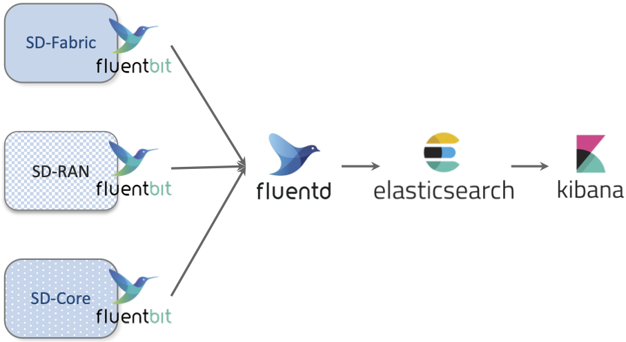
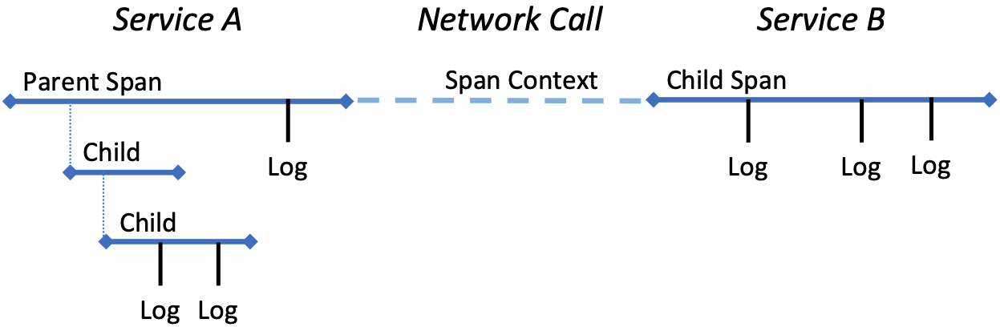
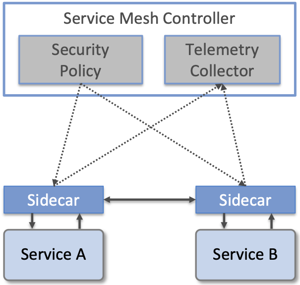

Chapter 6:  Monitoring and Telemetry
====================================

Collecting telemetry data for a running system is an essential
function of the management platform. It enables operators to monitor
system behavior, evaluate performance, make informed provisioning
decisions, respond to failures, identify attacks, and diagnose
problems. This chapter focuses on three types of telemetry
data—*metrics*, *logs*, and *traces*\—along with exemplar open source
software stacks available to help collect, store, and act upon each of
them.

Metrics are quantitative data about a system. These include common
performance metrics such as link bandwidth, CPU utilization, and memory
usage, but also binary results corresponding to "up" and "down", as
well as other state variables that can be encoded numerically.  These
values are produced and collected periodically (e.g., every few
seconds), either by reading a counter, or by executing a runtime test
that returns a value.  These metrics can be associated with physical
resources such as servers and switches, virtual resources such as VMs and
containers, or high-level abstractions such as the *Connectivity Service*
described in Section 5.3. Given these many possible sources of data,
the job of the metrics monitoring stack is to collect, archive,
visualize, and optionally analyze this data.

Logs are the qualitative data that is generated whenever a noteworthy
event occurs. This information can be used to identify problematic
operating conditions (i.e., it may trigger an alert), but more
commonly, it is used to troubleshoot problems after they have been
detected. Various system components—all the way from the low-level OS
kernel to high-level cloud services—write messages that adhere to a
well-defined format to the log. These messages include a timestamp,
which makes it possible for the logging stack to parse and correlate
messages from different components.

Traces are a record of causal relationships (e.g., Service A calls
Service B) resulting from user-initiated transactions or jobs. They
are related to logs, but provide more specialized information about
the context in which different events happen. Tracing is
well-understood in a single program, where an execution trace is
commonly recorded as an in-memory call stack, but traces are
inherently distributed across a graph of network-connected
microservices in a cloud setting. This makes the problem challenging,
but also critically important because it is often the case that the
only way to understand time-dependent phenomena—such as why a
particular resource is overloaded—is to understand how multiple
independent workflows interact with each other.

Taking a step back from the three types of telemetry data, it is
helpful to have a broad understanding of the design space, and to that
end, we make four observations.

First, there are two general use cases for telemetry data, which we
broadly characterize as "monitoring" and "troubleshooting". We use
these terms in the most general way to represent (a) proactively
watching for warning signs of trouble (attacks, bugs, failures,
overload conditions) in a steady-state system; versus (b) reactively
taking a closer look to determine the root cause and resolve an issue
(fix a bug, optimize performance, provision more resources, defend
against an attack), once alerted to a potential problem. This
distinction is important because the former (monitoring) needs to
incur minimal overhead and require minimal human involvement, while
the latter (troubleshooting) can be more invasive/expensive and
typically involves some level of human expertise. This is not a
perfect distinction, with plenty of operator activity happening in a
gray area, but being aware of the cost/benefit trade-offs of the
available tools is an important starting point.

Second, the more aspects of monitoring and troubleshooting that can be
automated, the better. This starts with alerts that automatically
detect potential problems; typically includes dashboards that make it
easy for humans to see patterns and drill down for relevant details
across all three types of data; increasingly leverages Machine
Learning and statistical analysis to identify deeper connections
that are not obvious to human operators; and ultimately supports
closed-loop control where the automated tool not only detects problems
but is also able to issue corrective control directives. For the
purpose of this chapter, we give examples of the first two (alerts and
dashboards), and declare the latter two (analytics and close-loop
control) as out-of-scope (but likely running as applications that
consume the telemetry data outlined in the sections that follow).

Third, when viewed from the perspective of lifecycle management,
monitoring and troubleshooting are just a continuation of testing,
except under production workloads rather than test workloads. In fact,
the same set of tools can be used on either side of the
development-vs-production boundary. For example, as anyone who has
profiled a program will recognize and appreciate, tracing is an
extremely valuable tool during development—both to track down bugs and
to tune performance. Similarly, artificial end-to-end tests can
provide value in production systems by triggering early warning
alerts. This can be especially helpful when dealing with problematic
failure modes.

Finally, because the metrics, logs, and traces collected by the
various subsystems are timestamped, it is possible to establish
correlations among them, which is helpful when debugging a problem or
deciding whether or not an alert is warranted. We give examples of how
such telemetry-wide functions are implemented in practice today, as
well as discuss the future future of generating and using telemetry
data, in the final two sections of this chapter.

6.1 Metrics and Alerts
-------------------------------

Starting with metrics, a popular open source monitoring stack uses
Prometheus to collect and store platform and service metrics, Grafana
to visualize metrics over time, and Alertmanager to notify the
operations team of events that require attention.  In Aether,
Prometheus and Alertmanager are instantiated on each edge cluster,
with a single instantiation of Grafana running centrally in the
cloud. More information about each tool is available online, so we
focus more narrowly on (1) how individual Aether components "opt into"
this stack, and (2) how the stack can be customized in
service-specific ways.

.. _reading_monitor:
.. admonition:: Further Reading

   `Prometheus <https://prometheus.io/docs/introduction/overview/>`__.

   `Grafana
   <https://grafana.com/docs/grafana/latest/getting-started/>`__.

   `Alertmanager <https://prometheus.io/docs/alerting/latest/alertmanager/>`__.

6.1.1 Exporting Metrics
~~~~~~~~~~~~~~~~~~~~~~~

Individual components implement a *Prometheus Exporter* to provide the
current value of the component's metrics. A component's Exporter is
queried via HTTP, with the corresponding metrics returned using a
simple text format. Prometheus periodically scrapes the Exporter's
HTTP endpoint and stores the metrics in its Time Series Database
(TSDB) for querying and analysis. Many client libraries are available
for instrumenting code to produce metrics in Prometheus format.  If a
component's metrics are available in some other format, tools are
often available to convert the metrics into Prometheus format and
export them.

A YAML configuration file specifies the set of Exporter endpoints that
Prometheus is to pull metrics from, along will the polling frequency
for each endpoint. Alternatively, Kubernetes-based microservices can
be extended with a *Service Monitor* custom resource that Prometheus
then queries to learn about any Exporter endpoints the microservice
has made available.

As an example of the latter, Aether runs a Service Monitor on every
edge cluster that periodically tests end-to-end connectivity (for
various definitions of end-to-end).  One test determines whether the
5G control plane is working (i.e., the edge site can reach the SD-Core
running in the central cloud) and a second test determines whether the
5G user plane is working (i.e., UEs can reach the Internet). This is a
common pattern: individual components can export accumulators and
other local variables, but only a "third-party observer" can actively
test external behavior, and report the results. These examples
correspond to the rightmost "End-to-End Tests" shown in
:numref:`Figure %s <fig-testing>` of Chapter 4.

Finally, when a system is running across multiple edge sites, as is
the case with Aether, there is an design question of whether
monitoring data is stored on the edge sites and lazily pulled to the
central location only when needed, or is proactively pushed to the
central location as soon as it's generated. Aether employs both
approaches, depending on the volume and urgency of the data being
collected. By default, metrics collected by the local instantiation of
Prometheus stay on the edge sites, and only query results are returned
to the central location (e.g., to be displayed by Grafana as described
in the next subsection). This is appropriate for metrics that are both
high-volume and seldom viewed. The exception is the end-to-end Service
Monitors described in the previous paragraph. These results are
immediately pushed to the central site (bypassing Prometheus), because
they are low-volume and may require immediate attention.

6.1.2 Creating Dashboards
~~~~~~~~~~~~~~~~~~~~~~~~~

The metrics collected and stored by Prometheus running on each local
cluster are visualized centrally using Grafana dashboards.  In Aether,
this means the Grafana instance running as part of AMP in the central
cloud sends queries to the Prometheus instances running on all Aether
edge clusters. For example, :numref:`Figure %s <fig-ace_dash>` shows
the summary dashboard for a collection of Aether edge sites.

.. _fig-ace_dash:
.. figure:: figures/ace_dash.png
   :width: 600px
   :align: center

   Central dashboard showing status of Aether edge deployments.

Grafana comes with a set of predefined dashboards for the most common
set of metrics—in particular, those associated with physical servers
and virtual resources such as containers—but it can also be customized to
include dashboards for service-level metrics and other
deployment-specific information (e.g., per-enterprise in Aether). For
example, :numref:`Figure %s <fig-upf_dash>` shows a custom dashboard
for UPF (User Plane Function), the data plane packet forwarder of the
SD-Core. The example shows latency and jitter metrics over the last
hour at one site, with three additional collapsed panels (PFCP Sessions
and Messages) at the bottom.

.. _fig-upf_dash:

   Custom dashboard showing latency and jitter metrics for UPF, the
   packet forwarding data plane of the SD-Core component.

Briefly, a dashboard is constructed from a set of *panels*, where each
panel has a well-defined *type* (e.g., graph, table, gauge, heatmap)
bound to a particular Prometheus *query*. New dashboards are created
using the Grafana GUI, and the resulting configuration then saved in a
JSON file. This configuration file is then committed to the Config
Repo, and later loaded into Grafana whenever is is restarted as part
of Lifecycle Management. For example, the following code snippet
shows the Prometheus query corresponding to the ``Uptime`` panel
in :numref:`Figure %s <fig-ace_dash>`.

.. literalinclude:: code/uptime.yaml

Note that this expression includes variables for the site (``$edge``)
and the interval over which the uptime is computed (``$__interval``).

6.1.3 Defining Alerts
~~~~~~~~~~~~~~~~~~~~~

Alerts can be triggered in Prometheus when a component metric crosses
some threshold.  Alertmanager is a tool that then routes the alert to
one or more receivers, such as an email address or Slack channel.

An alert for a particular component is defined by an *alerting rule*,
an expression involving a Prometheus query, such that whenever it
evaluates to true for the indicated time period, it triggers a
corresponding message to be routed to a set of receivers. These rules
are recorded in a YAML file that is checked into the Config Repo and
loaded into Prometheus. (Alternatively, Helm Charts for individual
components can define rules via *Prometheus Rule* custom resources.)
For example, the following code snippet shows the Prometheus Rule for
two alerts, where the ``expr`` lines corresponds to the respective
queries submitted to Prometheus.

.. literalinclude:: code/prometheus-rule.yaml

In Aether, the Alertmanager is configured to send alerts with
*critical* or *warning* severity to a general set of receivers.  If it
is desirable to route a specific alert to a different receiver (e.g.,
a Slack channel used by the developers for that particular component),
the Alertmanager configuration is changed accordingly.

6.2 Logging
------------------

OS programmers have been writing diagnostic messages to a *syslog*
since the earliest days of Unix. Originally collected in a local file,
the syslog abstraction has been adapted to cloud environments by
adding a suite of scalable services. Today, one typical open source
logging stack uses Fluentd to collect (aggregate, buffer, and route)
log messages written by a set of components, with Fluentbit serving as a
client-side agent running in each component helping developers
normalize their log messages. ElasticSearch is then used to store,
search, and analyze those messages, with Kibana used to display and
visualize the results. The general flow of data is shown in
:numref:`Figure %s <fig-log>`, using the main Aether subsystems as
illustrative sources of log messages.

.. _fig-log:

   Flow of log messages through the Logging subsystem.

.. _reading_logging:
.. admonition:: Further Reading

   `Fluentd <https://docs.fluentd.org/>`__.

   `ElasticSearch
   <https://www.elastic.co/elasticsearch/>`__.

   `Kibana <https://www.elastic.co/kibana/>`__.

6.2.1 Common Schema
~~~~~~~~~~~~~~~~~~~

The key challenge in logging is to adopt a uniform message format
across all components, a requirement that is complicated by the fact
that the various components integrated in a complex system are often
developed independently of each other. Fluentbit plays a role in
normalizing these messages by supporting a set of filters. These
filters parse "raw" log messages written by the component (an ASCII
string), and output "canonical" log messages as structured JSON. There
are other options, but JSON is reasonably readable as text, which
still matters for debugging by humans. It is also well-supported by
tooling.

For example, developers for the SD-Fabric component might
write a log message that looks like this:

.. literalinclude:: code/log.ascii

where a Fluentbit filter transforms into a structure that looks like
this:

.. literalinclude:: code/log.json

This example is simplified, but it does serve to illustrate the basic
idea. It also highlights the challenge the DevOps team faces in
building the management platform, which is to decide on a meaningful
set of name/value pairs for the system as a whole. In other words,
they must define a common schema for these structured log messages.
The *Elastic Common Schema* is a good place to start that definition,
but among other things, it will be necessary to establish the accepted
set of log levels, and conventions for using each level. In Aether,
for example, the log levels are: FATAL, ERROR, WARNING, INFO, and
DEBUG.

.. _reading_ecs:
.. admonition:: Further Reading

   `Elastic Common Schema
   <https://www.elastic.co/guide/en/ecs/current/index.html>`__.

6.2.2 Best Practices
~~~~~~~~~~~~~~~~~~~~

Establishing a shared logging platform is, of course, of little value
unless all the individual components are properly instrumented to
write log messages. Programming languages typically come with library
support for writing log messages (e.g., Java's log4j), but that's just
a start. Logging is most effective if the components adhere to the
following set of best practices.

* **Log shipping is handled by the platform.** Components should
  assume that stdout/stderr is ingested into the logging system by
  Fluentbit (or similar tooling), and avoid making the job more
  complicated by trying to route their own logs.  The exception is for
  external services and hardware devices that are outside the
  management platform's control.  How these systems send their logs to
  a log aggregator must be established as a part of the deployment
  process.

* **File logging should be disabled.** Writing log files directly to a
  container's layered file system is proven to be I/O inefficient and
  can become a performance bottleneck. It is also generally
  unnecessary if the logs are also being sent to stdout/stderr.
  Generally, logging to a file is discouraged when a component runs in
  a container environment. Instead, components should stream all logs
  to the collecting system.

* **Asynchronous logging is encouraged.** Synchronous logging can
  become a performance bottleneck in a scaled environment.  Components
  should write logs asynchronously.

* **Timestamps should be created by the program's logger.** Components
  should use the selected logging library to create timestamps, with
  as precise a timestamp as the logging framework allows. Using the
  shipper or logging handlers may be slower, or create timestamps on
  receipt, which may be delayed. This makes trying to align events
  between multiple services after log aggregation problematic.

* **Must be able to change log levels without interrupting service.**
  Components should provide a mechanism to set the log level at
  startup, and an API that allows the log level to be changed at
  runtime. Scoping the log level based on specific subsystems is a
  useful feature, but not required. When a component is implemented by
  a suite of microservices, the logging configuration need only be
  applied to one instance for it to apply to all instances.

6.3 Distributed Tracing
-------------------------

Execution traces are the third source of telemetry data. Tracing is
challenging in a cloud setting because it involves following the flow
of control for each user-initiated request across multiple
microservices. The good news is that instrumenting a set of
microservices involves activating tracing support in the underlying
language runtime system—typically in the RPC stubs—rather than asking
app developers to explicitly instrument their programs.

The general pattern is similar to what we've already seen with metrics
and logs: the running code is instrumented to produce data that is
then collected, aggregated, stored, and made available for display and
analysis. The main difference is the type of data we're interested in
collecting, which, for tracing, is typically the sequence of API
boundary crossings from one module to another. This data gives us
the information we need to reconstruct the call chain. In principle,
we could leverage the logging system to support tracing—and just be
diligent in logging the necessary interface-crossing
information—but it is a specialized enough use case to warrant its own
vocabulary, abstractions, and mechanisms.

At a high level, a *trace* is a description of a transaction as it
moves through the system. It consists of a sequence of *spans* (each
of which represents work done within a service) interleaved with a set
of *span contexts* (each of which represents the state carried across
the network from one service to another). An illustrative example of a
trace is shown in :numref:`Figure %s <fig-trace>`, but abstractly, a
trace is a directed graph with nodes that correspond to spans and
edges that correspond to span contexts. The nodes and edges are then
timestamped and annotated with relevant facts (key/value tags) about
the end-to-end execution path, including when and for how long it
ran. Each span also includes timestamped log messages generated while
the span was executing, simplifying the process of correlating log
messages with traces.

.. _fig-trace:

   Example trace spanning two network services.

Again, as with metrics and log messages, the details are important and
those details are specified by an agreed-upon data model. The
OpenTelemetry project is now defining one such model, building on the
earlier OpenTracing project (which was in turn influenced by the
Dapper distributed tracing mechanism developed by Google).  Beyond the
challenge of defining a model that captures the most relevant semantic
information, there is the pragmatic issue of (1) minimizing the
overhead of tracing so as not to negatively impact application
performance, yet (2) extracting enough information from traces so as
to make collecting it worthwhile.  Sampling is a widely adopted
technique introduced into the data collection pipeline to manage this
trade-off. One consequence of these challenges is that distributed
tracing is the subject of ongoing research, and we can expect the
model definitions and sampling techniques to evolve and mature in the
foreseeable future.

.. _reading_tracing:
.. admonition:: Further Reading

   B. Sigelman, *et al.* `Dapper, a Large-Scale Distributed Systems
   Tracing Infrastructure
   <https://static.googleusercontent.com/media/research.google.com/en//archive/papers/dapper-2010-1.pdf>`__.
   Google Technical Report. April 2010.

   `OpenTelemetry: High-quality, ubiquitous, and portable telemetry to
   enable effective observability <https://opentelemetry.io/>`__.

   `Jaeger: End-to-End Distributed Tracing 
   <https://www.jaegertracing.io/>`__.

With respect to mechanisms, Jaeger is a widely used open source
tracing tool originally developed by Uber. (Jaeger is not currently
included in Aether, but was utilized in a predecessor ONF edge cloud.)
Jaeger includes instrumentation of the runtime system for the
language(s) used to implement an application, a collector, storage,
and a query language that can be used to diagnose performance problems
and do root cause analysis.

6.4 Integrated Dashboards
-------------------------

The metrics, logs and traces being generated by instrumented
application software make it possible to collect a wealth of data
about the health of a system. But this instrumentation is only useful
if the right data is displayed to the right people (those with the
ability to take action) at the right time (when action needs to be
taken). Creating useful panels and organizing them into intuitive
dashboards is part of the solution, but integrating information across
the subsystems of the management platform is also a requirement.

Unifying all this data is the ultimate objective of ongoing efforts
like the OpenTelemetry project mentioned in the previous section, but
there are also opportunities to use the tools described in this
chapter to better integrate data. This section highlights two
general strategies.

First, both Kibana and Grafana can be configured to display telemetry
data from multiple sources. For example, it is straightforward to
integrate both logs and traces in Kibana. This is typically done by
first feeding the tracing data into ElasticSearch, which Kibana then
queries. Similarly, it is useful to have a convenient way to see the
log messages associated with a particular component in the context of
metrics that have been collected. This is easy to accomplish because
Grafana can be configured to display data from ElasticSearch just as
easily as from Prometheus. Both are data sources that can be
queried. This makes it to possible to create a Grafana dashboard that
includes a selected set of log messages, similar to the one from
Aether shown in :numref:`Figure %s <fig-es_dash>`.  In this example,
we see INFO-level messages associated with the UPF sub-component of
SD-Core, which augments the UPF performance data shown in
:numref:`Figure %s <fig-upf_dash>`.

.. _fig-es_dash:

   Log messages associated with the UPF element of SD-Core, displayed
   in a Grafana dashboard.

Second, the runtime control interface described in Chapter 5 provides
a means to change various parameters of a running system, but having
access to the data needed to know what changes (if any) need to be
made is a prerequisite for making informed decisions. To this end, it
is ideal to have access to both the "knobs" and the "dials" on an
integrated dashboard.  This can be accomplished by incorporating
Grafana frames in the Runtime Control GUI, which, in its simplest form,
displays a set of web forms corresponding to the fields in the
underlying data models. (More sophisticated control panels are
certainly possible.)

.. _fig-dev_group:
.. figure:: figures/gui1.png
   :width: 600px
   :align: center

   Example control dashboard showing the set of Device Groups defined
   for a fictional set of Aether sites.

For example, :numref:`Figure %s <fig-dev_group>` shows the current set
of device groups for a fictional set of Aether sites, where clicking
on the "Edit" button pops up a web form that lets the enterprise admin
modify the corresponding fields of the `Device-Group` model (not
shown), and clicking on the "Monitor" button pops up a
Grafana-generated frame similar to the one shown in :numref:`Figure %s
<fig-dev_monitor>`. In principle, this frame is tailored to show only
the most relevant information associated with the selected object.

.. _fig-dev_monitor:
.. figure:: figures/gui2.png
   :width: 600px
   :align: center

   Example monitoring frame associated with a selected Device Group.

6.5 Observability
-----------------

Knowing what telemetry data to collect, so you have exactly the right
information when you need it, but doing so without negatively
impacting system performance, is a difficult problem. *Observability*
is a relatively new term being used to describe this general problem
space, and while the term can be dismissed as the latest marketing
buzzword (which it is), it can also be interpreted as another of the
set of *"-ities"* that all good systems aspire to, alongside
scalability, reliability, availability, security, usability, and so
on. Observability is the quality of a system that makes visible the
facts about its internal operation needed to make informed management
and control decisions. It has become a fertile space for innovation,
and so we conclude this chapter with two examples that may become
commonplace in the near future.

The first is *Inband Network Telemetry (INT)*, which takes advantage
of programmable switching hardware to allow operators to ask new
questions about how packets are being processed "in-band", as they
flow through the network. This is in contrast to either depending on
the predefined set of counters hardwired into fixed-function network
devices, or being able to inspect just a sampled subset of packets.
Because Aether uses programmable switches as the foundation for its
SDN-based switching fabric, it is able to use INT as a fourth type of
telemetry data, and in doing so provide qualitatively deeper insights
into traffic patterns and the root causes of network failures.

For example, INT has been used to measure and record queuing delay
individual packets experience while traversing a sequence of switches
along an end-to-end path, making it possible to detect *microbursts*
(queuing delays measured over millisecond or even sub-millisecond time
scales). It is even possible to correlate this information across
packet flows that followed different routes, so as to determine which
flows shared buffer capacity at each switch. As another example, INT
has been used to record the decision making process that directed how
packets are delivered, that is, which forwarding rules were applied at
each switch along the end-to-end path. This opens the door to using
INT to verify that the data plane is faithfully executing the
forwarding behavior the network operator intends. For more information
about INT, we refer the reader to our companion SDN book.

.. _reading_int:
.. admonition:: Further Reading

   L. Peterson, *et al.* `Software-Defined Networking: A Systems Approach
   <https://sdn.sysetmsapproach.org>`__. November 2021.

The second is the emergence of *Service Meshes* mentioned in
Chapter 1. A Service Mesh framework such as Istio provides a means to
enforce fine-grained security policies and collect telemetry data in
cloud native applications by injecting "observation/enforcement
points" between microservices. These injection points, called
*sidecars*, are typically implemented by a container that "runs along
side" the containers that implement each microservice, with all RPC
calls from Service A to Service B passing through their associated
sidecars. As shown in :numref:`Figure %s <fig-mesh>`, these sidecars
then implement whatever policies the operator wants to impose on the
application, sending telemetry data to a global collector and
receiving security directives from a global policy engine.

.. _fig-mesh:

   Overview of a Service Mesh framework, with sidecars intercepting
   messages flowing between Services A and B. Each sidecar enforces
   security policy received from the central controller and sends
   telemetry data to the central controller.
	   
From the perspective of observability, sidecars can be programmed to
record whatever information operators might want to collect, and in
principle, they can even be dynamically updated as conditions warrant.
This provides a general way for operators to define how the system is
observed without having to rely on instrumentation developers might
include in their services. The downside is that sidecars impose a
nontrivial amount of overhead on inter-service communication. For that
reason, alternative approaches to sidecars are gaining traction,
notably Cilium, which uses eBPF (extended Berkeley Packet Filters) to
implement observability, security and networking data plane features
inside the kernel rather than in a sidecar.

For more information about the Istio Service Mesh, we recommend
Calcote and Butcher's book. The Cilium project has extensive
documentation and tutorials at its web site.

.. _reading_mesh:
.. admonition:: Further Reading

   L. Calcote and Z. Butcher `Istio: Up and Running
   <https://www.oreilly.com/library/view/istio-up-and/9781492043775/>`__. October 2019.

   `Cilium: eBPF-based Networking, Observability, Security <https://cilium.io/>`__.

