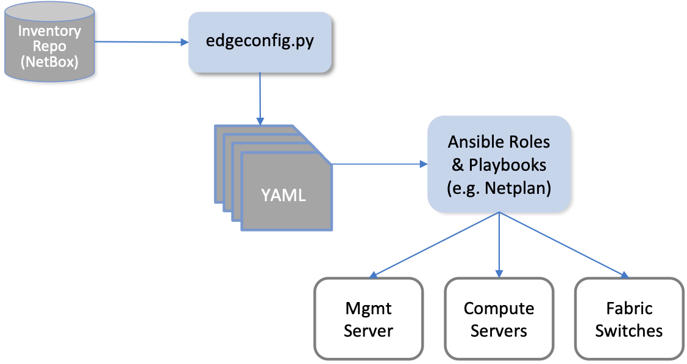
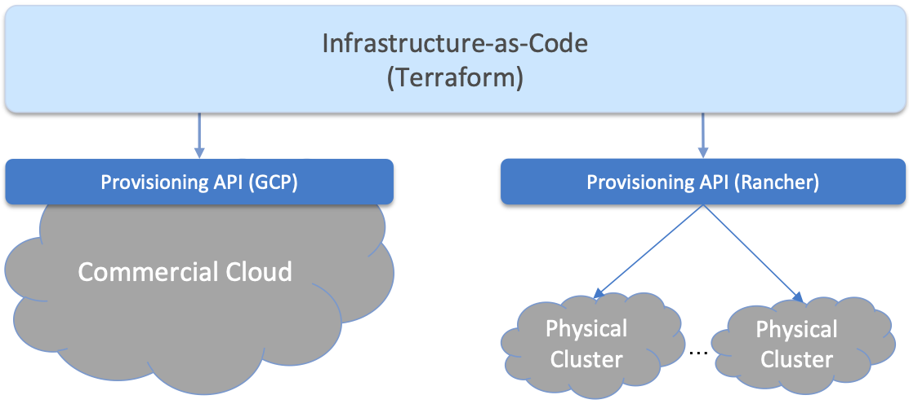

Chapter 3:  Resource Provisioning
=================================

Resource Provisioning is the process of bringing virtual and physical
resources online. It has both a hands-on component (racking and
connecting devices) and a bootstrap component (configuring how the
resources boot into a "ready" state). Resource Provisioning happens
when a cloud deployment is first installed—i.e., an initial set of
resources are provisioned—but also incrementally over time as new
resources are added, obsolete resources are removed, and out-of-date
resources are upgraded.

The goal of Resource Provisioning is to be zero-touch, which is
impossible for hardware resources because it includes an intrinsically
manual step. (We take up the issue of provisioning virtual resources
in a moment.) Realistically, the goal is to minimize the number and
complexity of configuration steps required beyond physically
connecting the device, keeping in mind that we are starting with
commodity hardware received directly from a vendor, and not a
plug-and-play appliance that has already been prepped.

When a cloud is built from virtual resources (e.g., VMs instantiated
on a commercial cloud) the "rack and connect" step is carried out by
sequence of API calls rather a hands-on technician.  Of course, we
want to automate the sequence of calls needed to activate virtual
infrastructure, which has inspired an approach know as
*infrastructure-as-code*.\ [#]_ The general idea is to document, in a
declarative format that can be "executed", exactly what our
infrastructure is to look like; how it is to be configured. We use
Terraform as our open source approach to infrastructure-as-code.

.. [#] *Infrastructure-as-Code* is a special case of the more general
       concept of *Configuration-as-Code*, which we discuss in much
       more detail in Chapter 4.

When a cloud is built from a combination of virtual and physical
resources, as is the case for a hybrid cloud like like Aether, we need
a seamless way to accommodate both. To this end, our approach is to
first overlay a *logical structure* on top of hardware resources,
making them roughly equivalent to the virtual resources we get from a
commercial cloud provider. This results in a hybrid scenario similar
to the one shown in :numref:`Figure %s <fig-infra>`. We use NetBox as
our open source solution for layering this logical structure on top of
physical hardware. NetBox also helps us address the requirement of
tracking physical inventory.

.. _fig-infra:
.. figure:: figures/Slide19.png
    :width: 450px
    :align: center

    Resource Provisioning in a hybrid cloud that includes both
    physical and virtual resources.

Note that the Provisioning API shown on the right in :numref:`Figure
%s <fig-infra>` is *not* the NetBox API. Terraform does not interact
directly with NetBox, but instead with artifacts left behind by the
hardware provisioning process described in Section 3.1. One way to
think about this that the task of booting hardware into the "ready"
state involves installing and configuring several subsystems that
collectively form the cloud platform. It is this platform that
Terraform interacts with through a well-defined API we describe below.

This chapter describes both sides of :numref:`Figure %s <fig-infra>`
starting with provisioning physical infrastructure. Our approach is to
focus on the challenge of provisioning an entire site the first time.
We comment on the simpler problem of incrementally provisioning
individual resources as relevant details emerge.

3.1 Physical Infrastructure 
---------------------------

The process of stacking and racking hardware is inherently human
intensive, and includes considerations such as airflow and cable
management. These issues are beyond the scope of this book.  We focus
instead on the "physical/virtual" boundary, which starts with the
cabling plan that a hands-on technician uses as a blueprint. The
details of such a plan are highly deployment specific, but we use the
example shown in :numref:`Figure %s <fig-cable_plan>` to help
illustrate all the steps involved. The example is based on Aether PODs
deployed in enterprises, which serves to highlight the required level
of specificity. Considerable planning is required to specify an
appropriate *Bill of Materials (BOM)*, including details about
individual device models, but this aspect of the problem space is
also outside our scope.

.. _fig-cable_plan:
.. figure:: figures/pronto_logical_diagram.png
    :width: 700px
    :align: center

    Example network cable plan for an edge cluster.

The blueprint shown in :numref:`Figure %s <fig-cable_plan>` actually
includes two logical clusters sharing a Management Switch and a
Management Server. The upper cluster corresponds to a production POD,
and includes five servers and a 2x2 leaf-spine switching fabric. The
lower cluster corresponds to a development POD, and includes two
servers and a single switch. Defining such logical groupings of
hardware resources is not unique to Aether; we can ask a commercial
cloud provider to provision multiple logical clusters, so being able
to do the same on physical resources is a natural requirement.

In addition to following this blueprint, the technician also enters
various facts about the physical infrastructure into a database. This
information, which is used in later provisioning steps, is where we
pick up the story.

3.1.1 Document Infrastructure
~~~~~~~~~~~~~~~~~~~~~~~~~~~~~

Documenting the physical infrastructure's logical structure in a
database is how we cross the physical-to-virtual divide. It involves
both defining a set of models for the information being collected
(this schema effectively represents the logical structure shown in
:numref:`Figure %s <fig-infra>`), and entering the corresponding facts
about the physical devices. This process is familiar to anyone that is
responsible for managing a network of devices, whether it is the first
stage in a larger automated framework (such as the one described in
this book) or simply a place to record what IP address has been
assigned to each network appliance.

There are several open source tools available for this task. Our choice
is NetBox. It supports IP address management (IPAM); inventory-related
information about types of devices and where they are installed; how
infrastructure is organized (racked) by group and site; and how
devices are connected to consoles, networks, and power sources. More
information is readily available on the NetBox web site:

.. _reading_netbox:
.. admonition:: Further Reading  

   `NetBox: <https://netbox.readthedocs.io/en/stable>`_ Information  
   Resource Modeling Application.  
 
One of the key features of NetBox is the ability to customize the set
of models used to organize all the information that is collected. For
example, an operator can define physical groupings like *Rack* and
*Site*, but also logical groupings like *Organization* and
*Deployment*.\ [#]_  In the following we use the Aether cable plan shown in
:numref:`Figure %s <fig-cable_plan>` as an illustrative example,
focusing on what happens when provisioning a single Aether site (but
keeping in mind that Aether spans multiple sites, as outlined in
Chapter 2).

.. [#] In this section, we denote models and model fields in italics
       (e.g., *Site*, *Address*) and specific values assigned to an
       instance of a model as a constant (e.g., ``10.0.0.0/22``).
       
The first step is to create a record for the site being provisioned,
and document all the relevant metadata for that site. This includes
the *Name* and *Location* of the *Site*, along with the *Organization*
the site belongs to. An *Organization* can have more than one *Site*,
while a *Site* can (a) span one or more *Racks*, and (b) host one or
more *Deployments*. A *Deployment* is a logical cluster,
corresponding, for example, to ``Production``, ``Staging``, and
``Development``. The cabling plan shown in :numref:`Figure %s
<fig-cable_plan>` includes two such deployments.

This is also the time to specify the VLANs and IP Prefixes assigned to
this particular edge deployment. Because it is important to maintain a
clear relationship between VLANs, IP Prefixes, and DNS names (the last
of which are auto-generated), it is helpful to walk through the
following concrete example. We start with the minimal set of VLANs
needed per Site:

* ADMIN 1
* UPLINK 10
* MGMT 800
* FABRIC 801

These are Aether-specific, but they illustrate the set of VLANs a
cluster might need. Minimally, one would expect to see a "management"
network (MGMT in this example) and a "data" network (FABRIC in this
example) in any cluster. Also specific to Aether (but generally
applicable), if there are multiple Deployments at a Site sharing a
single management server, additional VLANs (incremented by 10 for
MGMT/FABRIC) are added. For example, a second ``Development``
deployment might define:

* DEVMGMT 810
* DEVFABRIC 811

IP Prefixes are then associated with VLANs, with all edge IP prefixes
fitting into a ``/22`` sized block. This block is then partitioned in
a way that works in concert with how DNS names are managed; i.e.,
names are generated by combining the first ``<devname>`` component of
the *Device* names (see below) with this suffix. Using ``10.0.0.0/22``
as an example, there are four edge prefixes, with the following
purposes:

* ``10.0.0.0/25``

  * Has the Management Server and Management Switch
  * Assign the ADMIN 1 VLAN
  * Set the description to ``admin.<deployment>.<site>.aetherproject.net``

* ``10.0.0.128/25``

  * Has the Server Management plane, Fabric Switch Management
  * Assign MGMT 800 VLAN
  * Set the description to ``<deployment>.<site>.aetherproject.net``

* ``10.0.1.0/25``

  * IP addresses of the ``qsfp0`` port of the Compute Nodes to Fabric switches, devices
    connected to the Fabric like the eNB
  * Assign FABRIC 801 VLAN
  * Set the description to ``fab1.<deployment>.<site>.aetherproject.net``

* ``10.0.1.128/25``

  * IP addresses of the ``qsfp1`` port of the Compute Nodes to fabric switches
  * Assign FABRIC 801 VLAN
  * Set the description to ``fab2.<deployment>.<site>.aetherproject.net``

There are other edge prefixes used by Kubernetes, but do not need to be
created in NetBox. Note that ``qsfp0`` and ``qsfp1`` in this example
denote transceiver ports connecting the switching fabric, where *QSFP*
stand for Quad (4-channel) Small Form-factor Plugable.
   
With this site-wide information recorded, the next step is to install
and document each *Device*. This includes entering a ``<devname>``,
which is subsequently used to generate a fully qualified domain name
for the device: ``<devname>.<deployment>.<site>``. The following
fields are also filled in when creating a Device:

* Site
* Rack & Rack Position
* Manufacturer 
* Model 
* Serial number
* Device Type
* MAC Addresses
  
Note there is typically both a primary and management (e.g., BMC/IPMI)
interface, where the *Device Type* implies the specific interfaces.

Finally, the virtual interfaces for the Device must be specified, with
its *Label* field set to the physical network interface that it is
assigned. IP addresses are then assigned to the physical and virtual
interfaces we have defined. The Management Server should always have
the first IP address in each range, and they should be incremental, as
follows:

* Management Server

  * ``eno1`` - site provided public IP address, or blank if DHCP provided
  * ``eno2`` - 10.0.0.1/25 (first of ADMIN) - set as primary IP
  * ``bmc`` - 10.0.0.2/25 (next of ADMIN)
  * ``mgmt800`` - 10.0.0.129/25 (first of MGMT)
  * ``fab801`` - 10.0.1.1/25 (first of FABRIC)

* Management Switch

  * ``gbe1`` - 10.0.0.3/25 (next of ADMIN) - set as primary IP

* Fabric Switch

  * ``eth0`` - 10.0.0.130/25 (next of MGMT), set as primary IP
  * ``bmc`` - 10.0.0.131/25

* Compute Server

  * ``eth0`` - 10.0.0.132/25 (next of MGMT), set as primary IP
  * ``bmc`` - 10.0.0.4/25 (next of ADMIN)
  * ``qsfp0`` - 10.0.1.2/25 (next of FABRIC)
  * ``qsfp1`` - 10.0.1.3/25

* Other Fabric devices (eNB, etc.)

  * ``eth0`` or other primary interface - 10.0.1.4/25 (next of FABRIC)

Once this data is entered into NetBox, it can be used to generate a
rack diagram, similar to the one shown in :numref:`Figure %s
<fig-rack_diagram>`, corresponding to the cabling diagram shown in
:numref:`Figure %s <fig-cable_plan>`. Note that the diagram shows two
logical *Deployments* (``Production`` and ``Development``), co-located
in one physical rack.

.. _fig-rack_diagram:
.. figure:: figures/rack_diagram.png
    :width: 500px
    :align: center

    NetBox rendering of rack configuration.

It is also possible to generate other useful specifications for the
POD, helping the technician confirm the recorded logical specification
matches the actual physical representation. For example,
:numref:`Figure %s <fig-cable_list>` shows the set of cables and how
they connect the set hardware in our example deployment.

.. _fig-cable_list:
.. figure:: figures/cable_list.png
    :width: 700px
    :align: center

    NetBox report of cabling.    

Finally, if all of this seems like a tedious amount of detail, then
you get the main point of this section. Everything about automating
the control and management of a cloud hinges on having compete and
accurate data about its resources. Keeping this information in sync
with the reality of the physical infrastructure is often the weakest
link in this process. The only saving grace is that the information is
highly structured, and tools like NetBox help us codify this
structure.

3.1.2 Configure and Boot
~~~~~~~~~~~~~~~~~~~~~~~~

After installing the hardware and recording the relevant facts about
the installation, the next step is to configure and boot the hardware
so that it is "ready" for the automated procedures that follow. The
goal is to minimize manual configuration required to onboard physical
infrastructure like that shown in :numref:`Figure %s
<fig-cable_plan>`, but *zero-touch* is a high bar. To illustrate, the
bootstrapping steps needed to complete provisioning for our example
POD currently includes:

* Configure the Management Switch to know the set of VLANs being
  used.

* Configure the Management Server so it boots from a provided USB key.
  
* Load Ansible roles and playbooks needed to complete configuration
  onto the Management Server.

* Configure the Compute Servers so they boot from the Management
  Server (via iPXE).

* Configure the Fabric Switches so they boot from the Management
  Server (via Nginx).

* Configure the eNBs (mobile base stations) so they know their IP
  addresses.

These are all manual configuration steps, requiring either console
access or entering information into device web interface, such that
any subsequent configuration steps can be both fully automated and
resilient. Note that while these steps cannot be automated away, they
do not necessarily have to be performed in the field; hardware shipped
to a remote site can first be prepped accordingly. Also note that care
should be taken to *not* overload this step with configuration that
can be done later. For example, various radio parameters can be set on
the eNBs when it is physically installed, but those parameters will
become settable through the Management Platform once the POD is
brought online. Configuration work done at this stage should be
minimized.

The automated aspects of configuration are implemented as a set of
Ansible *roles* and *playbooks*, which in terms of the high-level
overview shown in :numref:`Figure %s <fig-provision>` of Chapter 2,
corresponds to the box representing the *"Zero-Touch Provision
(System)"*. Said another way, there is no off-the-shelf ZTP solution
we can use (i.e., someone has to write the playbooks), but the problem
is greatly simplified by having access to all the configuration
parameters that NetBox maintains.

The general idea is as follows. For every network service (e.g., DNS,
DHCP, iPXE, Nginx) and every per-device subsystem (e.g., network
interfaces, Docker) that needs to be configured, there is a
corresponding Ansible role and playbook.\ [#]_ This set is copied onto
the Management Server during the manual configuration stage summarized
above, and then executed once the management network is online.

.. [#] We gloss over the distinction between *roles* and *playbooks*
       in Ansible, and focus on the general idea of there being a
       *script* that runs with a set of input parameters.

The Ansible playbooks instantiate the network services on the
Management Server. The role of DNS and DHCP are obvious. As for iPXE
and Nginx, they are boot servers for the rest of the infrastructure:
the compute servers are configured to boot from the former and the
fabric switches are configured to boot from the latter.

In many cases, the playbooks use parameters—such as VLANs, IP
addresses, DNS names, and so on—extracted from NetBox. :numref:`Figure
%s <fig-ansible>` illustrates the approach, and fills in a few
details. For example, a home-grown Python program (``edgeconfig.py``)
extracts data from NetBox and outputs a corresponding set of YAML
files, crafted to serve as input to yet another open source tool
(*Netplan*), which actually does the detailed work of configuring the
network subsystem on the various backend devices. More information
about Ansible and Netplan is available on their respective web sites:

.. _reading_ansible:
.. admonition:: Further Reading

   `Ansible: <https://www.ansible.com/>`_ Automation Platform.

   `Netplan: <https://netplan.io>`_ Network Configuration Abstraction Renderer.

.. _fig-ansible:

    Configuring network services and OS-level subsystems using NetBox data.

While :numref:`Figure %s <fig-ansible>` highlights how Ansible is
paired with Netplan to configure kernel-level details, there is also
an Ansible playbook that installs Docker on each compute server and
fabric switch, and then launches a Docker container running a
"finalize" image. This image makes calls into the next layer of the
provisioning stack, effectively signalling that the POD is running and
ready for further instructions. We are now ready to describe that next
layer of the stack.

3.1.3 Provisioning API
~~~~~~~~~~~~~~~~~~~~~~~~

As a result of the steps described so far, we can assume each server
and switch is up-and-running, but we still have a little work to do to
prepare our bare-metal clusters for the next layer in the provisioning
stack, essentially establishing parity between the left- and
right-hand sides of the hybrid cloud shown in :numref:`Figure %s
<fig-infra>`. If you ask yourself *"What would Google do?"* this
reduces to the task of setting up a GCP-like API for the bare-metal
edge clouds. This API primarily subsumes the Kubernetes API, but it
goes beyond providing a way to *use* Kubernetes to also include calls
to *manage* Kubernetes.

In short, this "manage Kubernetes" task is to turn a set of
interconnected servers and switches into a fully-instantiated
Kubernetes cluster. For starters, the API needs to provide a means to
install and configure Kubernetes on each physical cluster. This
includes specifying which version of Kubernetes to run, selecting the
right combination of CNI plugins (virtual network adaptors), and
connecting Kubernetes to the local network (and any VPNs it might
need). This layer also needs to provide a means to set up accounts
(and associated credentials) for accessing and using each Kubernetes
cluster, as well as provide a way to manage independent projects that
are to be deployed on a given cluster (i.e., manage name spaces for
multiple applications).

As an example, Aether currently uses Rancher to manage Kubernetes on
the bare-metal clusters, with one centralized instance of Rancher
being responsible for managing all the edge sites. This results in the
configuration shown in :numref:`Figure %s <fig-rancher>`, which to
emphasize Rancher's scope, shows multiple edge clusters. Although not
shown in the Figure, the GCP-provided API, just like Rancher, also
spans multiple physical sites (e.g., ``us-west1-a``,
``europe-north1-b``, ``asia-south2-c``, and so on).

.. _fig-rancher:

    Provisioning in a hybrid cloud that includes includes an API layer
    for managing Kubernetes running on multiple bare-metal clusters.

We conclude this discussion by noting that while we often treat
Kubernetes as though it is an industry-wide standard, it is not. Each
cloud provider offers its own customized version:

* Microsoft Azure offers the Azure Kubernetes Service (AKS)
* AWS offers the Amazon Elastic Kubernetes Service (EKS)
* Google Cloud offers the Google Kubernetes Engine (GKE)
* Aether edges run the Rancher-certified version of Kubernetes (RKE)

We don't resolve this issue, which is the subject of ongoing work
across the industry, but just to caution that the portability of
microservices across Kubernetes clusters is not as simple as the
discussion might suggest. Our job, at the cloud management layer, is
to provide operators with a means to expose and manage this
heterogeneity. The architectural assumption we make is that for each
such variant, there is a corresponding provisioning API, with the
expectation that someone is responsible for provisioning the
Kubernetes cluster instantiated by that API (where that someone might
be us, as just outlined in this section).

3.2 Infrastructure-as-Code
--------------------------

The provisioning interface for each of the Kubernetes variants just
described includes a programmatic API, a Command Line Interface (CLI),
and a Graphical User Interface (GUI), where if you try any of the
tutorials we recommended throughout this book, you'll likely use one
of the latter two. For operational deployments, however, having a
human operator interact with a CLI or GUI is problematic. This is not
only because humans are error-prone, but also because it's nearly
impossible to consistently repeat a sequence of configuration steps.
Being able to continuously repeat the process is at the heart of
Lifecycle Management described in the next chapter.

The solution is to find a declarative way of saying what your
infrastructure is to look like—what set of Kubernetes clusters (e.g.,
some running at the edges on bare-metal and some instantiated in GCP)
are to be instantiated, and how each is to be configured—and then
automate the task of making calls against the programmatic API to make
it so. This is the essence of Infrastructure-as-Code, and as we've
already said, we use Terraform as our open source example.

Since Terraform specifications are declarative, the best way to
understand them is to walk through a specific example. In doing so,
our goal isn't to document Terraform (online documentation and
step-by-step tutorials are available for those those interested in
more detail), but rather, to build some intuition about the role this
layer plays in managing a cloud.

.. _reading_terraform:
.. admonition:: Further Reading 

   `Terraform Documentation <https://www.terraform.io/docs>`_.

   `Terraform Getting Started Tutorials
   <https://learn.hashicorp.com/terraform?utm_source=terraform_io>`__.

To make sense of the example, the main thing you need to know about
the Terraform configuration language is that it provides a means to
both (1) specify *templates* for different kinds of resources (these
are ``.tf`` files), and (2) fill in the *variables* for specific
instances of those resource templates (these are ``.tfvars`` files).
Then given a set of ``.tf`` and ``tfvars`` files, Terraform implements
a two-stage process. In the first stage it constructs an execution
plan, based on what has changed since the previous plan it
executed. In the second stage, Terraform carries out the sequence of
tasks required to bring the underlying infrastructure "up to spec"
with the latest definition. Note that our job, for now, is the write
these specification files, and check them into the Config Repo.
Terraform gets invoked as part of the CI/CD pipeline described in
Chapter 4.

Now to the specific files. At the top-most level, the operator defines
the set of *providers* they plan to incorporate into their
infrastructure.  We can think of each provider as corresponding to a
cloud backend, including the corresponding provisioning API depicted
in :numref:`Figure %s <fig-rancher>`. In our example, we show only two
providers: the Rancher-managed edge clusters and the GCP-managed
centralized clusters. Note that the example file declares a set of
relevant variables for each provider (e.g., ``url``, ``access-key``),
which are "filled in" in by instance-specific variable files described
next.

.. literalinclude:: code/provider.tf

The next step is to fill in the details (define values) for the actual
set of clusters we want to provision. Let's look at two examples,
corresponding to the two providers we just specified. The first shows
a GCP-provided cluster (named ``amp-gcp``) that is to host the AMP
workload. (There's a similar ``sdcore-gcp`` that hosts an instance of
the SD-Core.) The labels associated with this particular cluster
(e.g., ``env = "production"``) establish linkage between Terraform
(which assigns the label to each cluster it instantiates) and other
layers of the management stack (which selectively take different
actions based on the associated labels). We'll see an example of these
labels being used in Section 4.4.

.. literalinclude:: code/cluster-gcp_val.tfvars

The second example shows an edge cluster (named ``ace-X``) to be
instantiated at *Site X*. As shown in the example code, this is a
bare-metal cluster consisting of five servers and four switches (two
leaf switches and two spine switches). The address for each device
must match the one assigned during the hardware-provisioning stage
outlined in Section 3.1. Ideally, the NetBox (and related) tool chain
described in that section would auto-generate these Terraform
variables files, but in practice, manually entering the data is often
still necessary.

.. literalinclude:: code/cluster-edge_val.tfvars

The final piece of the puzzle is to to fill in the remaining details
about exactly how each Kubernetes cluster is to be instantiated. In
this case, we show just the RKE-specific module used to configure the
edge clusters, where most of the details are straightforward if you
understand Kubernetes. For example, the module specifies that each
edge cluster should load the ``calico`` and ``multus`` CNI plugins. It
also defines how to invoke ``kubeclt`` to configure Kubernetes
according to these specifications. Less familiar, all references to
``SCTPSupport`` indicate whether or not that particular Kubernetes
cluster needs to support SCTP, a Telco-oriented network protocol that
is not included in a vanilla Kubernetes deployment.

.. literalinclude:: code/main-rke.tf

.. sidebar:: Where To Draw the Line

  *The art of defining a system architecture, in our case a management
  framework for a hybrid cloud, is deciding where to draw the line
  between what's included inside the platform and what is considered
  an application running on top of the platform. For Aether, we have
  decided to include SD-Fabric inside the platform (along with
  Kubernetes), with SD-Core and SD-RAN treated as applications, even
  though all three are implemented as Kubernetes-based
  microservices. One consequence of this decision is that SD-Fabric is
  initialized as part of the provisioning system described in this
  chapter (with NetBox, Ansible, Rancher, and Terraform playing a
  role), whereas SD-Core and SD-RAN are deployed using the
  application-level mechanisms described in Chapter 4.*
  
  *There are also other edge applications running as Kubernetes
  workloads, which complicates the story because from their
  perspective, all of Aether (including the 5G connectivity that
  SD-Core and SD-RAN implements) is assumed to be part of the
  platform. In other words, Aether draws two lines, one demarcating
  Aether's base platform (Kubernetes plus SD-Fabric) and a second
  demarcating the Aether PaaS (which includes SD-Core and SD-RAN
  running on top of the platform, plus AMP managing the whole
  system). The distinction between "base platform" and "PaaS" is
  subtle, but essentially corresponds to the difference between a
  software stack and a managed service, respectively.*

  *In some respects this is just a matter of terminology, which is
  certainly important, but the relevance to our discussion is that
  because we have multiple overlapping mechanisms at our disposal,
  giving us more than one way to solve each engineering problem we
  encounter, it is easy to end up with an implementation that
  unnecessarily conflates separable concerns. Being explicit and
  consistent about what is platform and what is application is a
  prerequisite for a sound overall design.*

There are other loose ends that need to be tied up, such as defining
the VPN to be used to connect edge clusters to their counterparts in
GCP, but the above examples are sufficient to illustrate the role
Infrastructure-as-Code plays in the cloud management stack. The key
takeaway is that everything Terraform handles could have been done by
a human operator making a sequence of CLI calls (or GUI clicks) on the
backend Provisioning APIs, but experience has shown that approach to
be error-prone and a difficult to make consistently repeatable.
Starting with declarative language and auto-generating the right
sequence of API calls is a proven way to overcome that problem.

We conclude this chapter by drawing attention to the fact that while
we now have a declarative specification for our cloud infrastructure,
which we refer to as the *Aether Platform*, these specification files
are yet another software artifact that we check into the Config Repo.
This repo, in turn, feeds the lifecycle management pipeline described
in the next chapter. The physical provisioning steps described in
Section 3.1 happen "outside" the pipeline (which is why we don't just
fold resource provisioning into Lifecycle Management), but it is fair
to think of resource provisioning as "Stage 0" of lifecycle
management.
